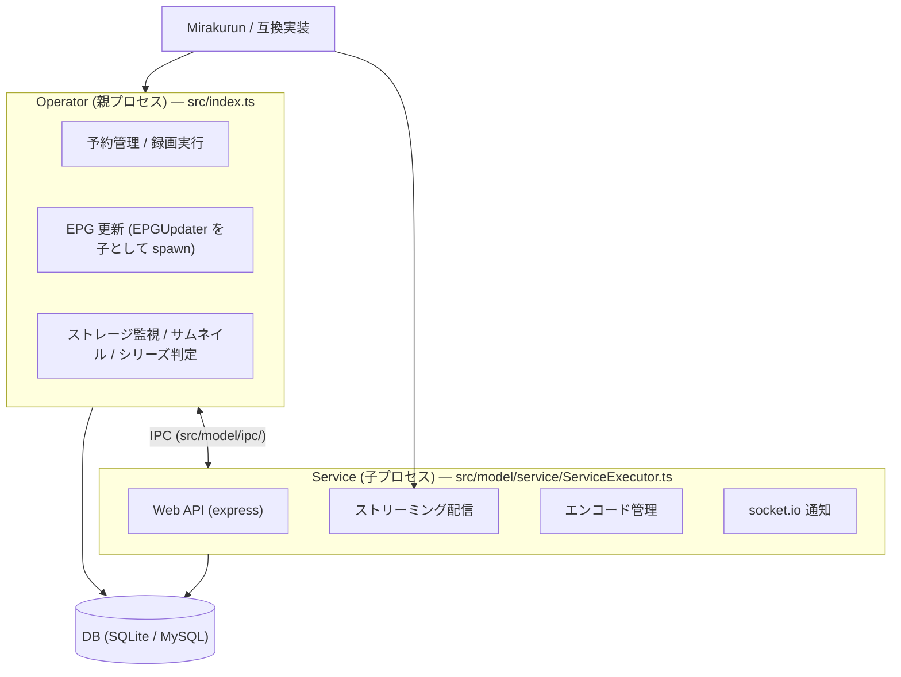

# EPGStation (stuayu フォーク) プロジェクト概要

日本の DTV 録画管理ソフトウェア EPGStation のフォーク版。
上流は [l3tnun/EPGStation](https://github.com/l3tnun/EPGStation) で、本フォーク (stuayu 版) は
**Windows 完全対応**・**県外地上波対応 (NW1〜NW40 チャンネル型の追加)**・**Mirakurun dev 版 (stuayu/Mirakurun) との連携** を主軸に拡張している。
フォーク独自の変更点の詳細はすべて [changelog-fork.md](changelog-fork.md) にある。

- 言語/ランタイム: TypeScript / Node.js 24 (CI も 24.x)
- サーバ: Express 5 + express-openapi, TypeORM 1.1 (SQLite / MySQL), inversify (DI), log4js, socket.io
- クライアント: Vue 3 + Vuetify 4 (クラスコンポーネント + `vue-facing-decorator`), inversify による独自 State 管理 (Vuex 不使用)。ビルドは Vite
- 動画再生: [DPlayer (tsukumijima フォーク)](https://github.com/tsukumijima/DPlayer) に統一 (タグ固定)。HLS は hls.js、低遅延ライブは mpegts.js、ARIB 字幕は DPlayer 内蔵の aribb24.js (`client/src/components/video/`)
- チューナーバックエンド: Mirakurun (`stuayu/Mirakurun` のタグ固定)

## プロセス構成

`dist/index.js` (親) を起動すると **2 プロセス構成** で動作する。



**図で全体像を掴みたい場合は [architecture.md](architecture.md)** (受信環境の全体像、録画が生まれるまで、
ストリーミングの経路、EPG のリアルタイム追従を mermaid でまとめてある)。

- 親 → 子は [index.ts](../src/index.ts) の `runService()` が spawn し、落ちたら自動再起動
- **Mirakurun 未接続でも起動する**: 起動時の疎通確認 (`ConnectionCheckModel`) は有限回で打ち切り、30 秒間隔のバックグラウンドリトライで復旧時に自動反映。状態は `GET /api/status` で取れ、Web UI が警告バナーを出す (DB 接続は必須)
- プロセス間通信は `src/model/ipc/` (`IPCServer` = 親, `IPCClient` = 子, 定義は `IPCMessageDefine.ts`)

## ディレクトリ構成

### サーバ (`src/`)

| パス | 役割 |
| --- | --- |
| `src/index.ts` | エントリポイント (Operator)。init → runOperator → runService → cleanup → runEPGUpdater |
| `src/db/entities/` | TypeORM エンティティ |
| `src/db/migrations/{mysql,sqlite}/` | DB 種別ごとのマイグレーション (postgres は空 = 未対応) |
| `src/lib/` `src/util/` | 汎用ライブラリ / 純粋関数ユーティリティ |
| `src/model/ModelContainerSetter.ts` | **DI バインディングの中心。新規クラスは必ずここに登録** |
| `src/model/db/` | TypeORM Repository をラップしたデータアクセス層 (`I*DB.ts` / `*DB.ts`) |
| `src/model/operator/` | 録画エンジン本体: reservation / recording / recorded / rule / storage / thumbnail / externalCommand |
| `src/model/epgUpdater/` | EPG 更新 (Mirakurun イベントストリーム購読 + 定期実行) |
| `src/model/event/` | EventEmitter ベースの内部イベント |
| `src/model/ipc/` | Operator ⇔ Service 間 IPC |
| `src/model/api/` | API ビジネスロジック層 (express 非依存) |
| `src/model/service/api/` | express-openapi ルートハンドラ。**ディレクトリ構造 = URL パス** |
| `src/model/service/encode/` | エンコードプロセス管理 |
| `src/model/service/stream/` | ライブ/録画済み × 通常/HLS のストリーミング |
| `src/model/service/dataBroadcasting/` | データ放送 (BML) 用 WebSocket サーバ (映像プレイヤーとは別経路) |
| `src/model/series/` `src/model/metadata/` | シリーズ判定と外部辞書 (しょぼいカレンダー / Annict / Wikidata) |
| `src/model/Configuration.ts` | `config/config.yml` の読み込み (fs.watchFile でホットリロード) |

### クライアント (`client/src/`)

| パス | 役割 |
| --- | --- |
| `main.ts` | エントリ。DI コンテナ初期化 → サーバ config 取得 → Vue 生成 |
| `router.ts` | vue-router ルート定義 + スクロール位置復元 (**hash モード**) |
| `views/` `components/` | ページ / 機能別コンポーネント (guide, recorded, reserves, search, series, video, watch など) |
| `model/ModelContainerSetter.ts` | クライアント側 DI 登録 (サーバと同じパターン) |
| `model/api/` | REST API ラッパー (`RepositoryModel` = axios 共通層 + 機能別 `*ApiModel`) |
| `model/state/` | 画面ごとの State クラス (Vuex の代わり) |
| `model/storage/` | localStorage 永続化 |
| `model/socketio/` | socket.io クライアント (`updateStatus` / `updateEncode` / `updateOnAirProgram` / `updateProgram`) |

### API 仕様の共有

- ルートの **`api.yml`** (OpenAPI 3.0.1) が仕様の正。express-openapi がこれを読んでバリデーション/ルーティングする
- ルートの **`api.d.ts`** がサーバ・クライアント共有の型定義 (`import * as apid from '.../api'`)
- 本フォークでは `ChannelType` に `NW1`〜`NW40` (県外地上波) と `BS4K` / `CS4K` を追加済み

## 主要ワークフロー別・変更対象ファイル

| やりたいこと | 触るファイル |
| --- | --- |
| API エンドポイント追加 | `api.yml` → `src/model/service/api/**` → `src/model/api/**` → `ModelContainerSetter.ts` → `api.d.ts` |
| DB スキーマ変更 | `src/db/entities/` → `npm run orm-gen --db=<mysql\|sqlite> --name=<Name>` (**両方**) → `src/model/db/**` |
| 録画・予約ロジック | `src/model/operator/{reservation,recording,rule}/**` |
| EPG 更新 | `src/model/epgUpdater/**` |
| エンコード | `src/model/service/encode/**` |
| ストリーミング | `src/model/service/stream/**` |
| Operator⇔Service 通信追加 | `src/model/ipc/IPCMessageDefine.ts`, `IPCServer.ts`, `IPCClient.ts` |
| 設定項目追加 | `src/model/IConfigFile.ts`, `Configuration.ts` (DEFAULT_VALUE), `src/model/config/ConfigSchema.ts` (単一定義元), 両テンプレート |
| クライアント新ページ | `client/src/views/` → `router.ts` → `model/state/**` → `model/ModelContainerSetter.ts` → ナビゲーション |

## コーディング規約 (両側共通)

- **インターフェース分離**: DI 対象は `IXxx.ts` + `Xxx.ts` (`@injectable()`) のペア。文字列トークン `'IXxx'` で bind し、`container.get<IXxx>('IXxx')` で取る
- **命名**: PascalCase + 役割サフィックス (`~Model`, `~ManageModel`, `~DB`, `~ApiModel`, `~State`, `~Util`)。ファイル名 = クラス名
- **namespace 定数**: クラス定義直後に同名 `namespace` で定義
- **Provider パターン**: 複数インスタンスが要るもの (Recorder, Encoder, Stream) は `toProvider()` でファクトリ注入
- **JSDoc 風の日本語コメント** を public メソッドに付与
- **エラーハンドリング**: サーバ API は try/catch → `api.responseServerError()`。クライアントは try/catch → `ISnackbarState.open()` + `console.error`
- Lint/Format: ESLint (Flat Config) + Prettier。`npm run build-server` に組み込み済み

## ビルド・運用

```bash
npm run all-install   # サーバ + クライアントの依存インストール
npm run build         # Linux/Mac (build-win で Windows)
npm start             # node dist/index.js
npm run backup / restore       # DB バックアップ / リストア
npm run recover-channel-name   # 過去の録画の放送局名を復元 (既定 dry run, --apply で更新)
```

- テストは node:test ベース: `test/ut` (単体、行カバレッジ 80% ゲート) / `test/ita` (実 sqlite) / `test/itb` (HTTP スタブ)。`npm test` = ut + ita、`npm run test:ci` = + itb
- 設定は `config/config.yml` (テンプレートから起動時に自動コピー)。ログ設定は `config/{operator,service,epgUpdater}LogConfig.yml`
- マイグレーションは起動時に自動実行 (`migrationsRun: true`)
- Docker: `Dockerfile.alpine` / `Dockerfile.debian` のマルチステージ
- CI: `build-validation.yml` (3 OS × Node 24)、`docker.yml` (Docker Hub push)、`release.yml` (タグ push で 3 OS 分の 7z を作り GitHub Release 作成)
- データ放送 (BML) は `web-bml` を npm 依存として使うだけで追加のビルド手順は無い

## 主要機能と実装場所

詳細な設計と経緯は `doc/changelog-fork.md` にある。ここは「どこを見ればよいか」の索引。

| 機能 | 入口 | 要点 |
| --- | --- | --- |
| シリーズ自動マッピング | `src/model/series/`, `src/model/metadata/` | 下記「シリーズ判定」参照 |
| TS 解析 | `src/model/recorded/ts/TsInfoAnalyzer.ts`, `src/model/video/VideoFileAnalyzeModel.ts` | 下記「TS 解析」参照 |
| 放送局の系列 | `src/model/channel/BitParser.ts`, `BroadcastAffiliationData.ts` | 正は放送波の BIT (PID `0x0024`)。Mirakurun API では取れないため録画/配信経路から受動収集し `channel_affiliation` へ貯める。未受信の局は同梱データ (networkId 実測 127 局 + 局名 → 系列 129 局) で補い、どちらにも無い局だけ「未分類」。番組表・放映中のグルーピング軸 (地域別 / 系列別) は `/affiliations` のスイッチで切り替え |
| 実況コメント | `client/src/util/Jikkyo*.ts`, `src/model/service/stream/util/BroadcastTimeExtractor.ts` | サーバが TS の TDT/TOT から放送時刻を取り `GET /api/streams` の `broadcastTime` で配る。クライアントは「サーバ遅延 + 再生バッファ + 手動オフセット」だけ描画を遅らせる |
| テーマカラー | `client/src/util/ThemeColorUtil.ts`, `client/src/plugins/vuetify.ts` | Vuetify theme に独自色 `appTheme` を登録し、設定 > 表示 で 8 色から選ぶ (端末ごと・localStorage)。適用先はヘッダー・ナビゲーションドロワー・トグルスイッチ・プログレスバー。**`primary` は差し替えない** (`color="primary"` を明示している全箇所が連動してしまうため)。色の定義はライト用 / ダーク用の 2 値を持ち、`apply()` が両テーマを同時に書き換える |
| 視聴画面 | `client/src/components/watch/WatchLayout.vue` | `position: fixed` の全画面レイアウト。左にアイコンナビ、上に番組情報バー、右に情報パネル (名前付きスロットで差し替え)。視聴中はグローバルナビを畳む |
| データ放送 (BML) | `client/src/util/DataBroadcastingManager.ts`, `src/model/service/dataBroadcasting/` | `web-bml` (tsukumijima フォーク) を npm 依存で利用。iframe に隔離せず `BMLBrowser` を直接生成し、**映像要素を BML ブラウザの中へ物理的に移動**して DPlayer に組み込む |
| SNS 投稿 (Bluesky / Misskey) | `src/model/sns/`, `src/model/api/sns/`, `src/model/service/sns/`, `client/src/components/watch/sns/`, `client/src/views/SnsAccounts.vue` | 視聴画面 (ライブ・録画) から投稿できる、KonomiTV の Twitter 実況パネル移植 (Twitter 自体・リプライツリー実況は非移植)。**アカウントはログインユーザーごとに分離** (`sns_account.userId`、匿名時は共有枠)、**認証情報は `ISecretCrypto` で暗号化して DB 保存し、クライアントへは一切返さない**。Bluesky は App Password 方式 (AT Protocol OAuth は LAN 運用で client metadata を公開 HTTPS に置けないため不採用)。**Misskey は MiAuth によるワンクリック連携** — `POST /api/sns/misskey/auth` が発行した `sessionId` をメモリ Map (TTL 10 分、DB 非永続) で持ち、`authUrl` へ `location.href` で遷移 → 承認後 `GET /api/sns/misskey/callback` が 302 で `#/settings/sns?misskey=success\|error` へ戻す。ハッシュタグは `client/src/util/ChannelHashtagData.ts` (局名前方一致表、NW1〜NW40 は通常の地方局名なので `channelType` 分岐不要) + `ProgramHashtagUtil.ts` (番組概要・詳細からの抽出/合成/差し込み) の純粋関数群で組み立て、**自動合成は「番組が切り替わった契機」だけ** (同一番組内での再合成はユーザーが手で消したタグを足し戻すため行わない)。**Misskey の公開範囲・チャンネル・ローカルのみはパネルに UI を持たず**、`SnsAccounts.vue` で設定したアカウントごとの既定値へサーバー側 (`SnsApiModel.postToMisskey()`) がフォールバックする。キャプチャ添付は canvas → JPEG (Bluesky 2MB 上限に収まるよう品質→解像度の順に自動で下げる、`SnsCaptureAttachment.vue`)。**タイムライン・リアクション・カスタム絵文字** (`GET /api/sns/timeline`、`GET /api/sns/misskey/emojis`、`POST`/`DELETE /api/sns/reaction`、`POST /api/sns/renote`) は provider の差を `SnsTimelineNote` / `SnsTimeline` (`api.d.ts`) へ吸収し、変換は `src/model/sns/{Misskey,Bluesky}TimelineConverter.ts` の純粋関数に切り出す。Misskey のカスタム絵文字一覧はインスタンス単位でサーバー側メモリキャッシュ (TTL 1 時間)。**Misskey のリアルタイム TL は `src/model/service/sns/SnsTimelineWebSocketServer.ts` が WebSocket 中継する** — `DataBroadcastingWebSocketServer` と同じ流儀で既存 HTTP サーバーの `upgrade` に `noServer: true` で相乗りし (パス `<subDirectory>/api/sns/ws` 以外には触れない)、`SnsTimelineRelayManageModel` が購読ごとに上流 (`wss://<host>/streaming?i=<token>`) への接続を張り (所有者・provider を検証済み)、届いた note を `SnsTimelineNote` へ変換してから下流へ流す (生の note・トークンは渡さない)。上流切断時は指数バックオフで再接続、購読変更・クライアント切断では上流を必ず閉じる。Bluesky の TL はポーリング (WebSocket 中継なし)。Bluesky の like/repost 取り消しは AT Protocol 上「作成したレコード自身の rkey」が要るため、作成 API の戻り値から抽出した `reactionKey` を一度クライアントへ返し、取り消し時に渡し直してもらう。**Bluesky の repost 取り消し (unrenote) はサーバー API 自体が未実装**のため、クライアント (`SnsTimelinePanel.vue`) は `isRenotedByMe === true` のボタンを disabled にして理由を出すだけに留めている。**投稿パネル (`SnsPostPanel.vue`) の絵文字・MFM 装飾ピッカーは本文 `v-textarea` の実体 `<textarea>` を `$refs` 経由 (`$el.querySelector('textarea')`) で取得し、`selectionStart`/`selectionEnd` を直接操作する** — 絵文字は挿入して直後へカーソルを移すだけ、MFM 装飾は選択範囲があればその文字列を prefix/suffix で包み、無ければ記法を挿入して placeholder を選択状態のまま残す (続けて書き換えられるように)。挿入直後は `$nextTick()` を挟んでから `focus()` + `setSelectionRange()` する (bodyText の書き換えが DOM へ反映されるのを待つ必要があるため)。**リアクション絵文字の URL 解決は 3 段** (`MisskeyTimelineConverter.convertMisskeyNoteToTimelineNote()`): `reactionEmojis['name@host']` (リモート) → `reactionEmojis['name']` (ローカル) → 呼び出し側が渡す `resolveEmojiUrl()` (`MisskeyClient.getEmojis()` のインスタンス単位キャッシュ)。**`reactionEmojis` のキーはリモートだと `name@host`、ローカルだと `name`** で揃っており、短縮名だけで引くとリモート絵文字が必ず外れる。**WebSocket 中継 (`SnsTimelineRelayManageModel`) 経由の note には `reactionEmojis` 自体が無いことがある**ため③のキャッシュ解決が必須。クライアント (`SnsTimelineNoteCard.vue`) 側も `url: null` のときは手元の `emojiMap` で再解決を試みてから諦める。**SNS 投稿パネルは投稿フォームを `v-show` で常時マウントし続ける** (タブ切替中も unmount しない) — `SnsCaptureAttachment` が撮影済みキャプチャを自身の内部状態で持つため、`v-if` で unmount すると未添付のキャプチャが消える。投稿とタイムラインの同時表示 (設定 `snsUseSplitPanelView`、狭い端末では強制的にタブ切替) は新規依存を足さず pointer capture (`setPointerCapture()`) でドラッグ実装。本文のライブプレビュー (設定 `snsEnableComposePreview`) は `MfmText.vue` を使い回し、絵文字一覧の取得は `fetchComposerEmojisIfNeeded()` に一本化してピッカーと二重取得しない。**画像添付は data URL (base64) のまま JSON ボディに乗せて `POST /api/sns/post` へ送る**ため、`express.json()` の既定上限 (100kb) のままだと 1 枚のキャプチャ (最大 1.9MB 相当、base64 で約 2.5MB) すら収まらず必ず 413 Payload Too Large になる (実機で確認した実バグ)。`ServiceServer.JSON_BODY_LIMIT` (既定 20mb) を `express.json({ limit })` へ渡して回避している。**投稿とタイムラインの同時表示は既定 ON** (`snsUseSplitPanelView` の既定値 `true`)。切り替えは設定画面だけでなく `SnsPostPanel.vue` のタブ行にあるアイコンボタン (`mdi-view-split-horizontal` / `mdi-tab`) からも直接行え、狭い端末 (`isMobile`) ではボタンごと隠す (切り替えても見た目が変わらないため) |
| Amatsukaze 連携エンコード | `src/AmatsukazeEncodeTool.ts`, `src/model/amatsukaze/` | `AmatsukazeAddTask` でキューに投入し、`AmatsukazeServer` の TCP RPC (既定 32768) へ接続して自分のタスクだけを追跡。進捗・状態を JSON (`{"type":"progress",...}`) で stdout に出し、既存のエンコード画面 (`EncoderModel`) にそのまま乗せる。設定 (`amatsukaze`) は `editable: 'ymlOnly'` (config.yml 直接編集のみ)。**RPC のメソッド ID (`RPCMethodId`) は Amatsukaze のバージョンで並びが変わる** — 知らない ID を受け取ったサーバはエラーを返さず黙ってソケットを閉じるため、症状は `read ECONNRESET` だけになる。変えるときは 32768 への通信を中継して本物のクライアントのフレームと突き合わせること。**自分のタスクの探索は投入が済んでから** (`markTaskAdded()`) — Amatsukaze のキューは完了しても消えないため、投入前のキューから探すと同じ録画の過去のタスクを掴んで即失敗する。**完了しても `ActualDstPath` は返らない**ことがあり、その場合は `DstPath` (拡張子なしのベース) から `AmatsukazeOutputUtil.findOutputByBase()` で実ファイルを探す (同じベース名で `.ass` / `.chapter.txt` も並ぶ)。**出力ファイルは Amatsukaze が書いた場所をそのまま使う** — Amatsukaze は出力先ディレクトリしか受け付けずファイル名は自分で決めて上書きするため `%OUTPUT%` と食い違うことがあり、移動しようとすると完了直後はまだ掴まれていて `EBUSY` になる。エンコードコマンドが標準出力へ `{"type":"output","path":"..."}` を出すと `EncoderModel` がそのパスを登録する。**コンソール出力は cp932** なので `AmatsukazeTextUtil` を通す (子プロセスの出力はチャンクが文字の途中で切れるため `LineDecoder` で行が揃ってから変換する)。**進捗はコンソール出力の行頭 `[n%]` だけから拾う** — 同じ行の `GPU 21%` や別の行の `CPU: 10.8%` を拾うと値が飛ぶ。進捗行は改行ではなく CR で上書きされるので CR でも行を分ける。**`State.Progress` はキュー全体の進み具合**でタスクの進捗ではないので使わない |
| ログイン認証・権限 | `src/model/auth/` | `auth.enabled` で有効化 (既定 無効)。パスワード (scrypt) と SSO (Google / GitHub)。セッションは HMAC 署名付き HttpOnly Cookie。**最初にサインアップした人が管理者**。`/api/settings`・`/api/auth/users`・`/api/update`・`/api/logs` は管理者限定 |
| 更新通知・ワンクリック更新 | `src/model/update/`, `client/.../UpdatePanel.vue` | GitHub Releases を定期確認。リリース版 (タグ) と開発版 (`main`) を選べる。`git checkout` → `all-install` → ビルド → Operator 終了 (サービス管理に再起動させる)。git clone 環境のみ |
| Windows サービス | `scripts/win-service.js`, `src/util/GitCommand.ts` | `node-windows` で登録。LocalSystem・セッション 0 で動くためユーザーの PATH を参照できず、専用 `Path` と `git config --system safe.directory` を設定する |

### EPG 追従 (EIT[p/f] とリアルタイム同期)

- **リアルタイム同期**: event stream のイベントを `ProgramUpdatePriority.ts` が `immediate` / `normal` に分類し、`immediate` (番組の消滅・付け替え / 放送時間未定への変更 / `urgentWindowMinutes` 既定 180 分以内に始まる番組) だけを 10 秒 tick を待たず先行して DB へ書く (デバウンス 500ms)。設定は `featureFlags.epgRealtimeSync` と `config.yml` の `epgRealtime`
- **event stream が動いていても定期的に全件突き合わせる**: event stream は差分しか運ばないため、新規番組の `create` が届かないと DB が古いまま残る (再起動でだけ直る)。既存のウォッチドッグは「イベントが来ない」ことしか見ておらず、イベントが届き続けるこのケースを検知できない。`epgFullRefreshIntervalTime` (既定 360 分) ごとに `updateAll()` で取り直す
- **クライアントへの通知は 2 系統**: `updateOnAirProgram` (`channelIds`、EIT[p/f] 相当。視聴画面・放映中一覧) と `updateProgram` (`{ channelIds, startAt, endAt }`、変更のあった時間帯そのもの。番組表)。全体更新 (`updateStatus`) と分けているのは 10 秒周期で飛びうるため
- **予約も同じ通知で追従する**: `updateOnAirReserves()` (その局の現在〜15 分先の programId 予約) と `updateReservesByProgramIds()` (放送が何時間先でも追従)。番組 id が 1000 件を超える更新では id を載せず周期的な全体更新に任せる
- **録画開始ゲート**: 時刻指定予約と programId 予約はともに `getServiceStream` (既定) を録画優先度のリクエスト option で開く。`EitPresentParser` + `RecordingStartGate` が TS 到着 (transport) と EIT[p/f] 境界待ちを分離し、target present の event_id 一致 / target following の start_time 到達を通常開始条件にする。EIT 無しは soft timeout (既定 60 秒)、別 event_id 固着は hard timeout (既定 5 分) で録り逃しを防ぐ。待機中 TS は最大 8 MiB のリングバッファへ保持し、開始時に先に書き出す。設定は `recording.programStreamMode`、`recording.startGate*`、`recording.hardStartGateTimeoutMs`
- **programId 予約の開始待ち**: 既定のサービスストリームでは TS 到着を `firstDataTimeoutMs` で transport 異常として判定し、TS 到着後の EIT 境界待ちとは分離する。target present の event_id 一致、target following の start_time 到達を通常条件とし、EIT 無しは soft 60 秒、別 event_id 固着は hard 5 分で開始する。待機中は最大 8 MiB のリングバッファを使い、同じチャンネルのチューナーを保持する。`programStreamMode: program` の切り戻し経路も維持する
- **録画開始・終了は EIT[p/f] 追従**: service stream は自動終了しないため、対象 present が別 event_id に変化した場合はデバウンス後に終了し、`endAt + timeSpecifiedEndMargin` をハード期限とする。EPG 追従で `endAt` が変われば programId 予約もタイマーを更新する。開始後の一時的 EIT 欠落では終了しない。HTTP 応答、first TS、first EIT、開始/終了理由、priority を info ログへ出し、`isFollowingSchedule` は開始待ち時だけ true とする
- **録画先は空き容量で自動振り替え**: 録画開始前に予想サイズ (番組長 × 放送種別ごとの想定ビットレート + 余裕) を出し、`config.recorded` の順に空きを見て最初に収まる保存先を選ぶ。満杯になり次第順次次へ送り、どこも足りなければ最も空きが大きい所を使う。判定は `RecordedDirCapacity.ts` (純粋関数)、空き取得は `RecordingUtilModel`。設定は `recording.storageFallback*`
- **ログで追える**: EIT[p/f] の受信・予約の再スケジュール・録画側の時刻変更を「変更前 → 変更後」の時刻付き info で出す (整形は `src/util/ProgramTimeLog.ts`)。クライアントへの通知も Operator / Service の両方で接続クライアント数付きの info を出す

### シリーズ判定

外部の作品タイトル辞書が主軸。3 つの辞書をローカル DB へ取り込み、`WorkDictionary` が 1 つのメモリ索引へ統合する。

- 辞書: `SyobocalTitleDictionary` (しょぼいカレンダー、約 8 千件・アニメ) / `AnnictWorkDictionary` (`searchWorks`、約 1.7 万件・アニメ) / `WikidataProgramDictionary` (SPARQL、約 4 万件・**全ジャンル**)。**重複はしょぼいカレンダー TID で結合する** (Annict は `syobocalTid`、Wikidata は `P11648`)
- **判定順**: ①放送予定 (`SyobocalProgramLookup`、放送局 + 放送開始時刻) → ②エイリアス辞書 → ③作品辞書 (タイトル照合) → ④LLM → ⑤類似度スコアリング。**エイリアスより放送予定が優先**、**手動確定 (`manualLock`) だけは放送予定より強い**
- **確度**: `exactStart` (番組の頭から録画) 0.98 / 放送時間帯の包含 0.92 / 系列キー局で代用 (`viaKeyStation`) 0.9。返ってきた作品名が録画タイトルと共通部分を持たないものは `isPlausibleProgramTitle()` で捨てる
- **話数**: タイトルに表記があっても放送予定の `Count` を優先。遅れネットの県域局は `lookupDelayed()` がキー局の放送予定を 28 日遡って対応付ける。総集編・一挙放送 (`isSpecial`) はサブタイトル逆引きの対象外
- **放送種別**: `decideAirType()` が「放送予定が再放送 (`ProgItem.Flag` の bit 8) → `rerun` / キー局を遡って対応付け → `delayed` / それ以外 → `first`」で決める。タイトルに `(再)` があればフラグ付け漏れとみなし `rerun` を残す
- **問い合わせ先の ChID は同梱マップ** (`SyobocalChannelMapData`、124 局)。しょぼいカレンダーの `ChLookup` と実機の networkId / serviceId から起こしているので、**書き換えるときは必ず実データで確認する** (取り違えると別局の番組表を引く)
- **続編は放送時期で選び分ける**: 期表記の無い録画はタイトル照合だと第 1 期に当たるため、基本キーで全期をまとめ放送日時が入る期へ差し替える (再放送では放送日時を渡さない)
- **総話数 (欠番検出)** は `ISeriesTotalEpisodes` が `series.totalEpisodes` → しょぼいカレンダー → Annict の順に解決する
- **実行契機**: 録画完了・アップロード / 取り込み完了 (どちらも `EventSetter`)。手動はバックフィル (`POST /api/series/backfill`、全件 / `onlyUnlinked` / `latest`)、シリーズ単位 (`POST /api/series/reanalyze`)、1 件 (`POST /api/series/analyze/{recordedId}`)。`latest` と `seriesIds` は部分実行なので全件バックフィルの再開カーソルを動かさない
- **判定過程はトレースできる**: `resolve(recording, trace?)` に収集器を渡すと各照会の入力と戻り値を記録する (1 件実行の結果はポップアップ + Operator のログ)
- **表示名は辞書の正式タイトルへ同期する**: `SeriesMetadataFiller.fill()` が `series.title` と引き当てキー `normalizedTitle` を辞書名由来へ揃える (外部 ID あり・手動設定でない・寄せ先が未使用、の 3 条件を満たす場合のみ)。手動で付けた名前 (`titleSource: 'manual'`) は上書きしない
- **誤生成の掃除**: 出所 (`SeriesListItem.origin`) は外部 ID の有無で `dictionary` / `local` を判定。一覧から複数選択して `POST /api/series/merge`、統合先は辞書起点を既定にする。エイリアスの誤学習は設定画面 > シリーズ管理タブから付け替え・削除できる (`source: 'manual'` になり自動学習で上書きされない)
- **しょぼいカレンダーのコメント**は作品コメント (`series.comment`) と放送回コメント (`series_episode.comment`) の 2 種類。作品コメントは全件同期に含めず TID 指定で個別取得する (XML が 9.5MB → 24MB になるため)。表示は Wiki 記法を解析する `SyobocalWiki.ts` + `SyobocalComment.vue` を通す (**`v-html` は使わない**)
- 同期は Operator 起動時 + しょぼいカレンダー 24h / Annict 7d / Wikidata 7d。アイキャッチ画像は Annict 由来で、`SeriesImageModel` がサーバ側でキャッシュして `GET /api/series/{seriesId}/image` で配る (取れない作品は録画サムネイルで代用)

### 録画サムネイル V1

`ThumbnailManageModel` は探索範囲の 5〜95% から候補時刻を生成し、既存 Queue 経由で代表フレームを保存する。探索範囲は録画先頭から `thumbnailSearchDuration` 秒 (既定1200秒=20分、0で全編) までで、短い録画は全体を使う。`ThumbnailScorer` は画像評価の差し替え境界で、V1 の `BasicThumbnailScorer` は明るさ・コントラスト・シャープネス・場面変化を加点し、黒画・ぼけを減点する。生成形式は JPEG (既定) / WebP、variant は poster / wide。`Thumbnail` には形式、寸法、動画開始からの相対時刻、スコア、生成時刻を保持する。旧 `filePath` は維持し、既存 API / クライアントから利用できる。保存先は `thumbnailStorageRoot` (未指定時 `thumbnail`)。録画単位の再生成は `POST /api/videos/{recordedId}/thumbnail/regenerate`。

V1.6 では `ThumbnailExtractor` が FFmpeg の RGB24 出力を取得し、`ThumbnailImageAnalyzer` が画像特徴量を計算する。現在は候補時刻ごとに input-side `-ss` で1フレームだけseekし、最大3並列で抽出する。録画区間を連続デコードしないため、長時間TSでも処理量は候補数に比例する。候補単位のtimeoutは120秒で、失敗候補を除外し、全候補失敗・低品質時だけ `thumbnailPosition` を優先する fallback へ戻る。poster 幅は `thumbnailPosterWidth` (既定 1280)、wide は 640。候補ごとの特徴量と score は debug ログ、採用結果は `meta/<recordedId>.json` に保存する。

duration 10 秒未満は中央候補1点とし、候補0件でも既存の thumbnail 生成を継続する。候補時刻の生成は `ThumbnailCandidateGenerator` に統一し、設定した `thumbnailPosition` も duration 不明時・候補1点時に維持する。

### TS 解析

`TsInfoAnalyzer` (`src/model/recorded/ts/`) が `aribts` で PAT / SDT / NIT / PMT / EIT[p/f] / TDT / TOT を解析し `video_file_ts_info` へ保存する。ffprobe と合わせて `VideoFileAnalyzeModel` が入口。

- **既定でファイル中央から読む** (64MB 以上)。先頭には前番組の EIT[p/f] と録画開始直後の壊れた TS が混ざるため
- **`firstTdtAt` は「ファイル先頭の放送時刻」の意味を保つ**。`resolveFileStartAt()` が「先頭を読み直した値」を常に優先し、「中央から実測バイトレートで遡った見積もり」は先頭が読めなかったときの代替としてだけ使う。**見積もりを採否の判断材料にしない** — ファイル全体が一定ビットレートである前提のため、tsreplace 等で再エンコードした VBR のファイルでは数分ずれる (実測: HEVC 出力で 7 分 48 秒、見積もりの方が誤り)。先頭の時刻が中央の時刻より後になる場合だけ、壊れた TDT/TOT とみなして見積もりへ退避する
- **相乗りサービス (ワンセグ・サブチャンネル・データ放送) からの本編選択は `selectServiceId()`**: service_type の格 → PID ごとのパケット数 → EIT[p/f] の有無 → service_id 昇順。パケット数の偏りを見るため最低 20000 パケットは読む
- `video_file.startAt` は TDT/TOT を使うが、**出現位置がファイル先頭から離れていることがある**ため PCR (27MHz) で経過時間を測って補正する (`correctStartAtByPcr()`)
- **番組情報の上書きは明示的な再解析のときだけ** (`overwriteProgramInfo`)。取り込み・アップロード時と「未解析のみ」の一括解析は空の項目を補うだけ。**番組名 (`recorded.name`) はどちらでも上書きしない**
- 取り込み時の放送局特定は**ファイル名の推定ではなく network id + service id での厳密な引き当て**を優先する
- 録画の放送局名の表示は `ChannelNameUtil.getRecordedChannelName()`、一覧のタイトル表示は `RecordedUtil.convertRecordedItemToDisplayData()` の 1 箇所で決まる

## 注意点・ハマりどころ

### 環境・ビルド

- **Windows 対応が本フォークの柱**。パス区切り・named pipe を常に考慮する
- package.json の `overrides` にある `express-openapi.glob: ^7.0.0` は外さない。glob 10 以降の `globSync()` は Windows でパス区切りが `\` になり、`fs-routes` の API ルート解決が壊れる
- `mirakurun` 依存は `stuayu/Mirakurun` の**タグで固定**する。ブランチ参照は Mirakurun 側の push で lockfile の integrity が壊れ CI が落ちる
- **リリースタグと package.json のバージョンは形が違う** (`2.14.0-stuayu-260727` と `2.14.0-stuayu`)。素の semver 比較だと自分より新しく見えるため `src/util/VersionUtil.ts` が日付サフィックスを別枠で扱う。現在バージョンの解決は `src/util/CurrentVersion.ts` に集約

### 設定・DB

- **config.yml は「ファイルがベース + DB の差分」**: GUI での変更は `app_setting` の `config` キーに差分として入り、`ConfigOverlay.ts` が重ねて実効値を作る。**yml へは書き戻さない**。差分は各プロセスで **DB 接続直後・モデル構築前**に適用する (多くのモデルがコンストラクタで config を読むため)
- **項目の定義元は `ConfigSchema.ts` の `CONFIG_SCHEMA` に一本化**されている (キー・型・GUI 編集可否・再起動要否・秘密情報フラグ)。追加時は両テンプレートへの記載が必須 (`test/ut/config-schema-template-sync.test.js` が検知)
- `ormconfig.js` (CLI マイグレーション用) は `Configuration.ts` と別に config.yml を読む二重管理
- 対応 DB は sqlite / mysql のみ (postgres のマイグレーションディレクトリは空)
- TypeORM 1.x は criteria が空の `delete()` を禁止しているため、全件削除は `createQueryBuilder().delete()` を使う
- **番組表の全件更新は「残した過去番組」と主キーが衝突しうる**: `epgRetentionTime` で過去の番組を残すと、Mirakurun が終了直後の番組も返し続けるため同じ id を再挿入してしまい、`ER_DUP_ENTRY` で `updateAll()` が丸ごとロールバックされる。`ProgramDB.insert()` が削除の直後に「これから挿入する番組のうち終了済み (`endAt < now`) のもの」の id を消して衝突を防いでいる
- **機能フラグ (`featureFlags`) は opt-out**。未指定は**有効**扱い (`featureFlags: {}` は「全部有効」)
- 秘密情報の暗号化鍵は `data/key/secret.key` に自動生成 (`EPGSTATION_SECRET_KEY_FILE` で上書き可)

### サーバ

- Express 5 は `req.query` がアクセスごとに再パースされる getter のため、`ServiceServer.ts` で一度だけ実体化するミドルウェアを挟んでいる
- ストリーミング API の `req.query` は express-openapi がスキーマに従い数値へ型変換する。`mode` 等を文字列前提で扱わない
- **放送時間未定の番組**: ARIB の `duration = 0xFFFFFF` を Mirakurun は `duration: 1` で返す。そのまま `startAt + duration` にすると開始直後に消えるため、`src/util/ProgramDuration.ts` が暫定の終了時刻 (3 時間) を与え、番組表 API で次の番組の開始時刻まで切り詰める。**番組の時刻を扱うコードは必ずここを通す**
- **Mirakurun 互換実装との差を前提にする**: `recisdb-proxy` のような実装は「チューナ情報の `types` が空」「未運用のサブチャンネル・空きスロットまで全サービスを返す」「`remoteControlKeyId` が無い」「値なしの項目を `undefined` ではなく `null` で返す」。放送波の状態 (`getBroadcastStatus()`) は `types` が空ならチャンネルの `channelType` から補い、Mirakurun からの値は `null` 込みで扱う
- **親と同一内容のサブチャンネルは番組表・放映中から隠す**: 親 (同一 networkId で serviceId 最小) と同時刻・同名の番組しか持たないサブチャンネルを `ScheduleApiModel.createSchedule()` が列から落とす (`isHideDuplicateSubChannel`、既定 有効)。別番組を放送している間は表示される
- **EPG が無い放送局は放映中にだけ出す**: 番組情報を 1 件も持たない放送局は、`getBroadcastingSchedule()` (放映中) では**映像・音声サービスの親サービスだけ**が空の `programs` で返る (視聴はできるため)。**番組表 (`getSchedules()`) では従来どおり落とす**。クライアントは `schedule.programs[0]` を前提にしないこと (`OnAirState` / `OnAirCard.vue` は空を許容済み)
- **放送局の並びはリモコンキー昇順**で、`remoteControlKeyId` が `null` の局は末尾に回る (`ChannelDB` の ORDER BY)。並びがおかしいときは**まずチューナーサーバがキーを返しているかを疑う** (EPGStation 側では補完しない)
- エンコードキューは `data/encodeQueue.json` に永続化され Service 起動時に復元される。キューを変更したら `saveQueue()` の呼び出し漏れに注意
- **エンコードの成否を終了コードだけで判断しない**。外部エンコーダ (Amatsukaze / tsreplace 等) はディスクフルで書き込みに失敗しても終了コード 0 で終わることがある。`EncoderModel.childEndProcessing()` が出力ファイルのサイズ (`MIN_OUTPUT_FILE_SIZE` = 1MiB) も見て失敗扱いにしている。**元ファイルの削除 (`removeOriginal`) はこの判定が失敗を返さないことに依存している**ので、`EncodeManageModel.onFinish()` の分岐を崩さないこと
- `ExecutionManagementModel` (優先度付き排他ロック) の `getExecution()` は 60 秒でタイムアウトする。reject を握り潰すとキュー処理が止まる
- **Annict GraphQL API に `Query.works` は無い** (`searchWorks` のみ)。`Episode.airedAt` も無い。存在しないフィールドが 1 つあるとクエリ全体がエラーになるため introspection で確認してから書く

### クライアント

- **クラスフィールドのコールバックの `this` は Vue インスタンスではない**: `vue-facing-decorator` はフィールドの初期値を data 用の一時インスタンスから集めるため、`private xxxCallback = ((): void => { ... }).bind(this)` の中から `this.watchParam` のようなデータを読むと初期値しか見えない (**メソッドだけが Vue インスタンスへ束縛される**)。**`this.xxxState` もリアクティブなプロキシではなくなる**ので、state を書き換えても再描画が起きない (データは新しいのに画面が古いまま)。**コールバックからメソッドを呼ぶだけでは直らない** — 呼ばれた側の `this` も一時インスタンスのままになる。socket.io の購読は**フィールドを挟まずメソッドをそのまま渡す** (`this.socketIoModel.onUpdateState(this.onUpdateStatus)`)
- **番組表 (`Guide.vue`) のセルは手組み DOM**: `GuideState.createProgramDoms()` が作った DOM を `renderProgramDoms()` で流し込む。データを取り直したら**両方**呼ばないと画面が古いまま (可視判定の `updateVisible()` も `renderProgramDoms()` の末尾で走る)
- **色は Vuetify 3 以降のクラス名で書く**: 背景色は `bg-success` / `bg-grey-darken-3` のように `bg-` が要る (Vuetify 2 の `success` / `grey darken-3` は無効で、**黙って透明になる**)。`v-switch` / `v-progress-linear` は `color` 未指定だと `currentColor` (ほぼ黒) になるため、既定色を `plugins/vuetify.ts` の `defaults` で `appTheme` に寄せてある
- **タイトルバーのタイトルには `.app-bar-title` を付ける**: Vuetify の `.v-toolbar-title` は `flex: 1 1` (basis 0) のため、後ろに置いた `v-spacer` と余った幅を等分してしまう。右にメニューアイコンが 1 つしか無くても画面の半分ほどで ellipsis され、狭い端末では「番組表 08/...」のように日付が読めなくなる (Issue #18)。共通クラス `.app-bar-title` (`client/src/App.vue`、`flex: 0 1 auto`) が必要幅を先に確保する。画面に出すバージョンは `VersionState.getVersionString()` が semver のベースまでに切り詰め、`git describe` そのままの文字列は `getFullVersionString()` (ドロワーのツールチップ) と設定 > 更新で見られる
- **横並びの入力は狭い端末で潰れる**: `.v-input` は既定が `flex: 1 1 auto` なので、`d-flex` に 2 つ並べると入力側だけが縮み、ラベル (「季..」) や選択値 (「M2TS-...」) が読めなくなる。折り返すものは `flex: 1 1 <基準幅>` + `flex-wrap`、縮ませたくないものは `flex: 0 0 auto`。説明 + スイッチの行は説明側の div に `flex: 1 1 auto; min-width: 0` を付ける (付けないとスイッチが画面外へ出る)。`v-date-picker` は固定幅 328px なので `v-menu` / 狭い `v-dialog` では `width: 100%` にする。`v-list-item-title` / `v-card-title` は nowrap + ellipsis なので、項目名・作品名として使うなら `white-space: normal`。入力欄のラベルに説明を書くと省略されるので `hint` へ回す。タイトルバーの menu スロットにアイコンを 3 つ並べると 375px でもタイトルが省略されるため、狭い端末ではケバブメニューへ畳む
- **`v-pagination` は折り返さない**。`total-visible` が大きいまま `show-first-last-page` を付けると狭い端末で前後ページのボタンが画面外に出る。`$vuetify.display.smAndDown` で表示数を減らす (`SeriesPending.vue` が例)。共通の `Pagination.vue` は 500px 以下で `MobilePagination` に切り替わるので、そちらを使えるならそれで良い
- **`DataBroadcastingManager` は `markRaw()` で包む**: BMLBrowser 内部の JS-Interpreter が Vue のプロキシに包まれると壊れる。Vue コンポーネントではなくプレーンクラスに切り出しているのも同じ理由
- **socket.io の接続先を組み立て直さない**: 専用ポート (`socketioPort` / `clientSocketioPort`) の指定が無ければ `GET /api/config` の `useDedicatedSocketIOPort` が `false` になり、クライアントは `location.origin` へそのまま接続する。ここでポートを組み立てるとリバースプロキシ配下 (443 → 8888 など) で必ず接続に失敗する。**接続できていないと画面の自動更新が一切効かなくなる**ので、失敗は `connect_error` (`disconnect` ではない) で拾って知らせること
- **socket.io は複数経路から接続される前提で書く**: 同じサーバーが LAN 直アクセスとプロキシ経由の両方で使われる。サーバは**専用ポートを指定していても Web API と同じ待ち受けでも socket.io を受ける** (プロキシ経由のクライアントは専用ポートに届かないため)。`useDedicatedSocketIOPort` は `api.getAccessPort()` が見たアクセス先ポートと自分の待ち受けポートの一致で**接続ごとに**決まる。クライアントは候補を順に試して切り替えるので、**`getIO()` に直接 `on` してはいけない** (切替で socket が作り直され購読が外れる)。購読は `ISocketIOModel` の `on*` を使う
- **自分の操作の反映をサーバ通知に頼らない**: `RepositoryModel` が POST / PUT / DELETE の成功を `ApiMutationNotifier` へ流し、`SocketIOModel` が `updateStatus` / `updateEncode` と同じ扱いで購読者へ配る。各画面は socket.io の購読だけ書けばよく、削除後の再取得を個別に書く必要はない

### ストリーミング・データ放送

- **HLS は 2 モード**: cmd が `%streamFileDir%` を含まなければ in-memory 配信 (`HLSMemoryStoreModel`、ディスク書き込みなし)、含めば従来のディスク方式。ライブ・録画済みとも同じ判定で、**`encodePresets` が生成する HLS プリセットはどちらも in-memory (fMP4)**。**どちらのモードも ARIB 字幕対応**で、in-memory 側は ID3 を `emsg` box (**version 1 必須**) で運ぶ
- **録画済み HLS はエンコードを再生位置の近くに留める**: 録画ファイルのエンコードは実時間の数倍速で進むため、放置すると再生位置との差が際限なく開く。in-memory ストアはセグメントを 180 本 (約 3 分) しか保持しないので、約 90 秒でプレイリストの先頭が再生位置を追い越し、**hls.js が `synchronizeToLiveEdge()` でエンコード最新位置へ強制シークする** (録画済みのプレイリストも `#EXT-X-ENDLIST` が無いため live 扱いになる)。`HLSMemoryStoreModel.getAheadSegmentNum()` が取得済み seq からの先行量を返し、`RecordedStreamBaseModel` が 60 セグメントを超えたらエンコーダの stdout の読み出しを止める (パイプが詰まりエンコーダ自身がブロックする)。**ただし止めっぱなしにはしない**: 完全に止めるとプレイリストの更新も止まり、ブロッキングプレイリスト要求 (`?_HLS_msn=`) の応答が変わってから次を取りに来るプレイヤー (iOS Safari 等) がセグメントを取得しなくなる → 先行量の基準 (`lastServedSeq`) も進まない → 永久に再開しない、というデッドロックになる (再生が止まったまま戻らない)。そのため抑制は比例制御で行い、停止時間 = (先行量 - 60) × 100ms (上限 5 秒) だけ止めて**先行量が減っていなくても必ず再開する**。**一定時間ごとの粗い ON/OFF にもしない** — 停止中もエンコーダはパイプバッファへ書き込み続け、再開時に一気に流れ込むため配信がバーストと空白の繰り返しになり、再生がとびとびになる
- **in-memory HLS は LL-HLS (`#EXT-X-PART`)**: パート = fMP4 フラグメント = GOP (既定 0.5 秒)、2 パートで 1 秒セグメント。ブロッキングプレイリスト要求 (`_HLS_msn` / `_HLS_part`) と `#EXT-X-PRELOAD-HINT` の先行要求は、該当パートが生成されるまでレスポンスを保留する。**`emsg` (字幕) はセグメントではなくパート先頭に置く** (パートが単独配信されるため)
- **音声トラックの切り替えは cmd のプレースホルダで行う**: `%DUALMONOMODE%` (`-dual_mono_mode main|sub`) と `%AUDIOMAP%` (`-map 0:v:0 -map 0:a:<n>`)。**二か国語放送のデュアルモノラルは `-map` では選べない** (1 つのステレオ ES の左右に主音声・副音声が入っているため)。`-dual_mono_mode` を直書きした手書き cmd では切り替わらない
- **チャプターは DB に持たず要求のたびに ffprobe で読む** (`GET /api/videos/{videoFileId}/chapters`)。DPlayer に `highlight` を渡せるのは生成時だけなので、プレイヤーを作る前に取得すること。**マーカーの位置決めは DPlayer に任せない** — DPlayer は `durationchange` のたびに `time / video.duration` で位置を計算し直すため、ストリーミング再生ではエンコードが進むたびにマーカーが動く。`VirtualTimeline` が `options.highlight` を取り上げて自分で描く。**MPEG-TS はチャプターを埋め込めない**ので、ffprobe が 0 件のときは動画の横の `<動画ファイル名>.chapter.txt` (simple chapter format) を読む (`ChapterFileUtil`)。Amatsukaze の tsreplace 出力 (`*.hevc.ts`) はこの経路になる
- **HEVC を配信するなら fMP4 + `hvc1` タグが必須**: iOS / Safari は MPEG-TS セグメントの HEVC を再生できず、`hev1` タグでも映像が出ない。rigaya 系 (QSVEncC 等) はエンコーダ側でタグを指定できないため、後段 ffmpeg の `-c:v copy -tag:v hvc1` で付ける。プロファイルは Main・8bit 4:2:0 に固定する
- **rigaya 系エンコーダ (QSVEncC / NVEncC / VCEEncC) で録画ファイルを直接読む cmd (`--seek %SS% -i %INPUT%`) には `--avsync forcecfr --fps 30000/1001` が必須**。rigaya 系はファイル先頭付近のタイムスタンプからフレームレートを推定するが、録画 TS (特に tsreplace 出力) は先頭が不揃いなため推定を外し (実測: 59.94fps を 31.75fps と誤検出)、映像だけが遅れて音ズレする (60 秒で 7.2 秒)。`forcecfr` が入力 PTS どおりの CFR に揃え、`--fps` が出力レートを固定して LL-HLS のパート長を一定に保つ。パイプ入力 (ライブ・録画中の TS) は放送 TS がそのまま流れるので対象外 (`EncodePresets.FILE_INPUT_SYNC_OPTIONS`)
- エンコード cmd に `|` を含むとシェル経由で実行される (tsreadex 前処理用)。`%TSREADEX%` は config の `tsreadex` で置換。**シェル経由の cmd へパスを埋め込むときは必ず `ProcessUtil.replaceShellPlaceholder()` を通す** — 録画ファイル名には空白・括弧が普通に入るため、素の文字列置換だとシェルがそこでコマンドを分割し、エンコーダが起動直後に落ちる (画面には「再生が始まらない」としか出ない)
- **データ放送の WebSocket は socket.io と同じサーバの `upgrade` イベントに `noServer: true` で相乗りする**。パスが `<subDirectory>/api/dataBroadcasting/ws` と一致しない socket には絶対に触れない (触ると socket.io のハンドシェイクが壊れる)
