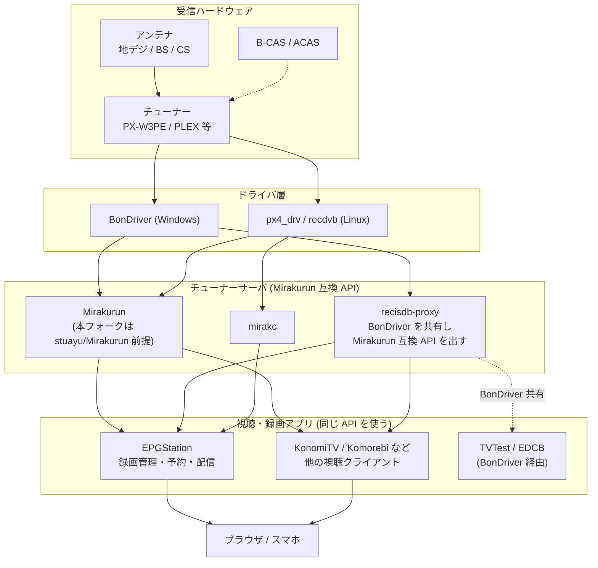
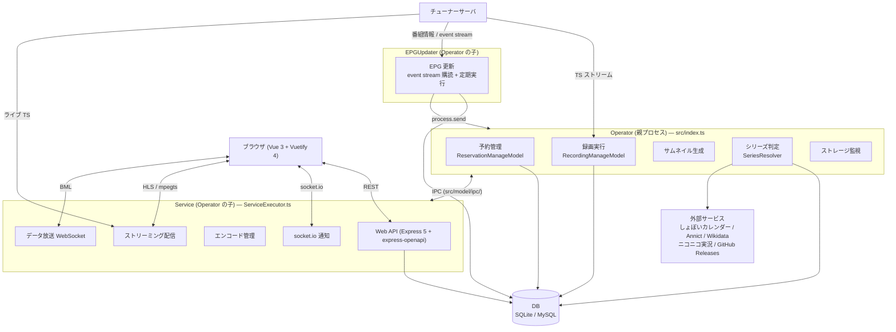
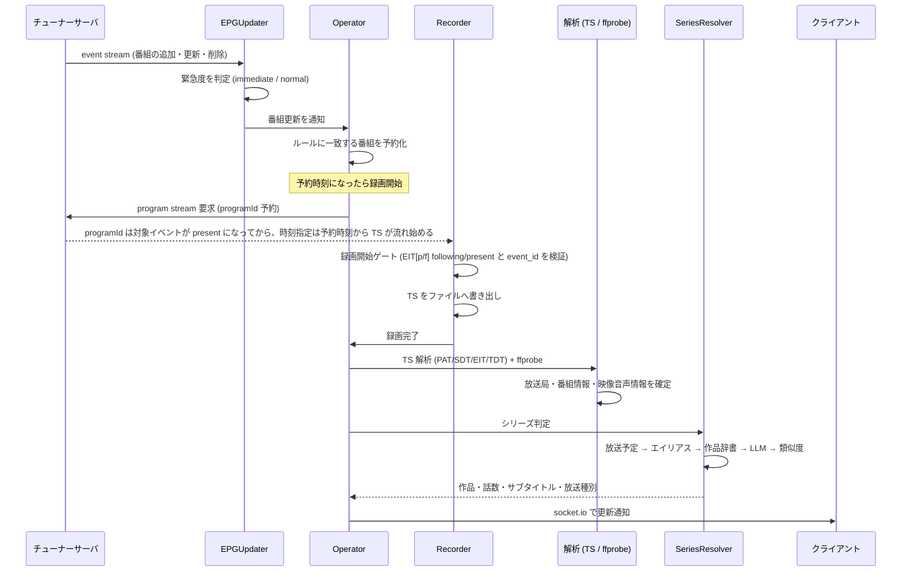
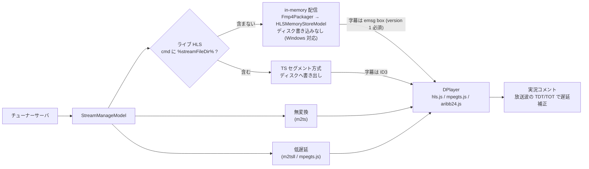
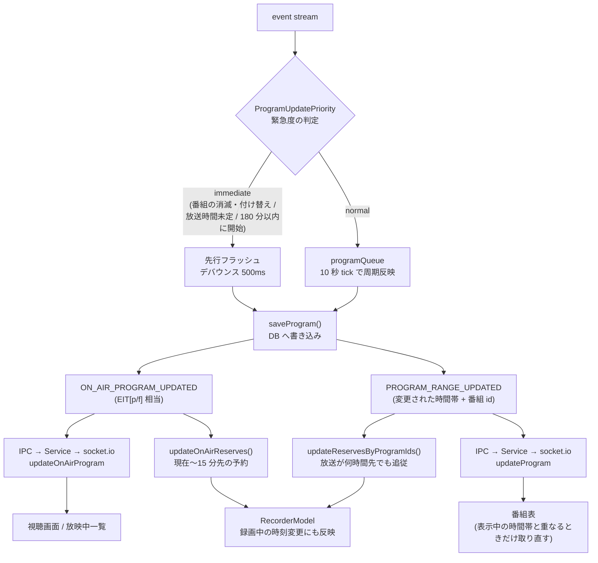

# アーキテクチャ図

EPGStation が「どこに置かれ」「中で何が動き」「録画が生まれるまでに何が起きるか」を図でまとめたもの。
文章での説明は [PROJECT_OVERVIEW.md](PROJECT_OVERVIEW.md) にある。

- [1. 受信環境の全体像](#1-受信環境の全体像)
- [2. EPGStation のプロセス構成](#2-epgstation-のプロセス構成)
- [3. 録画が生まれるまで](#3-録画が生まれるまで)
- [4. 視聴 (ストリーミング) の経路](#4-視聴-ストリーミング-の経路)
- [5. EPG のリアルタイム追従](#5-epg-のリアルタイム追従)

## 1. 受信環境の全体像

EPGStation は**チューナーを直接触らない**。チューナーサーバ (Mirakurun / その互換実装) の
HTTP API 越しに TS ストリームと番組情報を受け取るだけで、チューナーの取り合いは
チューナーサーバ側で調停される。同じ API を使う視聴クライアントを並べて共存できるのはこのため。

> [!NOTE]
> 本フォークは[フォーク版 Mirakurun (stuayu/Mirakurun)](https://github.com/stuayu/Mirakurun) との
> 組み合わせが前提。mirakc や互換実装でも起動はするが動作は保証しない。
> 互換実装を使う場合は `config.yml` の `tunerServerType` を明示すること
> (`/api/config/server` の応答で mirakurun / mirakc を自動判定しているため、
> 実装によっては誤判定して SSE を叩き続ける)。

## 2. EPGStation のプロセス構成

`dist/index.js` (Operator) を起動すると、Operator が Service を、さらに EPGUpdater を子として spawn する。
**録画に関わるものは Operator、Web に関わるものは Service** と覚えるとよい。

- Operator ⇔ Service は `src/model/ipc/` (`IPCServer` = 親、`IPCClient` = 子)
- **Service から Operator のモデルを直接呼ばない**。録画・予約・サムネイルの操作は必ず IPC 経由 (直接呼ぶとイベントが発火せず socket.io 通知やサムネイル生成が動かない)
- Service が落ちても Operator が再起動する。**Mirakurun 未接続でも起動する** (DB 接続だけは必須)

## 3. 録画が生まれるまで

判定の詳細 (順序・確度・辞書の使い分け) は [PROJECT_OVERVIEW.md](PROJECT_OVERVIEW.md#シリーズ判定) を参照。

## 4. 視聴 (ストリーミング) の経路

ライブ HLS は **cmd に `%streamFileDir%` を含むかどうかで 2 モードに分かれる**。
どちらも ARIB 字幕に対応する。

詳細と制限は [streaming-refresh.md](streaming-refresh.md) にある。

## 5. EPG のリアルタイム追従

災害時の特番割り込みや前番組の延長を、10 秒周期の tick や `epgUpdateIntervalTime` (既定 10 分) を
待たずに反映するための経路。

通知が届いたかは Operator と Service の両方のログで追える
(`send onAirProgramUpdated to client: ...` / `notify updateOnAirProgram: ... clients: N`)。
