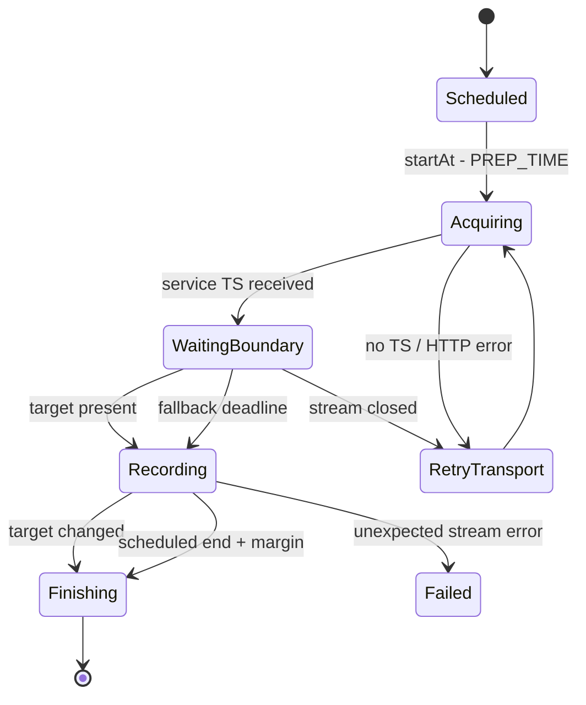

# programId 録画をサービスストリームで制御する設計

## 1. 結論 (実装確定: 2026-08-19)

`programId` 予約も Mirakurun の `getServiceStream` でチャンネルを事前確保し、番組の開始・終了境界を
EPGStation 側で判定する方式へ移行する。

実装では `RecordingStreamCreator` が `recording.programStreamMode` (既定 `service`) を解決し、
`priority` を各リクエスト option に渡す。`RecorderModel` の `RecordingStartGate` が TS 到着後に
target service の CRC/current-next 検証済み EIT[p/f] を判定し、soft 60 秒・hard 5 分、最大 8 MiB
リングバッファ (188-byte packet 単位)、following の時刻到達、present event 変更終了を適用する。開始理由・終了理由・first TS
をログへ出す。終了タイマーは programId にも適用し、`changeEndAt()` で EPG 追従更新を反映する。

変更理由は「通常視聴 API がチューナーを起こすから」ではない。`getProgramStream` は Mirakurun の
`TSFilter(eventId)` が対象イベントを検出するまで HTTP 応答データを出さないため、EPGStation から見ると
「チューナーが動いているが番組待ち」なのか「EIT が壊れている」のか「HTTP 応答自体が止まっている」のかを
判別できず、安全弁も開始できない。サービスストリームなら TS の到着と EIT の状態を EPGStation が直接観測し、
番組境界の厳密判定と録り逃し防止の期限を同じ状態機械で制御できる。

単純な API 置換にはしない。現在 Mirakurun が担っている対象イベントまでの出力保留と、イベント終了時の
ストリーム終了も EPGStation に移す必要がある。

## 2. 調査結果

### 2.1 Issue #13 の追加報告

- 22:00 開始の番組が 22:14 まで録画開始しなかった。
- 放映中画面で同じ局を視聴した時点から録画が始まったように見えた。
- 以前の報告では、放送中に予約を削除して作り直すと録画が始まった。

この事実は「長時間待っている program stream を作り直すと復旧する」ことは示すが、通常視聴リクエストが
既存の program stream を解除したことまでは示さない。

### 2.2 API の実装差

| 項目                          | `getProgramStream`                                  | `getServiceStream`         |
| ----------------------------- | --------------------------------------------------- | -------------------------- |
| チューナー選択・優先度        | 同じ (`recPriority`)                                | 同じ (`recPriority`)       |
| サービス PID の抽出           | あり                                                | あり                       |
| EIT[p/f] の対象 event_id 待ち | Mirakurun 内で待つ                                  | 待たない                   |
| HTTP データ開始               | event_id が present になった後                      | PMT 準備後すぐ             |
| 番組終了                      | present が別 event_id になったら Mirakurun が閉じる | 呼び出し側が閉じるまで継続 |
| 待機中の診断                  | EPGStation からはほぼ不可                           | TS/EIT/無信号を分離可能    |

Mirakurun の `TSFilter` は EIT actual p/f (`table_id=0x4e`, `section_number=0`) の先頭イベントだけを見て、
対象 event_id と一致するまで映像・音声 PID を出力しない。対象イベント終了後は短い猶予を置いてフィルタを閉じる。

本家 EPGStation も現在は programId 予約で `getProgramStream`、時刻指定予約で `getServiceStream` を使っている。
したがって今回の案は互換修正ではなく、番組境界の責務を EPGStation へ明示的に移す設計変更である。

### 2.3 実機で確認したこと

2026-08-19 05:55 JST に `fuku-mirak.stuayu.com` で、06:00 開始番組の program stream を待機させたまま
同一サービスの service stream を開始した。service stream は約 0.55 秒で TS を返したが、待機中の
program stream は開始せず、05:57:43 にリバースプロキシの HTTP 524 で終了した。通常視聴 API の呼び出し自体が
既存の番組フィルタを解除する挙動はこの環境では再現しなかった。一方、Mirakurun の program stream handler は
待機中に `flushHeaders()` しないため、データが出るまで HTTP 応答も観測できず、リバースプロキシ経由では番組開始前に
timeout し得ることを実測した。Windows の EPGStation は localhost 直結なので、この 524 は同実機の録画失敗原因ではない。

同じ環境の現在番組では program stream の初回データが約 2.67 秒、service stream が約 1.33 秒だった。
どちらも HTTP 200 と TS を返したため、平常時の API 自体は動作している。

Windows 実機は EPGStation `ab50167f` で、調査時点の `main` (`bdb5ee7e`) より古い。
また Mirakurun は 2026-08-18 21:25 頃に複数チューナーの `Could not get IBonDriver`、respawn、fault を記録し、
21:26、21:30、22:10 頃に再起動していた。現在値にも `tunerDeviceRespawn: 4` と大きな timer 遅延がある。
これは Issue 報告者の Ubuntu 環境の原因証拠ではないが、Windows 実機での録画試験では API 選択と外部チューナー障害を
別々に評価する必要がある。

## 3. 目標と非目標

### 目標

- programId 予約で、Mirakurun 内部の EIT 待ちが永久に見える状態をなくす。
- TS 未到着、EIT 未検出、別 event_id、対象 event_id、ストリーム断を区別して記録する。
- EIT が正常なら対象番組だけを録画し、EIT が異常でも設定した期限後は録画開始して全損を避ける。
- 番組終了、延長、予約更新、イベントリレーの現在の挙動を維持する。
- 同一物理チャンネルの視聴有無に録画開始が依存しないことを試験で保証する。

### 非目標

- チューナー、BonDriver、ネットワーク自体が TS を供給できない場合の録画保証。
- 壊れた EIT しか無い状態で、前番組と対象番組の境界を常に正確に復元すること。
- Mirakurun の program stream API の廃止または変更。

## 4. 提案する構成

### 4.1 `RecordingSourceSession`

`RecordingStreamCreator.create()` が裸の `IncomingMessage` を返す構造を、録画元と終了期限を所有する
セッションへ段階的に置き換える。

```ts
interface RecordingSourceSession {
    readonly stream: NodeJS.ReadableStream;
    readonly tunerUserId?: string;
    updateEndAt(endAt: number): void;
    close(reason: RecordingSourceCloseReason): void;
}
```

セッションは次を所有する。

- `getServiceStream({ id: channelId, decode: true, priority, signal })`
- 初回 TS と無通信タイムアウト
- EIT 境界コントローラー
- 終了期限タイマー
- AbortController とリスナーの一括解放

優先度は共有クライアントの `mirakurun.priority` を書き換えず、各リクエストの `priority` オプションで明示する。

### 4.2 `ProgramBoundaryController`

EIT の解析結果、予定時刻、経過時間から副作用のない判定を返す。

```ts
type StartReason = 'present-event-match' | 'following-time-reached' | 'eit-soft-timeout' | 'eit-hard-timeout';
type EndReason = 'present-event-changed' | 'scheduled-end' | 'stream-ended' | 'canceled';
```

既存の `EitPresentParser` と `RecordingStartGate` の判定をここへ統合し、programId と時刻指定で異なるのは
「対象 event_id があるか」だけにする。

### 4.3 状態遷移



「番組開始待ち」と「伝送障害」を同じ再試行回数で扱わない既存方針は維持する。ただし service stream では
TS が到着した時点で伝送正常と判断できるため、EIT 待ち中にストリームを 60 秒ごとに開き直さない。

## 5. 開始判定

1. `startAt - PREP_TIME` に service stream を録画優先度で開く。
2. `firstDataTimeoutMs` 内に TS が来なければ伝送障害としてストリームを閉じ、既存の error retry へ回す。
3. TS 到着後は対象 serviceId の有効な EIT[p/f] だけを解析する。CRC 不正、`current_next_indicator=0`、
   他サービスの EIT は無視する。
4. programId 予約は present の event_id 一致を通常の開始条件にする。
5. following の event_id が対象で、放送 start_time に達した場合は present 更新前でも開始できる。
6. EIT が欠落・停滞しても録画を全損しないよう、2 段階の期限を設ける。
    - soft timeout: 有効な EIT を一度も得られない場合に開始する。
    - hard timeout: 別 event_id のまま更新されない場合にも開始する。
7. 期限値は既存 `startGateTimeoutMs` を soft timeout として再利用し、hard timeout は別設定にする。
   初期案は soft 60 秒、hard 5 分。正確な値は実放送試験後に確定する。

hard timeout は「前番組を含める可能性」と「対象番組を全損しない」の明示的なトレードオフである。
開始理由を録画メタデータまたは少なくとも info ログへ残し、正常な EIT 一致と同じ成功扱いに見せない。

EIT の送出が番組境界より遅れる場合に冒頭を落とさないため、待機中は最後の一定量だけ TS をリングバッファへ保持する。
対象 event_id を検出したらバッファを先に書き出す。初期上限は Mirakurun の待機バッファと同程度の 8 MiB とし、
同時録画数に比例するメモリ上限をテストする。期限前の全 TS を無制限に保持してはならない。

## 6. 終了判定

service stream は番組終了時に自動で閉じないため、次を必須とする。

- 対象 event_id で録画開始した後、valid present が別 event_id に変わったら短いデバウンス後に正常終了する。
- `reserve.endAt + endMargin` をハード終了期限にする。EIT が来ない場合も必ず終了する。
- EPG 追従で `endAt` が変わったら programId 予約を含め終了タイマーを再設定する。
- 開始後の一時的な EIT 欠落だけでは終了しない。
- 対象 event_id を一度も確認できず fallback 開始した録画は、EIT で対象を確認した時点から通常の終了判定へ移る。
  最後まで確認できなければ予定終了タイマーで閉じる。
- イベントリレー確認タイマーは維持し、リレー先は別セッションとして扱う。

終了理由を `present-event-changed`、`scheduled-end`、`transport-error` に分ける。現在の
`stream.finished()` だけでは service stream の正常終了と障害終了を判別できないため、セッションが理由を渡す。

## 7. 再試行とキャンセル

- HTTP エラー、初回 TS timeout、開始前の stream close は transport retry。
- TS が来ているが EIT が一致しない状態は同じセッション内で待ち、retry 回数を消費しない。
- キャンセル、予約削除、開始時刻変更では AbortController、終了タイマー、EIT timer、リングバッファを同期的に無効化する。
- `prepGeneration` を維持し、古い非同期チェーンが新しい予約状態へ録画開始・失敗通知を返さないようにする。
- 再試行時は同一 reserveId の旧セッションが閉じたことを確認してから新しいセッションを登録する。

## 8. 可観測性

予約ごとに最低限、次の時刻と識別子を 1 行ずつ記録する。

- service stream request: reserveId, programId, channelId, eventId, priority
- HTTP response: status, tuner user ID, elapsedMs
- first TS: elapsedMs, bytes
- first valid EIT: present/following eventId と startAt
- recording start: reason, waitMs, bufferedBytes
- recording end: reason, actual start/end, scheduled start/end
- retry: transport/boundary の分類、回数、次回時刻

これにより「視聴したら始まった」という報告を、同じチューナーへの相乗り、EIT 更新、再チューニング、単なる時刻一致に
分解できる。UI の `isFollowingSchedule` は `WaitingBoundary` のときだけ true とする。

## 9. 移行とロールバック

1. `recording.programStreamMode: program | service` を追加し、初回リリースでは `service` を既定、`program` を
   即時ロールバック用に残す。
2. 時刻指定予約は既に service stream のため、同じセッションと境界コントローラーへ寄せるが、挙動変更は分けてテストする。
3. 1 リリース以上、開始・終了理由と fallback 回数を収集する。
4. `service` で exact match、延長、EIT 欠落、イベントリレーが安定した後に legacy program 経路を削除する。

設定追加時は `ConfigSchema.ts`、両 config template、`conf-manual.md` を同時更新する。

## 10. テスト計画

### Unit

- target present で開始、別 eventId では待機。
- following の対象 start_time 到達で開始。
- CRC 不正、current/next 不一致、他 serviceId を無視。
- EIT 無しの soft timeout、別 eventId 固着の hard timeout。
- 開始前リングバッファの上限と書き出し順。
- 対象から別 eventId への遷移、デバウンス、予定終了 fallback。
- `endAt` 更新、キャンセル、世代交代後に古い timer が発火しない。

### Mirakurun stub integration

- programId 予約でも `/api/services/{channelId}/stream` を使い、`recPriority` をヘッダーへ渡す。
- `/api/programs/{programId}/stream` を呼ばない。
- HTTP 200 だが無データ、途中切断、遅延 EIT、同一 multiplex の複数録画を再現する。
- 通常視聴 stream の開始・終了が録画状態を変えない。

### 実放送・実予約

- 通常番組から次番組への連続予約。
- 前番組延長、放送時間未定、対象番組の早始まり。
- EIT を意図的に除去・固定したプロキシ経路で soft/hard fallback。
- 録画中に終了時刻を延長・短縮。
- イベントリレー。
- 同局視聴の開始前・開始待ち中・録画中の 3 条件。
- DB の Recorded 登録、TS サイズ・先頭/末尾、終了通知、予約削除まで確認する。

Windows 実機では先に `main` と同じ EPGStation を配備し、Mirakurun のチューナー fault と scan job が無い時間帯で
基準試験を取る。その後、障害を注入した試験を別に行う。外部チューナー障害を API 方式の成否へ混ぜない。

## 11. 受け入れ条件

- TS が供給されている予約が、開始理由を出さずに `preparing` のまま残らない。
- EIT 正常時は対象 event_id で開始・終了し、前後番組を恒常的に含めない。
- EIT 欠落時は設定した期限内に fallback 開始し、録画全損を避ける。
- 予約終了後は service stream、timer、listener、リングバッファが残らない。
- 同局の通常視聴有無で録画の開始時刻・状態遷移が変わらない。
- 延長、終了時刻更新、イベントリレー、キャンセルの既存シナリオが通る。
- fallback と transport error の件数をログから集計できる。

## 12. Issue 報告者へ追加で依頼する証跡

実装前の原因確定には、再発時刻の前後 20 分について次を依頼する。

- EPGStation Operator の debug ログ。
- Mirakurun ログの `TSFilter`, `TunerDevice`, 対象 `/programs/.../stream` と `/services/.../stream` 行。
- EPGStation / Mirakurun の正確な commit または version。
- reserveId, programId, channelId、番組名、予定開始・終了時刻。
- 視聴直前と直後の `/api/tuners`。

この証跡が無くても service stream 方式は可観測性と安全弁を改善するため設計価値があるが、追加コメントの直接原因は
現時点では「通常視聴が番組 API を解除した」と断定しない。
