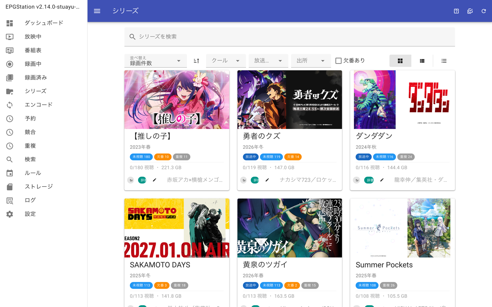
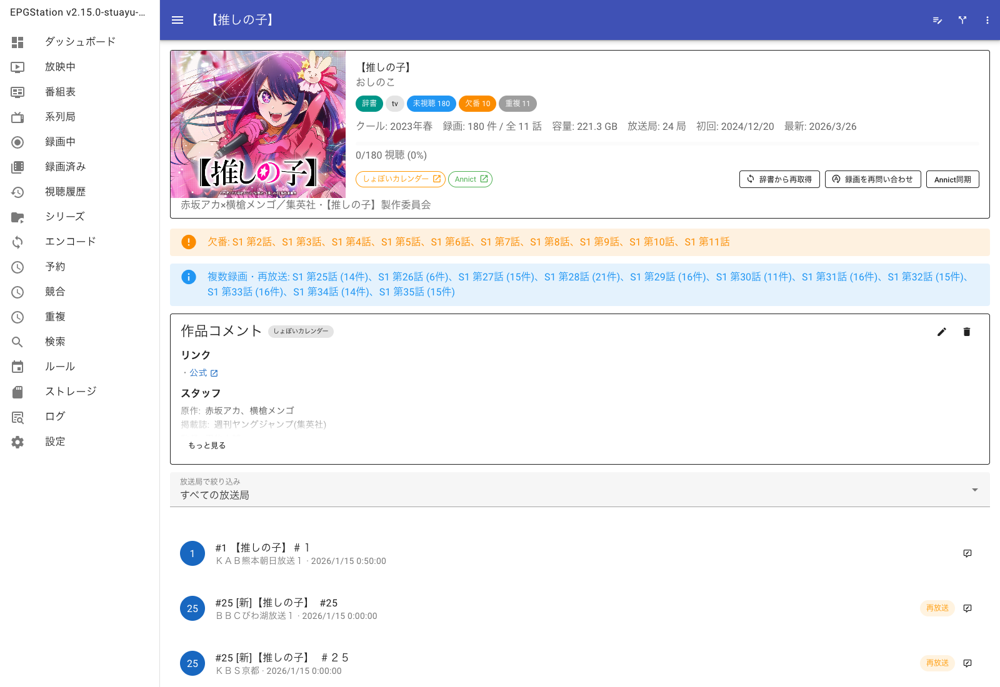
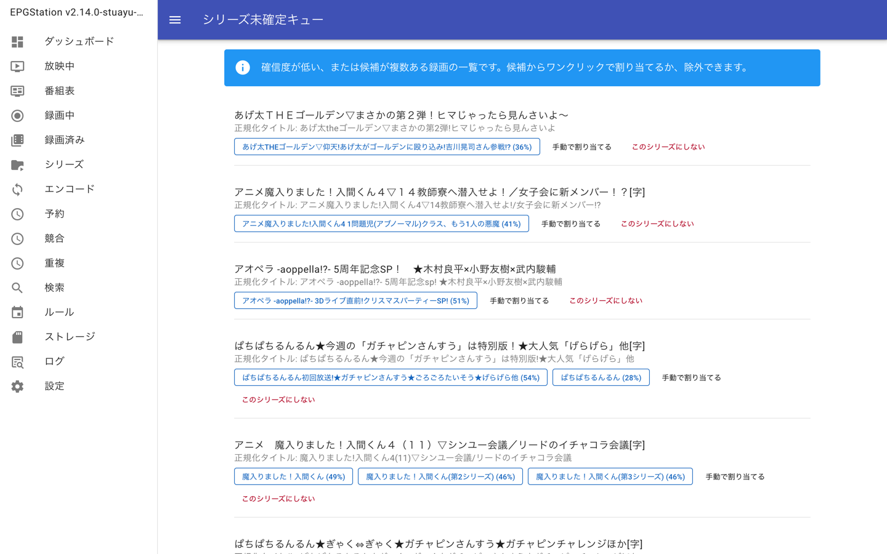
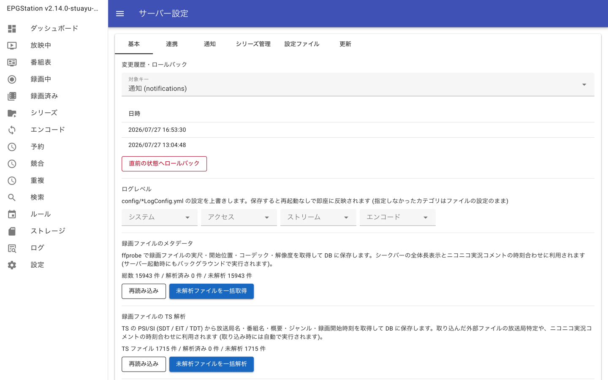
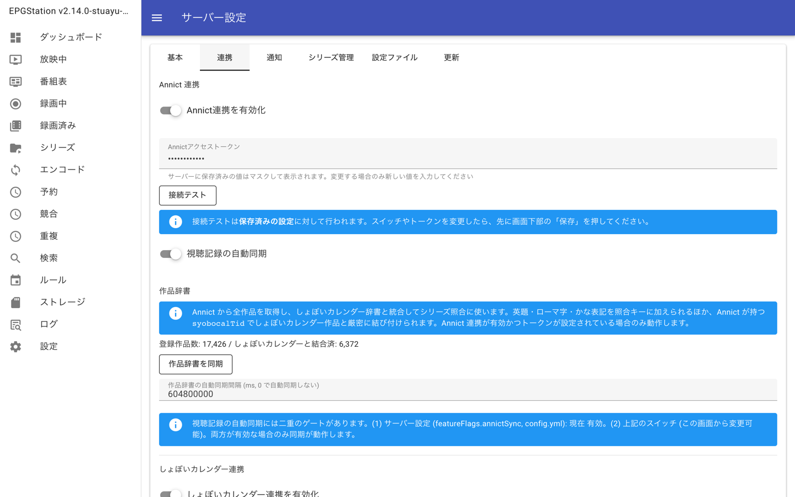
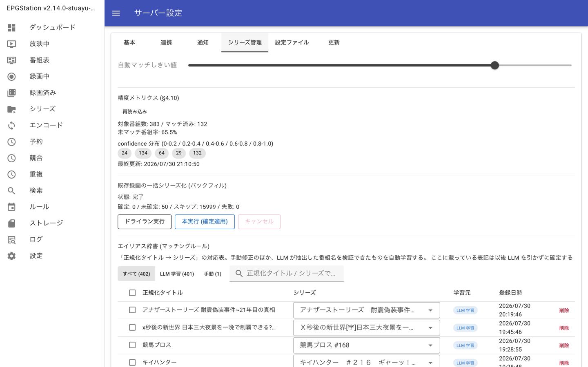
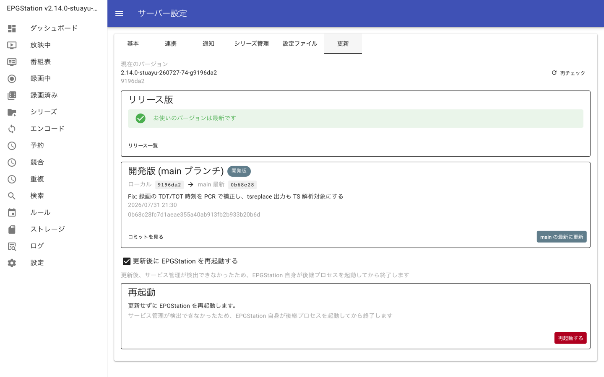

# このフォークプロジェクトについて

このフォーク版EPGStationを利用するには[フォーク版Mirakurun](https://github.com/stuayu/Mirakurun)が必要です。  
[フォーク版Mirakurun](https://github.com/stuayu/Mirakurun)は本家EPGStation環境下でも多分動作すると思いますが保証しません。
変更点などはコミットログや[変更箇所](#変更箇所)をご覧ください。

# windows用 mirakurun-epgstation セットアップガイド

- [このフォークプロジェクトについて](#このフォークプロジェクトについて)
- [windows用 mirakurun-epgstation セットアップガイド](#windows用-mirakurun-epgstation-セットアップガイド)
    - [Mirakurunインストール編](#mirakurunインストール編)
    - [EPGStationインストール編](#epgstationインストール編)
    - [変更箇所](#変更箇所)

## Mirakurunインストール編

改変版のMirakrunの導入について解説します.  
事前準備としてNodejs-LTSをインストールしてください。  
~~おすすめは[chocolatey](https://chocolatey.org/)をインストールしてから以下のコマンドを実行する方法です。~~  
Windows10/11から標準で利用可能になったwingetでインストールすることをお勧めします。  
公式サイトからのインストールでも動作します。

```powershell
winget install OpenJS.NodeJS.LTS
```

- フォーク版Mirakurunを導入する
    1. [Github](https://github.com/stuayu/Mirakurun)からソースコードをクローンし、ビルドを行う。
        ```powershell
        git clone https://github.com/stuayu/Mirakurun -b stuayu-main
        cd Mirakurun
        npm install
        npm run build
        ```
    2. 各種設定ファイルの編集  
       チューナー・サーバ・チャンネルの設定ファイル：`Mirakurun\local_config`  
       サービスの**LOGデータ**・Logoデータ・番組情報・チャンネル情報の保存先：`Mirakurun\local_data`  
       新規インストール時`local_data`フォルダ内のデータを削除することをお勧めします。

    3. サービスとして登録

        ```powershell
        npm run postinstall -g # 管理者権限で実行する
        ```

    4. ブラウザからアクセスする  
       `http://127.0.0.1:40772` or `http://localhost:40772`でアクセスできます。  
       アクセスできない場合はMirakurunのログを確認してください、起動できない理由が書いてあるはずです。
    5. Mirakurunの削除方法
        ```powershell
        npm run preuninstall -g # 管理者権限で実行する
        ```
        エクスプローラー等でフォルダを削除する。

## EPGStationインストール編

基本的には公式と一緒の手順です。  
改変前のEPGStationで実行したバックアップはルール予約のみ互換性がありません。手動でバックアップファイル内の予約データの箇所を削除するか、  
GR,BS,CSの箇所をNW1~40のチャンネル空間を追加することで正常にリストアできます。  
過去すでにMySQL(MariaDB)などを利用していた場合には、テーブルをドロップして再びテーブルを作成してください。

0. EPGStationデータベースからバックアップを作成する(データを引き継ぐ場合)

    ```powershell
    npm run backup {今日の日付など}.sql
    ```

    作成された`{今日の日付など}.sql`を保存しておいてください。  
    バックアップが完了したのち、データベースのテーブルを削除しておきます。

1. [Github](https://github.com/stuayu/EPGStation)からソースコードをクローンし、ビルドを行う。

    ```powershell
    git clone https://github.com/stuayu/EPGStation -b main
    cd EPGStation
    npm run all-install
    npm run build-win # Windowsの場合のみ実行する
    npm run build # Linux/Macの場合のみ実行する
    ```

2. 設定ファイルの編集  
   `config`フォルダ内に配置されているyamlファイルを各自にあった、設定ファイルに変更してください。

3. Windowsサービスとして登録

    ```powershell
    npm run install-win-service # 管理者権限必須
    ```

    エラーが起きた場合は管理者権限で`SC stop epgstation`と`SC delete epgstation`を実行してください。  
    存在してしまっているサービスを削除することができます。

4. MariaDBのインストール
    1. epgstationテーブルのセットアップ
        ```powershell
        winget install MariaDB.Server
        ```
    2. epgstationテーブルへのアクセス権設定（LinuxでもWindowsでも可能）  
       Windows環境の場合、環境変数にmysqlが登録されていない場合は、mysqlが見つからない場合があります。  
       Windows環境ではGUIで設定ができますので、以下の記事を参考に設定を行ってください。  
       https://zenn.dev/stuayu/articles/412f3faf5713a0
        ```powershell
        mysql -u root -e 'CREATE DATABASE epgstation CHARACTER SET utf8mb4 COLLATE utf8mb4_general_ci;'
        mysql -u root -e 'CREATE USER "epgstation"@"localhost" IDENTIFIED BY "epgstation";'
        mysql -u root -e 'GRANT ALL ON epgstation.* TO "epgstation"@"localhost";'
        ```
    3. バックアップしたデータの復元

        > [!IMPORTANT]
        > バックアップファイルからの復元は、EPGStationがWebから正常にアクセスできることを確認した後に行ってください。

        ```powershell
        npm run restore {今日の日付など}.sql
        ```

        復元作業中に、ruleの部分で失敗する場合は、手動でsqlファイルを修正してください。

## 画面キャプチャ

フォーク版で追加した主な画面。画像はクリックで原寸表示。

### シリーズ管理

| 画面                                                                                                    | 説明                                                                                                                                                                                                       |
| ------------------------------------------------------------------------------------------------------- | ---------------------------------------------------------------------------------------------------------------------------------------------------------------------------------------------------------- |
| [](../img/screenshots/series-list.png)               | シリーズ一覧 (`/series`)。並べ替え・クール絞り込み・出所 (辞書起点 / ローカル生成) 絞り込み、グリッド / リスト / コンパクトの 3 表示。未視聴・欠番・重複のバッジと Annict 由来のアイキャッチ画像を表示する |
| [](../img/screenshots/series-detail.png)           | シリーズ詳細 (`/series/{id}`)。話数順に録画を並べ、欠番と複数録画・再放送をアラートで示す。放送局での絞り込み、話数・放送種別の一括編集、Annict 同期に対応                                                 |
| [](../img/screenshots/series-pending.png) | シリーズ未確定キュー (`/series/pending`)。確信度が低い / 候補が複数ある録画を一覧し、候補ボタンからワンクリックで割り当てるか、シリーズ化の対象から除外できる                                              |

### サーバー設定 (`/settings/system`)

| 画面                                                                                                                             | 説明                                                                                                                                                    |
| -------------------------------------------------------------------------------------------------------------------------------- | ------------------------------------------------------------------------------------------------------------------------------------------------------- |
| [](../img/screenshots/system-settings-basic.png)             | 基本タブ。設定の変更履歴とロールバック、ログレベルの即時変更、録画ファイルの ffprobe メタデータ / TS (PSI/SI) 解析の一括実行                            |
| [](../img/screenshots/system-settings-integration.png) | 連携タブ。Annict / しょぼいカレンダー / Wikidata の各連携と作品辞書の同期。アクセストークンはマスク表示され、接続テストを画面から実行できる             |
| [](../img/screenshots/system-settings-series.png)   | シリーズ管理タブ。自動マッチしきい値、精度メトリクス、既存録画の一括シリーズ化 (バックフィル)、エイリアス辞書 (マッチングルール) の付け替え・削除       |
| [](../img/screenshots/system-settings-update.png)           | 更新タブ。リリース版と開発版 (main ブランチ) の 2 系統を表示し、ワンクリックで更新できる。更新後の再起動はサービス管理 (systemd / docker など) に委ねる |

## 変更箇所

- **放送中画面でチャンネルを選んでも DPlayer の映像が切り替わらないバグを修正した**
    - **原因**: 右パネルのチャンネル一覧からの切り替えは `/onair/watch` の query だけが変わる遷移なので、Vue Router は同じコンポーネントを使い回す。`videoParam` は書き換わるが `VideoContainer` に `key` が無く `videoParam.type` も同じのため、`LiveMpegTsVideo` / `LiveHLSVideo` が再マウントされない。各 video コンポーネントは `mounted()` でしか DPlayer を生成せず props の変化を見ていないため、古いチャンネルの映像が流れ続けていた
    - **修正**: 録画視聴側 (`WatchRecorded.vue` / `WatchRecordedStreaming.vue`) と同じやり方に揃え、`WatchOnAir.vue` の `VideoContainer` にも `videoKey` (配信種別 + 放送局 + エンコード設定) を付けて作り直すようにした。あわせて route 変更時に `videoParam` と実況コメントをリセットするようにした
- **視聴画面 (放送中・録画再生) をダークモード・ライトモードの両方に対応させた**
    - 視聴画面の配色は `#15100f` や `rgba(255, 255, 255, ...)` のハードコードだったため、ライトモードでも常に黑背景のままだった
    - `WatchLayout.vue` で `--watch-bg` / `--watch-fg*` / `--watch-surface-*` / `--watch-border*` といった CSS 変数を一括定義し、`$vuetify.theme.global.current.dark` を見てルート要素に `is-light` クラスを付ける方式にした
        - CSS 変数は scoped style の影響を受けず DOM を辿って継承されるので、子コンポーネントの scoped style からもそのまま参照できる
        - 対応ファイル: `WatchLayout.vue`, `WatchTopBar.vue`, `WatchSideBar.vue`, `WatchSidePanel.vue`, `WatchPanelProgram.vue`, `WatchPanelComments.vue`, `WatchPanelChannels.vue`, `NextUpPanel.vue`
    - 実況コメントの既定色は白なので、ライトモードでは右パネルのコメントが白背景に埋もれて読めなくなるため、白系のときだけテーマ色を使うようにした (`getCommentColor()`)
    - 映像の上に重なるチャンネル切替ボタンと映像の黑帯は、両モードで成立するため黑背景・白文字のままにしている

- **EDCB からの録画情報登録と TS ファイルのアップロードが失敗していたのを直した**
    - **背景**: 「サーバー上のファイル指定 (`localFilePath`)」を `POST /api/videos/upload` に追加した際、multipart/form-data で届く**空文字**を考慮していなかった
    - **アップロードが壊れていた原因 (1)**: `ServiceServer.uploadFile()` が `req.body.recordedId` を無条件に `parseInt()` していたため、空文字や数値以外が届くと **`NaN`** になり、OpenAPI の `integer` 検証で 400 になっていた。これにより「`recordedId` を省略して TS から番組情報を自動作成する」経路が使えなくなっていた。空文字・数値以外は「未指定」としてキーごと落とすようにした
    - **アップロードが壊れていた原因 (2)**: `localFilePath` が空文字で届くと `typeof === 'string'` の判定を抜けてしまい、**ブラウザからの通常の TS アップロードなのに** `ImportPathValidator` の importDirs 検証に入り、`importDirs` 未設定の環境で `ImportDirsNotConfigured` で失敗していた。API 層 (`videos/upload.ts`) とモデル層 (`RecordedApiModel.addUploadedVideoFile`) の両方で**非空のときだけ**サーバー上のファイル指定とみなすようにした (`subDirectory` も同様に正規化)
    - **EDCB 取り込みが壊れていた原因**: `config.yml` に `importDirs` を書いていないと `importDirs` は空配列になるが、スキャンは `ImportDirNotFound` (= 名前違い) と区別がつかないエラーを返していた。**`importDirs` ごと未設定の場合は `ImportDirsNotConfigured`** を返し、設定漏れと名前違いを切り分けられるようにした
        - EDCB の録画を取り込むには `config.yml` の `importDirs` に録画フォルダを登録する必要がある (テンプレートではコメントアウトされている)
    - **テスト**: `test/ut/recorded-upload-local-file.test.js` に「空文字の `localFilePath` は未指定扱い」「`importDirs` 未設定時は `ImportDirsNotConfigured`」を追加

- **前番組の延長中に録画が始まって前番組が録れてしまうのを防いだ (EIT[p/f] による録画開始ゲート)**
    - **背景**: programId 予約は Mirakurun が EIT[p/f] で対象イベントが present になるまでデータを流さないため問題にならないが、**時刻指定予約はチャンネルストリームを使う**ので予定時刻から即データが流れる。前番組が「放送時間未定」(ARIB の duration = 0xFFFFFF) で延長していると、その前番組が録画ファイルとして残り、録画詳細も作られてしまっていた
    - **EIT[p/f] を録画側でも読む**: `EitPresentParser` (`src/model/operator/recording/`) が録画ストリームから EIT[p/f] present (PID 0x12 / table_id 0x4E / section 0) を取り出し、放送中の番組の `eventId` / 開始時刻 / 番組長を返す。`BitParser` と同じくパケット分解とセクション組み立てだけを自前で行う (aribts の TsSectionParser は録画経路に挟むには重い)
    - **開始判定**: `RecordingStartGate` (`decideRecordingStart()`) が「いま流れているのが予約した番組か」を判断する。programId 予約は `eventId` の一致、時刻指定予約は present の開始時刻が予約開始時刻 (既定 2 分のマージン込み) 以降かで見る。**放送時間未定の番組が流れている間は延長中とみなして待つ**
    - **待っている間のデータは捨てる**: `RecorderModel.doRecord()` はゲートを通るまで録画ファイルを作らず pipe もしない (ゲート通過までストリームは `pause()` しておく)。そのため前番組は録画ファイルにも録画一覧にも残らない
    - **録り逃さないための安全弁**: EIT[p/f] を読めないまま `startGateTimeoutMs` (既定 60 秒) を過ぎたら録画を開始する。予約終了時刻を過ぎても始まらない場合は `WaitingForEventStart` として従来の再試行 (最大 3 時間待ち) へ回す。待機中は予約の「追従中」表示が点く
    - **設定**: `config.yml` の `recording` に `startGateEnabled` (既定 true) / `startGateTimeoutMs` / `startGateStartMarginMs` を追加した
    - **テスト**: `test/ut/recording-start-gate.test.js` (判定の分岐、設定の丸め、EIT[p/f] セクションの解析)

- **録画の再生速度がライブ視聴にも波及していたのを直した**
    - **原因**: DPlayer は再生速度を localStorage (`dplayer-speed`) に保存し、次に生成したプレイヤーへ自動で適用する。録画とライブで同じ localStorage を共有しているため、録画を倍速で見た後にライブ視聴を開くとライブまで倍速で始まっていた
    - **対処**: `BaseVideo.createDPlayer()` を追加し、**ライブ (`options.live === true`) のときだけ**生成中に保存値を等速に見せ、生成後に元の値へ戻す。さらにライブ中に速度を変えても `user.set('speed')` を保存へ通さない (画面内では効くが録画側の設定を書き換えない)。録画側の速度設定は従来通り保持される

- **ログ画面をログの構造に沿って表示するようにした**
    - **背景**: ログを 1 行そのまま出し、行全体をレベルで色付けするだけだったため、時刻・レベル・カテゴリ・本文が読み分けられなかった
    - **実装**: `client/src/util/LogLineParser.ts` が log4js の既定パターン (`[時刻] [レベル] カテゴリ - 本文`) を分解する。パターンに合わない行 (スタックトレースの続きなど) は本文だけの行として扱う。画面では時刻・レベルバッジ・カテゴリ・本文を分けて描画し、ERROR / FATAL と WARN は背景色と左のラインで目立たせる。絞り込みキーワードは本文中で強調する (`v-html` は使わず分割して描画する)

- **系列局の一覧画面を追加した (選ぶと系列別の番組表へ遷移する)**
    - **系列別が機能していなかった原因**: サーバは `GET /api/channels` に系列 (`affiliation`) を付けていたが、クライアントの `ChannelModel.toChannel()` が `region` だけを写して **`affiliation` を落としていた**。そのため系列別のサイドメニュー・放映中のタブ・系列局一覧がすべて空になっていた (実データ 200 局で系列判定自体は正しく効いている: NHK総合 27 / Eテレ 32 / 日テレ系 27 / テレ朝系 31 / TBS系 30 / フジ系 20 / テレ東系 4 / 独立系 21 / 未分類 8)
    - **切り替え UI の集約**: 番組表・放映中の 3 点リーダーにあった「放送局のまとめ方 (地域別 / 系列別)」を削除し、**系列局の一覧画面 (`/affiliations`) へ遷移する導線**に置き換えた (`ChannelGroupingMenu.vue` は削除)。サイドメニュー・放映中タブを系列別にする切り替えは系列局ページのスイッチへ移した
    - **背景**: 系列別のまとめ方は番組表・放映中の 3 点リーダーとサイドメニューにしか無く、「どの系列にどの局があるか」を見る画面が無かった
    - **UI**: `/affiliations` (`client/src/views/Affiliations.vue`) を追加し、ナビゲーションに「系列局」を出す。系列ごとにカードで並べ、カードを選ぶと `/guide?affiliation={id}` (系列別の番組表) へ、局のチップを選ぶとその局の番組表へ移動する。系列の判定はサーバが `GET /api/channels` に付ける `channel.affiliation` をそのまま使うため、新しい API は増やしていない
    - **関東の独立局**: 東京MX・群馬テレビ・とちぎテレビ・テレビ埼玉・千葉テレビ・tvk は同梱データ (`BroadcastAffiliationData`) で系列識別 0x07 (独立系) にまとまる。県外地上波 (`NWxx`) でも同じ扱いになることを `test/ut/broadcast-affiliation.test.js` で固定した
    - **切り替えスイッチが保存されていなかったのを直した**: 「サイドメニューの番組表・放映中のタブを系列別にする」スイッチは `ISettingStorageModel.getSavedValue()` の戻り値 (localStorage から作り直した別オブジェクト) を書き換えてから `save()` を呼んでいた。`AbstractStorageBaseModel.save()` が保存するのは `tmp` なので変更が捨てられ、**スイッチを入れてもサイドメニュー・放映中のタブが地域別のままだった**。`resetTmpValue()` で保存値を `tmp` へ読み直してから 1 項目だけ書き換えて保存するようにした
    - **系列別番組表の並び順**: 系列で絞った番組表は**キー局を先頭に置き、それ以降は都道府県コード順**で並べる (`client/src/util/AffiliationChannelSort.ts` の `sortByKeyStationAndPrefecture()` を `GuideState.filterSchedules()` から使う)。キー局は関東広域の 7 局の `networkId` (32736〜32742 = NHK 総合 / NHK E テレ / 日テレ / TBS / フジ / テレ朝 / テレ東) で判定し、都道府県コードは `channel.region.order` (JIS X 0401。広域圏は最小の県コード、判定不能は 99) をそのまま使う

- **視聴履歴の一覧画面を追加した**
    - **背景**: 視聴履歴 (`watch_history`) は再生位置と視聴状態を持っていたが、録画一覧のバッジと再生時の続き再生に使うだけで、「最近見た番組」を一覧する画面が無かった
    - **API**: `GET /api/watch-history` (最後に見た順・`offset` / `limit` / `status` / `isHalfWidth`) と `DELETE /api/watch-history/{videoFileId}` を追加した。1 件ずつは `WatchHistoryRecord` (履歴 + 対象の `RecordedItem`) で返し、**録画が削除済みの履歴は `recorded: null` にして行だけ残す** (画面から履歴を消せるようにするため)。機能フラグ `watchHistory` が無効なら 404
    - **UI**: `/watch-history` (`client/src/views/WatchHistory.vue`) を追加し、ナビゲーションに「視聴履歴」を出す (機能フラグ有効時のみ)。サムネイル・放送局・最終視聴日時・再生位置の進捗バー・視聴状態を並べ、行をクリックすると続きから再生する。「すべて / 視聴中 / 視聴済み」で絞り込める
    - **テスト**: `test/ut/watch-history-api.test.js`

- **録画 1 件だけ TS を再解析できるようにした (過去に取り込んだ録画の番組情報の補完)**
    - **背景**: 取り込み時に番組情報が入らなかった録画や、解析ロジックを更新した後の録画を直す手段が「全件を強制再解析」しか無かった。件数が多い環境では 1 件直すために全件を舐めることになる
    - **API**: `POST /api/videos/analyze` の `StartVideoAnalyzeJobOption` に `recordedId` を追加した (省略時は従来通り全件)。指定した場合はその録画のビデオファイルだけを対象にし、**解析済みでも必ずやり直す** (`mode` は `all` 扱い)。対象ファイルが無ければ `VideoFileIsNotFound` (404)。`VideoAnalyzeJob` にも `recordedId` を載せ、進捗表示から対象が分かるようにした
    - **UI**: 録画詳細の 3 点リーダーに「TS を再解析」を追加した。サーバー設定の TS 解析パネルには、既存録画の空の項目が「全件を強制再解析」で埋まること (既存値は上書きしないこと) を明記した

- **しょぼいカレンダーのコメントを Wiki 記法として描画し、シリーズ画面の導線を整理した**
    - **背景**: しょぼいカレンダー由来のコメントは独自の Wiki 記法 (`*見出し` / `-箇条書き` / `:項目:内容` / `[[ラベル URL]]` / `!注記`) で書かれているが、画面ではそのまま文字列として出していたため「\*リンク」「:監督:○○」のような生の記法が並んでいた
    - **レンダラ**: `client/src/util/SyobocalWiki.ts` が記法を解析してブロック (見出し・箇条書き・定義リスト・注記・段落) とインライン要素 (テキスト・リンク) の構造にする。描画は `client/src/components/series/SyobocalComment.vue` + `WikiInlineText.vue` が行い、**`v-html` は使わない** (解析済みの構造をテンプレートで描画するため、コメント本文から HTML が混入しない)。リンクは `http(s)` のみ許可し、別タブで開く (`rel="noopener noreferrer"`)
    - **適用箇所**: シリーズ詳細の作品コメント・放送回コメント、録画詳細のシリーズ情報欄の両方。長い作品コメントは既定で折りたたみ、「もっと見る」で展開する (従来の `-webkit-line-clamp` から、末尾をフェードさせる表示に変更)
    - **Wikidata のタグを表示・リンクした**: `SeriesDetail.externalIds` に `wikidataQid` を追加し (`api.d.ts` / `SeriesApiModel`)、外部辞書のタグを共通コンポーネント `client/src/components/series/SeriesExternalLinks.vue` に集約した。しょぼいカレンダー (`https://cal.syoboi.jp/tid/{tid}`)・Annict (`https://annict.com/works/{id}`)・**Wikidata (`https://www.wikidata.org/wiki/{QID}`)** の 3 つを、シリーズ詳細と録画詳細の両方で同じ見た目のリンク付きタグとして出す
    - **シリーズ詳細に「辞書から再取得」ボタンを追加した**: `POST /api/series/refresh-metadata` に `seriesId` を渡せるようにし (`ISeriesMetadataFiller.fill({ seriesIds, force })`)、そのシリーズだけメタデータを取り直せるようにした。1 件指定のときは `force` 扱いで**すでに埋まっている項目も辞書の値で引き直す** (表示名・クール・コメントの**手動設定は対象外**のまま)。従来はシリーズ一覧の全件再取得しか無く、1 作品だけ直す手段が無かった
    - **録画詳細からシリーズ詳細への導線**: シリーズ名リンクをリンク色 + 下線 + `chevron-right` にしたうえで、チップ列に埋もれない位置に「シリーズ詳細を開く」ボタンを独立して置いた
    - **スマホでのポップアップ崩れ**: シリーズ判定結果ダイアログ (`SeriesAnalyzeDialog.vue`) が「照会 / 入力 / 戻り値」の 3 列テーブル (セル幅 380px 固定) で横スクロールしていたため、**カードを縦に積むレイアウト**へ変更し、幅 600px 以下では項目名と値も縦積みにした。あわせて `smAndDown` では全画面ダイアログにする
    - **テスト**: `test/ut/series-metadata-filler.test.js` に `fill({ seriesIds })` の絞り込みと `force` の上書き / 手動設定の保護を追加

- **取り込み・アップロードした TS でも、EPGStation で録画した番組と同じ項目を表示できるようにした**
    - **背景**: EPGStation の録画は Mirakurun の番組情報から概要・詳細・ジャンル 3 組・映像音声情報まで入るのに対し、アップロードや API 経由で登録した録画は概要・ジャンル 1 組までしか入らず、映像音声情報は空のままだった。同じ TS を持っていても画面の情報量が大きく違っていた
    - **TS 解析の拡張**: `TsInfoAnalyzer` が EIT[p/f] の **component_descriptor (0x50)** と **audio_component_descriptor (0xC4)** を読むようにし、`TsInfo` に `videoType` / `videoResolution` / `videoStreamContent` / `videoComponentType` / `audioSamplingRate` / `audioComponentType` を追加した。`stream_content` → `mpeg2` / `h.264` / `h.265`、`component_type` → `1080i` 等の対応表は Mirakurun (`EPG.ts`) と同じ値を使う
    - **登録時に反映**: `CreateNewRecordedOption` に映像音声の項目を追加し、アップロード (`createRecordedFromUploadedTsFile`) と外部取り込み (`importExternalRecordedFiles`) の両方が同じ `applyTsInfoToCreateOption()` を通るようにした。**ジャンルも 1 組だけでなく EIT に載る 3 組すべて**を入れる (従来は `genre1` のみ)。画面から指定されたジャンルは TS 由来の値より優先する
    - **後から追加した動画ファイルでも補完**: API で録画情報だけ先に作り、後から動画ファイルを足す経路 (外部連携) では上の処理を通らないため、`VideoFileAnalyzeModel.saveTsInfo()` から `applyProgramInfo()` を呼び、**空の項目だけ** EIT の値で埋めるようにした (`IRecordedDB.updateProgramInfo()`)。すでに値が入っている項目は上書きしない。番組名は利用者が付けた名前を尊重して触らない
    - **既存の録画も直せる**: サーバー設定の解析ジョブ (`tsInfo`) を実行すると、既存の録画ファイルにも同じ補完が走る
    - **テスト**: `test/ut/video-file-analyze-model.test.js` に「空の番組情報を EIT で補完する」「入っている項目は上書きしない」を追加

- **録画ファイルのアップロードで、TS ならファイルだけ上げれば番組情報をサーバー側で自動作成するようにした**
    - **背景**: アップロード画面は放送局・日付・長さ・番組名の入力が必須だった。放送 TS の PSI/SI にはこれらがすべて入っているため、TS を上げるときにまで手入力させる必要が無い
    - **API**: `POST /api/videos/upload` の `recordedId` を任意にした。**省略しかつ拡張子が `.ts` の場合**、アップロードされたファイルを解析して番組情報を新規作成し、そこへ紐付ける。応答は `{ recordedId }` (自動作成した場合は新しい id)
        - **対象判定は `fileType` ではなく拡張子で行う**。tsreplace 系 (映像だけ差し替え済みで出力拡張子は `.ts` のまま) は `fileType` が `encoded` でも PSI/SI を保持しているため、番組情報を取り出せる。TS 解析 (`VideoFileAnalyzeModel.analyzeTsInfo`) と同じ方針
        - 放送局は **network id + service id で `channel` を引けた場合のみ**採用する (取り違えると実況や番組表がずれるため、引けなければ `ChannelIsNotFound` で拒否する)
        - 開始時刻は EIT[p/f] present、無ければ TDT/TOT。終了時刻は EIT の番組長、無ければ ffprobe の実測尺。番組名は EIT、無ければファイル名。概要・詳細・ジャンルは EIT の値をそのまま使う
        - 拡張子が `.ts` 以外 (完全な再マルチプレクスで PSI/SI を持たない `.mp4` など) で `recordedId` を省略した場合は `RecordedIdIsRequired` で拒否する。一時ファイルは削除する
        - 動画の登録に失敗した場合、自動作成した番組情報も削除する (中身の無い録画を残さない)
    - **UI (アップロード画面)**: 先頭に「TS ファイル (番組情報をサーバーで自動取得)」/「エンコード済みファイル (番組情報を入力する)」の切り替えを置いた。自動取得を選ぶと番組情報の入力欄は出さず、表示名はファイル選択時にファイル名で埋める。**ファイルタイプは自動取得でも選べる** (既定 `ts`。tsreplace 出力は `encoded` のまま登録できる)
    - **UI (録画詳細)**: 右上のメニューに **「ビデオファイルを追加」** を追加した。すでに番組情報が登録済みの録画に対して動画だけを追加する導線で、番組情報の入力欄は持たない (`recordedId` を指定してアップロードするだけ)。エンコード済みファイルを後から足す場合もこちらを使う
    - **アップロード / 取り込みの直後にシリーズ自動マッピングを走らせる**: TS 解析 (放送局・番組名・開始時刻の確定) が終わってから発行される `addUploadedVideoFile` イベントを受けて、`EventSetter` が `ISeriesResolver.resolve()` を呼ぶ。**録画完了時と同じ経路**なので、しょぼいカレンダーの放送予定照会 (`SyobocalProgramLookup`) → エイリアス → 作品辞書 → LLM → 類似度、の判定順もそのまま効く (予約が存在しないため `reserveId` だけ渡さない)。イベントは Operator 内部のもので、シリーズ判定に必要な `recordedId` を引数に持たせている。従来はアップロードした録画のシリーズ判定はバックフィルか録画詳細の 1 件実行を待つ必要があった
    - **サーバー上のファイルを指定してアップロードできる**: ビデオファイル欄で「この端末のファイルをアップロード」/「サーバー上のファイルを指定」を選べる。後者は `POST /api/videos/upload` の `localFilePath` を使い、**指定したファイルは録画ディレクトリへ移動される** (元の場所からは消える)
        - **許可範囲は `config.importDirs` 配下のみ**。`RecordedApiModel.addUploadedVideoFile()` が `ImportPathValidator.resolveImportTargetPath()` で realpath ベースに検証し、配下でなければ `ImportPathNotAllowed`、`importDirs` 未設定なら `ImportDirsNotConfigured` で拒否する (任意パスを許すと無関係なファイルを動かせてしまうため)
        - ファイル選択は `ServerFileSelectDialog.vue` から行う。一覧はディレクトリスキャン API を流用するが、選ぶだけの用途では番組情報の推定が要らないため `ImportScanOption.analyze: false` (既定 true) を付けて **TS 解析・重複判定を省いたファイル列挙**にしている

- **「不明な放送局」と表示される録画を、TS 解析結果 (SDT) の局名で埋めるようにした**
    - **背景**: 放送局の表示は「channel テーブル → 録画時点の局名 (`recorded.channelName`) → `不明な放送局 (NID: … / SID: …)`」の順で解決する (`client/src/util/ChannelNameUtil.ts`)。取り込み時に放送局を特定できなかった録画は channel も局名も持たないため、TS の SDT には局名が入っているのに画面では「不明な放送局」のままだった
    - **反映のしかた (`VideoFileAnalyzeModel.applyChannelInfo()`)**: TS 解析の保存時 (`saveTsInfo`) に、次の順で録画情報へ書き戻す
        1. TS の original_network_id + service_id で channel を引けたら、**その放送局へ紐付け直す** (`recorded.channelId` も直すので、実況チャンネルの解決や番組表との突き合わせも直る)
        2. channel テーブルに無い放送局 (受信できなくなった局・他地域の局) は、**表示名が空のときに限り** SDT の局名を `channelName` / `halfWidthChannelName` に入れる
    - **すでに channel を引ける録画には触らない**。正しく表示できているものを TS 由来の値で書き換えると、局名の表記ゆれ (「ＮＨＫ総合１・福島」など SDT 側の表記) が混ざるため
    - **既存録画への反映は 2 通り**: TS 解析ごとやり直す「全件を強制再解析」と、**保存済みの解析結果だけを使う「解析結果から放送局を反映」** (一括解析ジョブの `type: 'channel'`)。後者はファイルを読み直さないため、16000 件規模でも短時間で終わる。サーバー設定 > 基本タブの「録画ファイルの TS 解析」から実行する
    - 書き戻しに失敗しても TS 解析自体は成功扱いにする (解析結果は保存済みのため)

- **録画ファイルの一括解析をサーバー常駐ジョブにし、ffprobe メタデータも全件を強制再解析できるようにした**
    - **背景**: 一括解析はクライアントが 100 件ずつ API を呼び続ける方式だったため、**画面を閉じる・再読み込みするだけで処理が止まり、進捗も失われていた**。TS 解析の「全件を強制再解析」は 16000 件規模で数時間かかるので、実質最後まで流せなかった
    - **ジョブモデル (`src/model/video/VideoAnalyzeJobModel.ts`)**: Service プロセスに常駐する解析ジョブ。種別 (`metadata` = ffprobe / `tsInfo` = TS の PSI/SI) × 対象 (`unanalyzed` = 未解析のみ / `all` = 解析済みを含む全件) の 4 通りを扱い、進捗 (`total` / `processed` / `analyzed` / `failed`) を保持する。同時に走るジョブは 1 つだけ (実行中の開始要求は 409)。ジョブはプロセスが生きている間だけ保持し、EPGStation の再起動では失われる
    - **ffprobe メタデータの全件強制再解析を追加**: これまで「未解析ファイルのみ」しか対象にできず、解析ロジックを更新しても既存の録画ファイルへ反映できなかった。TS 解析と同じ「全件を強制再解析」をメタデータ側にも用意した (`IVideoFileDB.findAllPaged()` を追加)
    - **失敗し続けるファイルで無限ループしない**: 未解析のみのモードは「解析すると対象から外れる」前提で同じクエリを繰り返す。ファイル欠損などで失敗するとその行は残り続けるため、**失敗した件数だけ offset を進める** (`findWithoutMetadata` / `findWithoutTsInfo` に offset を追加)
    - **API**: `POST /api/videos/analyze` (開始) / `GET /api/videos/analyze` (進捗) / `DELETE /api/videos/analyze` (中断)。従来の `POST /api/videos/metadata`・`/api/videos/tsinfo`・`/api/videos/tsinfo/reanalyze` は単発バッチとしてそのまま残している
    - **UI**: サーバー設定 > 基本タブの 2 セクション (録画ファイルのメタデータ / TS 解析) を書き換え、進捗バーと「処理済み / 総数 (成功・失敗)」を表示して 2 秒間隔でポーリングする。画面を開き直したときは `GET /api/videos/analyze` でジョブ状態を復元するため、**別のブラウザ・別セッションからでも進捗の続きが見える**。中断ボタンは解析中の 1 件を終えてから止める

- **サーバー設定の「更新」タブから EPGStation を再起動できるようにした (更新を伴わない再起動 + 子プロセスの取り残し修正)**
    - **API**: `POST /api/update/restart`。応答 (`UpdateRestartResult`) は再起動を担う仕組み (`supervisor`)・その説明 (`note`)・プロセスを終了する予定時刻 (`restartAt`) を返す。処理自体は更新後の再起動と同じ `UpdateManageModel.restart()` を使うため、Docker / systemd / pm2 / Windows サービスの配下ならそれが起こし直し、検出できない環境では後継プロセスを detached で spawn してから終了する。実行は Operator (親) 側 (IPC `ModelName.update` の `restart`)
    - **更新との関係**: 更新が実行中 (`running` / `restarting`) のときは 409 を返して拒否する (checkout 済み・ビルド前のような中途半端な状態で上がってしまうため)。**git 管理下かどうかは問わない**ので、配布アーカイブ環境 (`canUpdate: false`) でも再起動だけは使える。再起動方法の説明は `UpdateStatus.restartNote` として常に返す (`updateNote` は更新可否に依存するため別項目にした)
    - **UI**: `UpdatePanel.vue` に「再起動」カードを追加。確認ダイアログで「実行中の録画・配信・エンコードは中断される」ことを明示し、実行後はプロセスの終了予定時刻 + 5 秒待ってから 3 秒間隔で `GET /api/update` を叩き、応答が戻ったら画面を読み込み直す (最大 3 分)。落ちている間の通信エラーは想定内なので無視する
    - **あわせて修正: 再起動で子プロセスが取り残される問題**: Operator (親) が `process.exit()` しても Service / EPGUpdater は道連れにならない。サービス管理下ではプロセスツリーごと止められるので表面化しないが、**手動起動 (`supervisor: 'none'`) では旧 Service が 8888 を握ったまま残り、後継プロセスの Service が待ち受けられなくなる** (実機で再現。更新後の再起動でも同じ事象が起きていた)。`src/util/ChildProcessRegistry.ts` に子プロセスの登録簿を作り、終了前に `killAllChildProcesses()` でまとめて止める。登録簿は「自分から止めた」フラグ (`isShuttingDown()`) も持ち、`index.ts` の Service 再起動と `EPGUpdateExecutorManageModel.restart()` がこれを見て**自分で止めた子を再起動し直さない**ようにしている

- **ライブ HLS の遅延を詰め、m2ts-ll (mpegts 配信) の ARIB 字幕が出ない問題を修正した**
    - **m2ts-ll で字幕が出なかった原因**: DPlayer は mpegts.js の `TIMED_ID3_METADATA_ARRIVED` イベント経由でしか aribb24 へ字幕を渡さない。TS に ARIB 字幕 ES が入っていてもそれだけでは表示されない。HLS 配信でのみ `arib-subtitle-timedmetadater` を通していたため、mpegts 配信には ID3 timed metadata が無く字幕が 1 つも出なかった
    - **修正**: `LiveStreamBaseModel` で配信種別によらず `arib-subtitle-timedmetadater` を通すようにした。m2ts-ll の自動生成コマンドは `-map 0 -c:s copy -c:d copy -ignore_unknown` を持つため、エンコード後も ID3 ES (`Data: timed_id3`) が残ることを実データで確認済み。in-memory HLS だけは従来どおり `AribId3Extractor` で ID3 を抜いて `emsg` box に載せ替える
    - **ライブ HLS の遅延短縮**: 遅延の主因は 2 つあった
        - **`-re`**: 入力をリアルタイム速度に制限するオプション。Mirakurun からの TS は元々リアルタイムなので二重の律速になり遅延だけが増える (m2ts-ll 側には元から付いていない)。ライブ HLS の cmd (テンプレート・自動生成プリセットの両方) から外し、代わりに `-fflags nobuffer -flags low_delay` を付けた
        - **セグメント長**: fMP4 のフラグメント境界はキーフレームなので、**セグメント長 = GOP 長**になる。`-g 30` (1 秒) から `-g 15` (0.5 秒) へ短縮した。実測でセグメントが 1.00 秒 → 0.50 秒になることを確認済み
    - **クライアント側**: hls.js に `lowLatencyMode: true` / `liveSyncDurationCount: 3` (0.5 秒 × 3 = 約 1.5 秒) / `maxLiveSyncPlaybackRate: 1.5` (遅れたら再生速度を上げて追いつく) を設定。プレイリストウィンドウは 8 セグメント (約 4 秒)、メモリ保持は 16 セグメントに調整した
    - **既存環境への反映**: `config/config.yml` は git 管理外のため、テンプレートを更新しても既存の設定ファイルには反映されない。既に運用している環境で遅延を詰めるには、`stream.profiles.live` の HLS プロファイルの cmd から `-re` を外し、`-g 30 -keyint_min 30` を `-g 15 -keyint_min 15` に変更する
    - **さらに詰めるなら**: 本来の LL-HLS (EXT-X-PART + ブロッキングなプレイリスト更新) が必要。`Fmp4Packager` は既にパート単位でデータを保持しているため実装の土台はある (未実装)

- **上記の低遅延化 (`-flags low_delay`) が QSV 実運用で「ずっとかくつく」不具合の原因だったため、`-flags low_delay` を除去した**
    - 実機 (Intel QSV, `hevc_qsv`) でこの設定を運用したところ、視聴中ずっと映像がかくつく不具合が発生した。サーバー側のエンコード速度・セグメントの `tfdt`/`trun` 連続性はいずれも問題なく、クライアント側の自動計測 (フレームドロップ数・画面録画のフリーズ検出) も食い違う結果になり長時間切り分けに苦戦した (詳細な調査経緯は `doc/streaming-refresh.md` の「実運用で発生した『ずっとかくつく』問題の調査経緯と真因」を参照)
    - 最終的にユーザーによる実機確認で特定できた真因は `-flags low_delay`。ffmpeg 入力側でデコーダの内部バッファ/フレーム並べ替え遅延を無効化するオプションで、放送波の MPEG-2 (インターレース) との相性が悪く再生タイミングが不安定になっていた。`-fflags nobuffer` のみを残し `-flags low_delay` を外すことで解消した
    - 併せて、これが原因で「QSV は 0.5 秒 GOP だと負荷が厳しい」と誤診断して `-g 24` まで戻していたが、`-flags low_delay` 除去後は `-g 8` (≒0.27 秒) まで詰めても安定して実時間に追いつくことを実機で確認した。QSV 自体の負荷が問題だったことは一度もなかった
    - クライアント側の `lowLatencyMode: true` (`LiveHLSVideo.vue`) も当初の有力な仮説だったが、実際には無関係だった。ただしこのサーバーは真の LL-HLS (`#EXT-X-PART`) を実装しておらず有効にする意味が無いため `lowLatencyMode: false` のまま残している
    - **既存環境への反映**: `stream.profiles.live` の HLS プロファイルの cmd から `-flags low_delay` を外し (`-fflags nobuffer` のみ残す)、`-g`/`-keyint_min` は環境の実測次第でさらに詰めてよい

- **ライブ視聴のニコニコ実況コメントを放送波の時刻 (TDT / TOT) で遅延補正するようにした**
    - **背景**: 実況コメントは実時間で届くのに対し、ライブ視聴の映像はチューナー → Mirakurun → エンコード → 配信 → 再生の分だけ遅れている。補正が無いとコメントが映像より先に流れ、実況として成立しなかった
    - **放送時刻の取得 (`src/model/service/stream/util/BroadcastTimeExtractor.ts`)**: エンコード前の TS から TDT / TOT (PID 0x14) を読み取る pass-through Transform。入力の TS は加工せず下流へ流すので配信自体には影響しない。`LiveStreamBaseModel` のパイプライン先頭 (ARIB 字幕変換の前) に挿入している
    - **配布**: `GET /api/streams` の `LiveStreamInfoItem` に `broadcastTime { time, receivedAt }` を追加した。`time` が放送時刻、`receivedAt` がサーバがそれを受け取った時刻で、差がチューナー → EPGStation の遅れにあたる
    - **クライアント側の補正 (`client/src/components/video/BaseVideo.ts`)**: ライブ実況が有効な間 15 秒間隔で放送時刻を取り直し、**サーバ遅延 (receivedAt − time) + 再生側の遅延 (受信済みバッファ末尾 − 再生位置) + 手動オフセット**の合計だけコメント描画を遅らせる。補正しすぎを防ぐため上限は 60 秒、プレイヤー破棄時には待機中のコメントを破棄する
    - **手動微調整**: 設定 > 「実況コメントの表示タイミング微調整」で ±秒を指定できる (`jikkyoLiveOffsetSec`)。環境ごとの配信遅延の差を詰めるためのもの
    - **過去ログ再生は対象外**: 録画の過去ログ実況は元から再生位置に同期しているため補正しない。ただし基準となる `video_file.startAt` は TS 解析で TDT / TOT が取れた場合そちらを使うようになったので、こちらも精度が上がっている

- **録画ファイルの TS (PSI/SI) を解析し、放送局・番組情報を DB に持つようにした**
    - **背景**: 外部ファイルの取り込みは、放送局や番組名をファイル名のパターンと `program.txt` から**推定**していた。ファイル名に放送局名が入っていない・表記が違うと放送局を特定できず、番組名も装飾付きのファイル名がそのまま入っていた。また取り込み時に ffprobe 解析すら行っておらず、尺・コーデック・解像度は再生時まで DB に入らなかった
    - **TS 解析器 (`src/model/recorded/ts/TsInfoAnalyzer.ts`)**: 既存の `DropCheckerModel` と同じ `aribts` のパイプライン (`TsReadableConnector` → `TsPacketParser` → `TsSectionParser`) で **PAT / SDT / NIT / PMT / EIT[p/f] / TDT / TOT** を解析する。[recisdb-proxy-rs](https://github.com/stuayu/recisdb-proxy-rs) の `ts_analyzer` に相当する。取得するのは以下
        - `original_network_id` / `transport_stream_id` / `service_id` / `service_type` / **放送局名 (service_descriptor)** / 事業者名 / ネットワーク名
        - `event_id` / 番組名 / 概要 (short_event) / 詳細 (extended_event) / 開始時刻 / 長さ / ジャンル (content_descriptor)
        - 映像・音声の `stream_type` と PID (PMT)
        - **ファイル先頭の TDT / TOT の放送時刻** = 録画開始時刻
    - **対象サービスの判定**: EIT[p/f] は同一 TS の全サービス分が流れてくるため、**PAT に載っているサービス以外の EIT は採用しない**。これが無いと、NHK 総合 1 を録画したファイルから NHK 総合 2 の番組情報を拾ってしまう (実データで再現した)
    - **時刻の扱い**: TS 上の時刻 (MJD + BCD) は日本標準時なので、サーバのタイムゾーンに関係なく JST として解釈して UNIX 時刻に直す。放送時間未定 (全ビット 1) は null にする
    - **読み込みは途中で打ち切る**: 局名・番組・時刻・ストリーム構成がそろった時点で読み込みを止める (実測で先頭 20ms 程度)。そろわない場合の上限は既定 64MB / 60 秒
    - **保存先 (`video_file_ts_info` テーブル)**: `video_file` と 1:1 の別テーブルにした (`video_file` の列が 30 近くになるのを避けるため)。sqlite / mysql 両方のマイグレーションあり。`video_file` 削除時は ON DELETE CASCADE で消える
    - **取り込みへの反映**: 登録前に TS を解析し、**放送局を network id + service id で `channel` テーブルから厳密に引く**。番組名・開始時刻・長さは EIT[p/f] present から、概要・詳細・ジャンルは画面から入力できないため TS の値をそのまま使う。**画面で明示指定された値がある場合はそちらを優先する** (ユーザーがスキャン結果を確認・修正できる導線を潰さないため)
    - **ffprobe 解析も取り込み時に実行する**: 解析処理は `VideoFileAnalyzeModel` (`src/model/video/`) にまとめ、Operator (取り込み時) と Service (API 経由) の双方から使う。`VideoApiModel` の解析ロジックはこのモデルへ移して委譲にした
    - **録画開始時刻の精度**: `video_file.startAt` (ファイル先頭 = 再生位置 0 秒に対応する実時刻) は、これまで「ファイルの更新時刻 - 実測尺」で推定していた。**TDT / TOT が取れた場合はそちらを優先する**ため、ニコニコ実況の過去ログ再生の時刻合わせのズレが小さくなる

- **`video_file.startAt` (TDT/TOT 由来) を PCR で補正し、録画詳細画面の開始・終了時刻のズレを解消した**
    - **報告された症状**: 録画詳細画面の開始・終了時刻が実際の録画内容とズレて見える。調査の結果、画面には2行の時刻表示があり (1行目 = 予約時点の EPG 値 `recorded.startAt`/`endAt`、2行目 = 実測値 `videoFiles[].startAt` + `duration`)、実測値の方の基準である `video_file.startAt` (TDT/TOT ベース) 自体の計算に誤差があった
    - **原因**: `TsInfoAnalyzer.ts` は「ファイル先頭から順に読んで最初に見つかった1個の TDT/TOT の時刻を、そのままファイル先頭の時刻とみなす」実装だった。TDT/TOT (PID 0x14) は必ずしもファイル先頭にあるとは限らず、数百 ms 〜 数秒後に初めて出現することがあり、その分がそのまま `video_file.startAt` の誤差になっていた
    - **修正**: PCR (Program Clock Reference、PMT が示す `PCR_PID` の adaptation field に乗る 27MHz クロック) で「ファイル先頭付近の PCR」と「TDT/TOT が見つかった位置以前で最も近い PCR」の差分から実経過時間を測り、TDT/TOT の時刻からその分を差し引いてファイル先頭の時刻を逆算するようにした (`TsInfoAnalyzer.correctStartAtByPcr()`)。PCR は TDT/TOT よりずっと高頻度に送出されるため、これでファイル先頭からの誤差を数百 ms 未満まで縮められる
    - **PCR サンプリングの実装**: `tsPacketParser` の生パケットを (`tsSectionParser` へのパイプとは別に) 追加の `data` リスナーで覗き見て、`getPcrFlag() === 1` のパケットだけ `decode()` して PCR (33bit base × 300 + 9bit extension) を拾う。全パケットを毎回フルデコードすると遅いため、軽量な `getPcrFlag()` でまず絞り込んでから必要な分だけ `decode()` する
    - **ラップアラウンド対策**: PCR は約 26.5 時間周期でラップアラウンドするため、差分が負になった場合は周期分 (`2^33 * 300`) を足す
    - **安全弁**: 対象 PID の PCR サンプルが 2 点そろわない・`PCR_PID` が未割り当て (`0x1fff`)・補正量が 2 分を超える (壊れたストリーム等の誤検出とみなす) 場合は補正せず、従来どおり無補正の TDT/TOT 時刻を使う
    - **`aribts` の型定義追加**: `src/@types/types.d.ts` (手書きの最小限の型定義) に `TsPacket` / `AdaptationField` / `DecodedPacket` を追加した。33bit の PCR base は `aribts` の `TsReader.readBits()` が内部で `Math.pow` を使った桁上げで安全に読んでいる (32bit ビット演算に丸められる心配は無い) ことをソースで確認済み
    - **テスト**: `test/ut/ts-info-analyzer.test.js` に PCR 補正が効くケース (5 秒ズレを正しく補正)・PCR サンプル不足で補正しないケース・`PCR_PID` 不一致で補正しないケースを追加した
    - **既存録画への反映**: 既存の「TS 一括解析」機能 (サーバー設定 > 基本タブ) で再解析すれば、この補正が適用された `video_file.startAt` に更新できる

- **tsreplace 系のエンコード出力を TS 解析の対象に含め、解析済みファイルも含めた強制再解析機能を追加した**
    - **背景**: `hevc_tsreplace` (Amatsukaze の tsreplace モード) のような、映像ストリームだけを差し替えて PSI/SI (TDT/TOT/PCR 等) やコンテナ構造をそのまま維持するエンコードプリセットがある。しかし `VideoFileAnalyzeModel`/`VideoFileTsInfoDB` は `video_file.type === 'ts'` のみを TS 解析の対象にしており、エンコード出力は (拡張子が `.ts` のままでも) 常に `type: 'encoded'` で登録されるため、tsreplace 出力は実際には PSI/SI を保持しているにもかかわらず解析対象から除外されていた
    - **`video_file.type` を書き換える案は却下**: 当初 `EncodeFinishModel.finishEncode()` で出力拡張子が `.ts` なら `type: 'ts'` として登録する案を実装したが、**`video_file.type` はストリーミングパイプラインの選択 (`StreamProfileManageModel.getRecordedProfiles('ts'|'encoded')`, `StreamApiModel.ts`) にも使われている**ことを見落としていた。`'ts'` は「生の放送 TS を前提にしたパイプ入力 + yadif 有りの変換経路」を意味するため、実体は既にエンコード済み・シーク可能なファイルである tsreplace 出力を `'ts'` にしてしまうと、誤ったストリーミングパイプラインが選ばれる (二重エンコードや不要な yadif 適用の恐れ) うえ、「TS ファイル ○件」の集計にも tsreplace 出力が二重に乗ってきて件数がおかしく見える不具合になった。**`type` は本来の意味 (ストリーミングパイプライン選択) のまま変更せず**、TS 解析の対象判定だけを別軸で行うよう修正した
    - **修正後の判定**: `video_file.type` ではなく**拡張子** (`.ts` かどうか) で TS 解析の対象を判定するようにした
        - `VideoFileAnalyzeModel.analyzeTsInfo()`: ゲート条件を `video.type !== 'ts'` から `path.extname(video.filePath).toLowerCase() !== '.ts'` に変更
        - `VideoFileTsInfoDB.ts` (`findWithoutTsInfo` / `countWithoutTsInfo` / `countAnalyzableVideoFiles` / `findAllAnalyzable`): SQL の絞り込みを `video_file.type = 'ts'` から `LOWER(video_file.filePath) LIKE '%.ts'` に変更
        - `EncodeFinishModel.finishEncode()` は元通り無条件で `type: 'encoded'` を登録する (変更なし)
    - **既存の解析済みファイルの再解析**: 前述の PCR 補正のように TS 解析ロジックを更新しても、既存の「TS 一括解析」(`POST /api/videos/tsinfo`) は `video_file_ts_info` が **まだ無い** ファイルしか対象にしないため、既に解析済みのファイルには新しいロジックが反映されない。解析済みかどうかに関わらず全件を id 昇順で強制的に再解析する `POST /api/videos/tsinfo/reanalyze` (`offset`/`limit` を受け取り `nextOffset` を返す、`null` になるまで呼び続けるページング方式) を追加した
        - サーバー: `IVideoFileTsInfoDB.findAllAnalyzable(limit, offset)` (拡張子が `.ts` のファイルを id 昇順・無条件で取得) → `VideoApiModel.reanalyzeAllTsInfo()` → ルート `src/model/service/api/videos/tsinfo/reanalyze.ts`
        - クライアント: サーバー設定 > 基本タブの「録画ファイルの TS 解析」に「全件を強制再解析」ボタンを追加 (`SystemSetting.vue`)。`nextOffset` が `null` になるまでクライアント側でループしてポーリング的に呼び続け、進捗 (`n / total 件`) を表示する。画面を離れた場合はループを止める
        - `analyzeTsInfo()`/`saveTsInfo()` (`VideoFileAnalyzeModel.ts`) はもともと UPSERT + 無条件の `startAt` 上書きなので、再解析ロジック自体に変更は不要だった
    - **教訓**: `video_file.type` のように複数の目的で参照されているフィールドを変更するときは、`grep` で全参照箇所を洗い出してから着手すること。今回は「PSI/SI 解析対象かどうか」だけを見て変更し、「ストリーミングパイプライン選択」という別の用途を見落としたため手戻りになった
    - **テスト**: `test/ut/encode-finish-model.test.js` (拡張子に関わらず `type: 'encoded'` のまま)、`test/ut/video-file-analyze-model.test.js` (拡張子ベースの対象判定)、`test/ut/video-metadata-api.test.js` (`reanalyzeAllTsInfo`)

- **視聴画面 (ライブ / 録画) をテレビ風の全画面レイアウトにした**
    - **背景**: 視聴画面は `TitleBar` + プレイヤー + 情報カードの縦積みで、番組情報を見るにもチャンネルを変えるにも画面を離れる必要があった。KonomiTV のような「映像 + 右の情報パネル」の形に寄せて、視聴したまま番組情報・チャンネル・コメントを追えるようにした
    - **レイアウト** (`client/src/components/watch/WatchLayout.vue`): `position: fixed` の全画面ダークレイアウト。左に**アイコンだけのナビゲーション** (`WatchSideBar.vue`、項目はグローバルナビゲーションの `INavigationState` と共有)、上に**放送局ロゴ + 番組名 + 放送時間 + 時計**のバー (`WatchTopBar.vue`)、右に**情報パネル**を置く。映像は 16:9 を保ったまま縦にも横にも収まる最大サイズにする (`max-width: calc((100vh - 64px) * 16 / 9)`)
        - **視聴中はグローバルナビゲーション (drawer) を畳む**。左のアイコン列が役割を兼ねるため二重に出さない。画面を離れるときに元の開閉状態へ戻す
        - 画面幅 1024px 以下では縦積み (左ナビは上部の横並びツールバー、パネルは映像の下) に切り替わる
    - **右パネル** (`WatchSidePanel.vue`): 下部のタブで中身を切り替える。中身は名前付きスロット (`program` / `channel` / `nextup` / `comment`) で受け取るため、画面ごとに使うタブを選べる (ライブは 番組情報・チャンネル・コメント、録画は 番組情報・次の話・コメント)
        - **番組情報** (`WatchPanelProgram.vue`): 放送局名・放送時間・番組名・概要・詳細。録画視聴では `actions` スロットに「視聴済みにする」ボタンを差す
        - **チャンネル** (`WatchPanelChannels.vue`): 放送中の番組を **ピン留め / 地デジ (地域別) / BS / CS** のタブで並べる。各行は現在番組・**NEXT (次の番組)**・番組の進捗バーを持ち、クリックでその放送局の視聴へ切り替える (配信種別・エンコード設定は今の視聴から引き継ぐ)。ピン留めは localStorage (`pinnedChannelIds`) に保存する
            - **ピン留めはまとめて設定できる** (`WatchPinnedChannelsDialog.vue`): ピン留めタブの「ピン留めを編集」から開く。上段でピン留め済みの並べ替え (↑↓) と解除、下段で全放送局 (地上波系は地域名、BS / CS は放送波種別でグルーピング) をキーワード検索しながらチェックで追加する。一覧の各行にあるピンアイコンと同じ設定を編集する
            - **設定の参照は `ISettingStorageModel.tmp` を使う**。`getSavedValue()` は localStorage の直読みで Vue のリアクティブ依存が張られないため、これで組み立てた表示は設定を変えても再描画されない
        - **次の話** (`NextUpPanel.vue`): パネル内に収まる高さ (縦 flex) にして、タブ・カウントダウンは固定、**リスト部だけをスクロール**させる。以前は一覧が長いとパネルからはみ出して下の項目を見られなかった
            - **サムネイルを出すため `GET /api/recorded/{recordedId}/next-up` はサムネイル情報を返す** (`RecordedApiModel.getNextUp()` の `isNeedThumbnails` を `true` にした)。以前は取得していなかったため、パネルの一覧は全件が代替画像 (`./img/noimg.png`) になっていた
            - **見た目は番組情報タブに揃えている**。`v-card` / `v-list` (Vuetify のテーマ色) をやめ、暗色パネル上で読める配色 (`rgba(255,255,255,*)`) の自前リストにした。各行はサムネイル + 番組名 + 放送局・日時 + 視聴状態で、**行全体のクリックでも再生**できる。「最新 / シリーズ」の切り替えは `v-tabs` ではなくチップ状のスイッチ。パネルのタブで開閉できるため、パネル自体の折り畳みボタン (設定 `isNextUpPanelOpen`) は廃止した
        - **コメント** (`WatchPanelComments.vue`): 映像に流れている実況コメントを時系列で並べる。末尾付近にいるときだけ自動追従し、上へスクロールしている間は追従しない (「最新のコメントへ」ボタンで戻る)
    - **実況コメントの受け渡し**: `BaseVideo.drawJikkyoComment()` が弾幕を描くタイミングで `jikkyoComment` イベントを上げ、`VideoContainer` が視聴画面へ中継する。**遅延補正後のタイミングで流すため、パネルの表示と弾幕の表示が揃う**。保持数は 500 件で、超えた分は古いものから捨てる
    - **チャンネル切り替え**: 映像の右端に前後のチャンネルへ移動するボタンを重ねた (放送中一覧の並び順で循環する)
    - **API**: NEXT を出すため `GET /api/schedules/broadcasting` に **`includeNextProgram`** を追加した。指定したときだけ放送局ごとに「放送中 + 次」の 2 件を返す (既定は従来どおり 1 件)。`ProgramDB.findBroadcasting()` は次の番組を拾うため、このとき `startAt` の上限を 4 時間先まで広げる
    - **削除したもの**: 役目を終えた `WatchOnAirInfoCard.vue` / `WatchRecordedInfoCard.vue`。番組情報の取得と視聴済み切り替えは各視聴画面 (`WatchOnAir.vue` / `WatchRecorded.vue` / `WatchRecordedStreaming.vue`) へ移した
    - **保存する設定** (`ISettingValue`): `isOpenWatchSidePanel` (パネルの開閉)、`watchSidePanelTab` (選択タブ)、`pinnedChannelIds` (ピン留めした放送局)
    - **未対応**: 下部の再生コントロールと設定ポップアップ (画質・音声・コメント表示・透明度・キーボードショートカット) は DPlayer 標準のものをそのまま使っている

- **視聴画面で別の録画へ切り替えても再生が変わらない問題を修正した**
    - **原因**: 各 video コンポーネント (`NormalVideo.vue` / `RecordedStreamingVideo.vue` など) は `mounted()` のときにしか DPlayer を作らない。「次の話」パネルの再生ボタンで同じ画面 (`/recorded/watch` の query 違い、`/recorded/streaming/:id`) へ遷移すると、Vue が同じコンポーネントを使い回して props だけ差し替えるため、**プレイヤーは前の動画のまま**だった (シークバーの長さ・再生位置も前のもの)
    - **修正**: `WatchRecorded.vue` / `WatchRecordedStreaming.vue` が `VideoContainer` に**再生対象から作ったキー** (`videoKey`: 直接再生は `normal-<videoFileId>`、ストリーミングは `<streamingType>-<videoFileId>-<mode>`) を付け、再生対象が変わったら `VideoContainer` ごと作り直す。URL 変更時は `videoParam` を一度 `null` に戻し、再生対象の無い URL で前の動画が鳴り続けないようにする
    - **併せて修正**: `VideoContainer` は再生位置の保存・復元に使うビデオファイル ID を**生成時に固定する** (`playingVideoFileId`)。以前は `videoParam` を都度参照していたため、切り替え時に親が `videoParam` を差し替えてから破棄される順序の関係で、**古い再生位置を新しいビデオファイルの視聴履歴へ書き込んでいた**。作り直しでレジューム状態 (`resumeApplied` / `resumeReady`) もリセットされるので、切り替え後は「前回再生位置、無ければ先頭」から始まる
    - 「次の話」からの遷移は**今の配信設定 (`streamingType` / `mode`) を踏襲する**。ストリーミング視聴中はストリーミング再生画面へ同じパラメータで、直接再生中はエンコード済みファイルの直接再生へ遷移する (従来どおり)

- **視聴履歴の一覧から再生方法を選べるようにした**
    - **原因**: 一覧の行クリックは常に `/recorded/watch?videoId=&recordedId=` へ送っていたが、この画面はファイルを直接再生するもので、**TS ファイルはブラウザで再生できない** (配信設定 `streamingType` / `mode` が要る)
    - **修正**: 行をクリックすると**再生方法を選ぶポップアップ** (`client/src/components/watchHistory/WatchHistoryPlayDialog.vue`) を出す。「そのまま再生」(ブラウザで直接再生、`/recorded/watch`) と「ストリーミング」(配信種別・画質を選んで `/recorded/streaming/:videoFileId`) を選べる。配信設定の選択肢の組み立てには録画詳細と同じ `IRecordedDetailSelectStreamState` を使う (選んだ設定は録画詳細と同じ localStorage に保存される)
        - 「そのまま再生」はエンコード済みファイルで出す。TS は直接再生できないため通常は出さないが、**配信設定が用意されていない場合 (`isEnableTSRecordedStream` が false など) だけは最後の手段として出す**
        - 録画ファイルが既に無い履歴 (履歴だけ残っている) は録画詳細画面へ逃がす
    - **ついでに直した**: `RecordedDetailSelectStreamState.open()` が `streamTypeItems` を作り直しておらず、同じ画面で 2 回開くと選択肢が重複していた。加えて ts ⇔ encoded で前回選んだ配信種別が今回の選択肢に無い場合は選び直すようにした (存在しない種別のまま開くと視聴設定が空になる)

- **録画済み一覧から複数選択してまとめてエンコードできるようにした**
    - **背景**: 複数選択 (編集モード) は削除にしか使えず、まとめてエンコードするには録画を 1 件ずつ開いて「エンコード」を実行する必要があった
    - **UI**: 編集モードのツールバー (`EditTitleBar.vue`) に歯車アイコンのエンコードボタンを追加した。`EditTitleBar` は予約・ルール・録画中・エンコード画面でも共用しているため、表示は **`showEncode` prop の opt-in** (既定 `false`) にして録画済み一覧だけで出す
    - **ダイアログ** (`RecordedMultipleEncodeDialog.vue`): エンコード元の種別 (TS / エンコード済み)・プリセット・保存先 (親ディレクトリ + サブディレクトリ、元ファイルと同じ場所に保存するか)・元ファイルを削除するかを指定する。プリセットと保存先の初期値は単体エンコードのダイアログと同じ `IAddEncodeSettingStorageModel` (localStorage) を共有するので、普段使う設定がそのまま出る
    - **実行** (`RecordedState.multipleEncode()`): 選択中の録画から指定種別のビデオファイルを 1 件ずつ選び、`POST /api/encode` (`IEncodeApiModel.addEncode()`) を順に呼ぶ。**指定した種別のファイルを持たない録画は飛ばす** (TS を選んだのに TS 削除済み等)。結果は「追加した件数 / 対象ファイルが無く飛ばした件数 / 失敗した件数」で返し、スナックバーに出す。一部が失敗しても残りは続行する
    - サーバー側の変更は無い (既存の単体エンコード追加 API を件数分呼ぶだけ)

- **録画の放送局名を TS 解析結果 (SDT) 優先で表示し、一覧のタイトル表示を切り替えられるようにした + 録画詳細にコメントを表示した**
    - **放送局名は TS 解析の局名を最優先にした**: `ChannelNameUtil.getRecordedChannelName()` の解決順を「TS 解析 (SDT) の局名 → 現在の channel 情報 → 録画時点の局名 → networkId/serviceId 表記」に変更した。実際に録画されたストリーム自身が名乗っている名前なので、チャンネル情報の変更・引っ越し・NW 局の取り違えがあっても録画の実体と一致する
        - 一覧に載せるため `RecordedItem.tsChannelName` を追加した。`IVideoFileTsInfoDB.findServiceNamesByRecordedIds()` で **1 クエリ**にまとめて引く (件数が増えても N+1 にならない)。同じ録画に複数ファイルがある場合は最初に解析されたものを採る
    - **一覧のタイトル表示を 3 点リーダーで切り替えられるようにした**: 録画済み一覧の 3 点リーダー (`RecordedMainMenu.vue`) に「作品名 + 話数で表示」/「録画タイトルで表示」を追加した。設定はシリーズ詳細の切り替えと**同じ `useDictionaryEpisodeTitle`** なので、どこで変えても全画面に反映される (ダッシュボードの録画カードも同じ表示名を使うため連動する)
        - 表示名の組み立ては `RecordedUtil.convertRecordedItemToDisplayData()` の 1 箇所に集約した。ここが `display.name` を作るため、録画済み一覧・ダッシュボード・検索結果など経由するすべての画面に効く
        - そのため `RecordedItem.series` (作品名・話数・サブタイトル・放送回コメント) を API に追加した。こちらも `ISeriesDB.findSeriesInfoByRecordedIds()` で 1 クエリにまとめている。`featureFlags.seriesLibrary` が無効なら問い合わせ自体を行わない
    - **録画詳細にコメントを表示した**: 録画詳細のシリーズ情報欄 (`RecordedDetailSeries.vue`) に「この回のコメント」(放送回コメント) と「作品コメント」(既定 5 行で折りたたみ) を追加した。放送回コメントを載せるため `SeriesMappingValue` に `episodeTitle` / `episodeComment` / `episodeCommentSource` を追加している (編集はシリーズ詳細から行う)
    - **テスト**: `test/ita/recorded-watch-history.test.js` (シリーズ情報・TS 局名の一括付与、機能フラグ無効時に問い合わせない)

- **しょぼいカレンダーのコメントを同期し、画面から編集・削除できるようにした**
    - **2 種類のコメントを扱う**
        - **作品コメント** (`TitleItem.Comment`) — シリーズ単位。公式リンク・スタッフ・主題歌などが Wiki 記法で書かれた数 KB の長文。`series.comment` / `series.commentSource` に保存する
        - **放送回コメント** (`ProgItem.ProgComment`) — エピソード単位。「定刻放送」「30 分繰り下げ」等の短いメモ。`series_episode.comment` / `commentSource` に保存する
    - **作品コメントは辞書の全件同期に含めない**: 1 作品あたり数 KB あり、`TitleLookup` の `Fields` に `Comment` を足すと同期する XML が 9.5MB → 24MB に膨らむ。代わりに `ISyobocalTitleDictionary.fetchComment(tid)` で**シリーズになっている作品だけを TID 指定で個別に取得**し、`SeriesMetadataFiller.fill()` (Operator 起動 10 分後 + 設定画面の「メタデータ再取得」) で埋める。1 回の実行あたり 100 件までに制限し、溢れた分は次回へ回す
    - **コメントだけが未取得のシリーズでは作品辞書を引き直さない**: コメントは辞書本体に無いため、`SeriesMetadataFiller` の「辞書から埋めるものが残っているか」の判定 (`needsDictionary`) にコメントを含めていない
    - **放送回コメントは追加の通信を伴わない**: 話数・サブタイトルと同じ `ProgLookup` のレスポンスに含まれるため、`SyobocalProgramLookup` が一緒に返し `SeriesResolver` がエピソードへ保存する
    - **手動編集は自動同期で上書きしない**: 画面から編集・削除すると出所が `manual` になり、以降の自動取得の対象から外れる (削除した場合も `manual` が残るので辞書の値が戻ってこない)。辞書由来の値は `dictionary`
    - **API**: 作品コメントは既存の `PUT /api/series/{seriesId}/metadata` に `comment` を追加した (null / 空文字で削除)。放送回コメントは `PUT /api/series/episodes/{episodeId}/comment` を新設した。取得は `GET /api/series/{seriesId}` のレスポンスに `comment` / `commentSource` と、各録画行の `episodeComment` / `episodeCommentSource` として載る
    - **UI (シリーズ詳細)**: 作品コメントはカードで表示し、長文なので既定は 5 行で折りたたむ (「もっと見る」で展開)。鉛筆アイコンから編集ダイアログ、ゴミ箱アイコンから削除 (確認あり)。放送回コメントは各録画行の下に小さく表示し、行のコメントアイコンから編集する (話数が未確定で `episodeId` が無い行にはボタンを出さない)。出所が `manual` の場合はバッジで示す
    - **DB**: `series` と `series_episode` に `comment` / `commentSource` を追加 (マイグレーションは mysql / sqlite 両方)。**`typeorm migration:generate` の出力は使えなかった** — 既存 DB との差分を全て拾って無関係なテーブルまで作り直し、`IDX_series_season` を復元しないなど破壊的だったため、`ALTER TABLE ... ADD COLUMN` だけの手書きに差し替えている
    - **テスト**: `test/ut/series-metadata-filler.test.js` (コメント取得・手動編集の保護・コメントだけ未取得のときに辞書を引かない)、`test/ut/series-resolver.test.js` (放送回コメントの保存・既存エピソードへの補完・手動編集の保護)

- **シリーズ名を外部辞書の正式タイトルへ同期するようにした (手動編集・解除つき)**
    - **背景**: シリーズは録画タイトルから作られることがあり (辞書に当たらなかった場合)、その後に外部 ID が埋まっても表示名は録画由来のゆらいだ名前のまま残っていた。しょぼいカレンダー / Annict / Wikidata 側の表示名と食い違うため、一覧で同じ作品と分かりづらい
    - **再取得で直す**: `SeriesMetadataFiller.fill()` (Operator 起動 10 分後 + 設定画面の「メタデータ再取得」) が作品辞書を引き、`WorkMatch.title` と表示名が違えば上書きする。結果は `titleSynced` として返し、画面のスナックバーと Operator ログ (`series title synced: seriesId=... "旧" -> "新"`) に出す
    - **引き当てキーは変えない**: 更新するのは表示名 (`series.title`) だけで、自動判定に使う `normalizedTitle` は録画タイトル由来のまま残す。既存の紐付け・エイリアス・マージ候補の前方一致を壊さないため
    - **出所で保護する**: `series.titleSource` を追加 (`dictionary` / `manual` / null)。手動で付けた名前 (`manual`) は再取得で上書きしない。辞書名と一致しているものは `dictionary` を記録する。辞書経由で新規作成したシリーズ (`SeriesResolver`) は最初から `dictionary`
    - **手動編集 UI**: シリーズ一覧の編集ダイアログに「シリーズ名 (表示名)」欄を追加した。手動設定済みの場合は「辞書名に戻す」ボタンが出て、押して保存すると `titleSource` が消えて次回の再取得で辞書名へ戻る
    - **API**: `PUT /api/series/{seriesId}/metadata` に `title` を追加 (文字列で手動設定 = `manual`、`null` で手動設定の解除)。`SeriesListItem` に `titleSource` を追加
    - **DB**: `series.titleSource` を追加 (mysql / sqlite 両マイグレーション。`ALTER TABLE ... ADD COLUMN` の手書き)
    - **テスト**: `test/ut/series-metadata-filler.test.js` (辞書名への上書き・手動設定の保護)、`test/ut/series-maintenance-api.test.js` (手動設定・解除・空文字の拒否)

- **話数マッピングの精度を上げた (しょぼいカレンダーの放送予定照会・話数表記の拡充・特番の除外) + エピソード名の表示切り替えを追加した**
    - **背景**: 話数の判定は「録画タイトルの表記 (第 1 話 / #1 / break1 …)」と「しょぼいカレンダーのサブタイトル一覧との照合」の 2 本だけで、**どちらも持たないタイトル** (局が話数もサブタイトルも送出せず作品名だけを流す番組) では話数が付かなかった。[rigaya/SCRenamePy](https://github.com/rigaya/SCRenamePy) が「放送局 + 放送日時」でしょぼいカレンダーの放送予定を引いて話数・サブタイトルを確定させているのを参考に、同じ経路を追加した
    - **放送予定照会 (`SyobocalProgramLookup`, `src/model/metadata/syobocal/`)**: 録画の `channelId` / `startAt` から `Command=ProgLookup&ChID=&Range=` を引き、`TID` / `Count` (通し話数) / `SubTitle` を得る。**タイトルの表記に一切依存しない**ため、話数表記もサブタイトルも無い録画で話数が確定し、辞書キーに当たらないタイトルでも作品自体を特定できる
        - 局の対応付けは既存の `SyobocalChannelMap` (networkId + serviceId → ChID) を使う
        - **未登録局は系列のキー局で代用する**: しょぼいカレンダーに放送データが無い地方局は、その局が属する系列 (`BroadcastAffiliation`、BIT の系列識別) のキー局の ChID へフォールバックして引く (日テレ系 → 日本テレビ ChID 3 など)。同時ネットの番組であれば同じ時刻に同じ作品が並ぶため、地方局の録画でも作品・話数が引ける。系列が分からない局 (BIT 未受信) と独立系はキー局が無いので問い合わせない
        - **キー局で代用した結果には `viaKeyStation: true` を付ける**: 遅れ放送では同時刻に別番組が並ぶため、この結果は**作品の確定には使わず**、作品が既に確定していて `TID` が一致する場合の話数・サブタイトルにのみ使う。一致判定も「開始時刻がほぼ一致 (= 同時ネットとみなせる)」に限り、時間帯の包含では拾わない
        - 取得は**放送日 1 日分をまとめて** (境界は JST 5 時、深夜番組を前日扱いにするため) 行い、`ChID + 放送日` 単位でメモリキャッシュする (TTL 6 時間・最大 256 件)。同じ局・同じ日の録画が続いても外部への問い合わせは 1 回で済む
        - 一致判定は開始時刻の差 5 分以内を最優先し、外れた場合のみ「放送時間帯に含まれる番組」を採る (録画開始が番組途中になっている場合の救済。キー局で代用した場合は行わない)
        - 失敗・連携無効・該当なしはすべて `null` を返し、従来の経路へ委ねる (放送予定が引けなくてもシリーズ化自体は成立する)
    - **`SeriesResolver` は放送予定を最優先で引く**。「その時間にその局で何が放送されていたか」は事実なので、タイトル文字列の照合 (含有・前方一致を許すため誤爆しうる) より確度が高い。**話数表記の有無にかかわらず必ず引く**。問い合わせは放送日 1 日分がキャッシュされるので局・日ごとに 1 回で済む
        - 判定の順序: ①**放送予定 (`resolveByProgram`)** → ②エイリアス辞書 → ③作品辞書 (タイトル照合) → ④LLM → ⑤既存シリーズとの類似度スコアリング。**エイリアス辞書 (手動修正から学習した対応) よりも放送予定が優先される**
        - **手動確定 (`manualLock`) だけは放送予定より強い**。`resolve()` の冒頭で返すため、利用者が直した割当を自動判定で覆さない
        - 確度は録画が番組の頭から始まっている場合 (`exactStart`) が 0.98、放送時間帯の包含で拾った場合 (録画開始が番組途中) が 0.92。後者は隣の番組を指す可能性が残るぶん下げている
        - **しょぼいカレンダー未登録の地方局は系列キー局の放送予定で代用したものも使う** (同時ネットなら同じ時刻に同じ作品が並ぶ)。遅れ放送では別番組を指しうるため確度は 0.9 と最も低くし、代用時は開始時刻がほぼ一致した放送しか拾わない (時間帯の包含では拾わない)
        - **返ってきた作品名が録画タイトルと共通部分を持たない場合はスキップする** (`isPlausibleProgramTitle()`)。時刻ずれ・キー局の代用で隣の番組や別番組を拾った場合の安全弁で、弾いた録画は後続の判定 (エイリアス → 作品辞書 → …) へ委ねる。局の独自表記も救うのが放送予定照会の目的なので完全一致は求めず、「作品名が録画タイトルに含まれる / 録画タイトルが略称になっている / 2-gram 類似度が 0.25 以上」のいずれかを満たせば通す
        - 話数の優先順位: ①放送予定の `Count` (タイトルの話数表記より優先) → ②タイトルの話数表記 → ③サブタイトル一覧との照合による逆引き (総集編・一挙放送では行わない)。放送予定の内容は**確定した作品と同じ `TID` を指している場合のみ**採用するので、別作品の話数を持ち込むことがない
        - **バックフィルのドライラン (`SeriesBackfillManageModel.decide()`) も同じ順序で判定する**。ここは `resolve()` とは別実装なので、判定順を変えたら両方直すこと (揃っていないとプレビューの「未確定」が実行では確定してしまい結果が食い違う)
    - **エピソード名 (`series_episode.title`) を埋めるようにした**: これまで常に `null` で作られていた。放送予定から取れたサブタイトルを優先し、無ければローカルの `syobocal_title_episode` から話数で引く (`IWorkDictionary.lookupEpisodeTitle()`、外部通信なし)。既存のエピソード行にも後から補完するが、**手動で付け直した値は上書きしない** (`SeriesDB.fillEpisodeTitle()` は `title IS NULL` の行のみ更新する)
    - **話数表記の拡充 (`SeriesNormalizer`)**: `Part2` / `vol.3` / `No.5` / `その 7` / `その十二` を話数として認識するようにした
    - **話数は括弧の外を優先して探す**: 従来はタイトル全体を走査していたため、サブタイトル中の数字を話数と誤読しうる。`「」『』` の中を潰した文字列を先に走査し、見つからない場合だけ全文へフォールバックする (SCRename が話数走査を括弧の手前で打ち切るのと同じ考え方)
    - **特番の除外 (`SeriesParseResult.isSpecial`)**: 総集編・傑作選・一挙放送・放送直前特番などは通し話数を持たないため、**タイトルに明示的な話数表記が無い場合の逆引き (放送予定・サブタイトル照合) を行わない**。明示表記があるときはそちらを尊重する
    - **エピソード名の表示切り替え (クライアント)**: シリーズ詳細 (`/series/{id}`) の 3 点リーダー (`client/src/components/series/SeriesTitleDisplayMenu.vue`) から「辞書のエピソード名を使う」/「録画タイトルを使う」を切り替えられるようにした。設定は localStorage の共通設定 (`ISettingValue.useDictionaryEpisodeTitle`、既定 有効) なので、一度切り替えればどの画面でも同じ値になる
        - 設定の保存は `ISettingStorageModel.tmp` を書き換えてから `save()` を呼ぶこと。`save()` が書き出すのは `tmp` で、`getSavedValue()` は localStorage を読み直した**別オブジェクト**を返すため、そちらを書き換えても保存されない (既存の `ChannelGroupingMenu.vue` / `GuideMainMenu.vue` はこの書き方になっており、設定がリロードで元に戻る)
    - **テスト**: `test/ut/syobocal-program-lookup.test.js` (放送予定照会。一致判定・日付境界・キャッシュ・キー局フォールバック・無効時の挙動)、`test/ut/series-resolver.test.js` (放送予定経由の確定・話数表記があっても放送予定を優先する・別作品を指す放送予定を無視する・キー局代用では作品を確定しない・特番の除外)、`test/ut/series-normalizer.test.js` (新しい話数表記・括弧外優先・特番判定)

- **シリーズ周りの UI を改善した (外部サイトへのリンク・戻る操作での検索結果復元・ページ番号指定)**
    - **録画詳細のシリーズタグから外部サイトへ飛べるようにした**: 録画詳細のシリーズ情報欄にある「Annict」「しょぼいカレンダー」のタグを、それぞれ `https://annict.com/works/{annictId}` / `https://cal.syoboi.jp/tid/{syobocalTid}` へのリンクにした (別タブで開く、`rel="noopener noreferrer"`)。外部 ID を持たないシリーズではこれまで通りタグ自体を出さない (`client/src/components/recorded/detail/RecordedDetailSeries.vue`)
    - **シリーズ一覧の検索条件・ページ位置を URL query に載せた**: シリーズ一覧 (`client/src/views/Series.vue`) はキーワード・並べ替え・クール・放送状態・出所・欠番絞り込み・ページをコンポーネントのローカル状態で持っていたため、シリーズ詳細へ遷移してブラウザバックすると検索結果もページ位置も失われていた。録画済み一覧と同じ方式に揃え、これらを `?keyword=&sort=&order=&season=&status=&origin=&hasMissing=&page=` として URL に持たせ、`$route` の変化 (条件変更・ページ移動・ブラウザバック) を watch して取得し直すようにした。既定値の項目は query に載せない
    - **スクロール位置の復元**: 取得完了後に `IScrollPositionState.emitDoneGetData()` を呼ぶようにした。router の `scrollBehavior` はこの通知を待ってから位置を戻すため、これが無いと一覧が描画される前にスクロール復元が走って先頭に戻ってしまう
    - **ページャをページ番号指定にした**: 「前へ / 次へ」だけだった画面下部のページャを、ページ番号を直接選べる `v-pagination` に置き換えた。シリーズ一覧は URL query 駆動の共通コンポーネント `Pagination.vue` を使い、シリーズ未確定キュー (`SeriesPending.vue`) と録画済み一覧のシリーズ表示 (`Recorded.vue`) はローカル状態のまま `v-pagination` にした。件数表記 (`1–30 / 983`) はページャの上に残している。あわせて録画済み一覧のシリーズ表示でキーワード検索したときに 1 ページ目へ戻るようにした (従来はページ位置が残ったままだった)

- **新しいバージョンの公開を Web UI で知らせ、ワンクリックで更新できるようにした**
    - **更新チェック**: Operator が GitHub Releases API (`https://api.github.com/repos/<owner>/<repo>/releases`) を起動 3 分後 + 既定 6 時間間隔で見に行き、最新の正式リリースとプレリリースをそれぞれ保持する (`UpdateManageModel`, `src/model/update/`)。取得に失敗しても前回のキャッシュを使い続け、理由だけを `checkError` で返す
    - **バージョン比較 (フォーク特有の落とし穴)**: 本フォークのリリースタグは `2.14.0-stuayu-260727` だが `package.json` の version は `2.14.0-stuayu` で、素の semver 比較では**自分自身のリリースが常に「新しい」と判定されて更新案内が消えなくなる**。`src/util/VersionUtil.ts` で末尾 6 桁の日付サフィックスを識別子から切り離して扱い、片方に日付が無い場合は「同じリリースの別表記」として同値にする。加えて git 管理下では `git describe --tags` の結果を現在バージョンとして優先し、チェックアウト中のタグと正確に突き合わせる。この解決は `src/util/CurrentVersion.ts` に切り出し、**ナビゲーション左上の表記 (`GET /api/version`) も同じ値を返す**ようにした (更新タブの「現在のバージョン」と食い違わないようにするため)
    - **プレリリースは色を変えて通知**: 正式リリースは青 (`primary`)、プレリリース (GitHub の prerelease フラグ) は紫 (`deep-purple`) のトーストで出し、ダイアログにも「プレリリース」チップと不安定な可能性がある旨の警告を出す。`updateChecker.includePrerelease: false` でプレリリースを通知対象から外せる (既定は通知する)
    - **ワンクリック更新 (リリース版 / 開発版の 2 系統)**: `POST /api/update/run` で `git status --porcelain` (ローカル変更が無いことの確認) → `git fetch --tags` → チェックアウト → `npm run all-install` → `npm run compile` → クライアントビルド、の順で実行する。進捗とコマンド出力は `GET /api/update/job` で取れ、画面は 2 秒間隔でポーリングして表示する
        - **リリース版**: `refType: 'tag'` (既定)。`git checkout --force <tag>` で detached HEAD にする
        - **開発版 (main ブランチの最新)**: `refType: 'branch'`。`git checkout -B <branch> origin/<branch>` でローカルブランチをリモートの最新に合わせる。追従先は `updateChecker.branch` (既定 `main`) で変えられる。GitHub の `/repos/{repo}/commits/{branch}` から先頭コミットを取り、ローカル HEAD (`git rev-parse HEAD`) と比べて `upToDate` を返すので、追従済みかどうかが画面で分かる
    - **UI の置き場所**: 実際の更新操作は共通コンポーネント `UpdatePanel.vue` にまとめ、**サーバー設定画面の「更新」タブ**と更新通知トーストのダイアログの両方から使う。設定画面ではリリース版カードと開発版カードが並び、それぞれのボタンから更新できる
    - **`npm run build` を使わない理由**: `build` は `lint --fix` と `prettier --write` を含み作業ツリーを書き換えるため、次回の更新時に「ローカル変更あり」で止まってしまう。更新では `compile` + クライアントビルドのみを実行する
    - **どのプラットフォーム・サービス管理下でも動く再起動**: Operator (親) を終了させれば Service (子) も落ちるので、サービス管理下ならそれだけで新しいコードで起動し直される。Docker (`/.dockerenv`) / systemd (`INVOCATION_ID`・`JOURNAL_STREAM`) / pm2 (`pm_id`・`PM2_HOME`) / Windows サービス (win32 かつ対話コンソールなし) を環境変数から判定し (`src/model/update/UpdateEnvironment.ts`)、**どれにも当てはまらない手動起動の場合のみ後継プロセスを detached で spawn してから終了する**。判定結果は `updateNote` として画面に出し、「更新したら上がってこない」事故を防ぐ
    - **更新は Operator 側で実行する**: git 操作・ビルド・プロセス再起動は親プロセスの責務なので、Service (Web API) からは IPC (`ModelName.update`) 経由で呼ぶ
    - **安全策**: タグは `^[A-Za-z0-9._-]{1,100}$`、ブランチ名は `/` のみ追加で許す書式に制限し、先頭が `-` のものは弾く (`git checkout --upload-pack=...` のようなオプション注入外部コマンドは `shell: false` で起動する。監視リポジトリの設定は `owner/repo` 形式、ブランチ設定も同じ書式検証を通したものだけ受け付ける。作業ツリーに未コミットの変更がある場合は更新を中断する
    - **対応する導入形態**: git clone した環境のみワンクリック更新できる (`installationType: 'git'`)。配布アーカイブ (7z) を展開しただけの環境は `canUpdate: false` を返し、リリースページへの導線だけを出す
    - **API**: `GET /api/update` (状況) / `POST /api/update/check` (再チェック) / `POST /api/update/run` (実行) / `GET /api/update/job` (進捗) / `POST /api/update/restart` (更新を伴わない再起動)。機能フラグ `updateNotification` (既定有効) と `config.yml` の `updateChecker` で制御する
    - **Windows サービスとして動かしている場合の対応 (実機で全く動いていなかった)**: winser (nssm) が作るサービスは既定で **LocalSystem・セッション 0** で動くため、git も npm も実行できていなかった。原因は 3 つあり、いずれも `src/util/GitCommand.ts` と `scripts/win-service.js` で手当てした
        - **git が PATH に無い**: Git for Windows を「現在のユーザーのみ」でインストールするとユーザースコープの PATH にしか入らず、サービスからは見えない (`spawn git ENOENT`)。`findGitExecutable()` が `%ProgramFiles%\Git\cmd\git.exe` 等の既定インストール先を探し、サービス登録スクリプトはサービス専用の環境変数 `Path` に node / git / (config.yml に絶対パスで書かれた) ffmpeg・tsreadex のディレクトリを追加する
        - **git の所有者チェックで全コマンドが失敗する**: リポジトリの所有者 (インストールしたユーザー) と実行アカウント (SYSTEM) が違うため Git 2.35.2 以降が `fatal: detected dubious ownership in repository` を返す。`buildGitArgs()` が **コマンド単位で `-c safe.directory=<repo>`** を渡す (設定ファイルを書き換えないので実行アカウントを変えても副作用が残らない)。登録スクリプトは `git config --system --add safe.directory` も入れる
        - **`npm.cmd` が起動できない**: Node 20 以降は `shell: false` で `.cmd` を spawn できない (EINVAL、CVE-2024-27980 の対策)。コメントには「shell 経由で起動する必要がある」と書かれていたのに `shell: false` のままだったため、`npm run all-install` が必ず失敗していた。`resolveNpmCommand()` が Windows のみ `shell: true` を返す (渡す引数は固定文字列だけなのでシェル解釈の余地は無い)
        - **更新後にサービスが起き上がらない**: node-windows の wrapper は子プロセスが終了すると自動で起動し直すため (`abortOnError: false`)、更新の `process.exit(0)` でそのまま新しいコードに入れ替わる。`UpdateManageModel` 側でも保険としてプロセスから切り離した `cmd.exe` に遅延させた `sc start` を投げる (既に起動していれば何もしない)
        - **サービス管理の判定を明示できるようにした**: Windows サービスの自動判定は「win32 かつ対話コンソールなし」というヒューリスティックで、`npm start > log.txt` のようなリダイレクト起動でも真になる。登録スクリプトが node-windows の `env` としてサービスの環境変数へ `EPGSTATION_SERVICE_MANAGER=windows-service` / `EPGSTATION_WIN_SERVICE_NAME=<サービス名>` を書き込み、`detectSupervisor()` はこれを自動判定より優先する
        - **サービスラッパを winser (nssm) から node-windows へ移行した**: `winser` は 2016 年で更新が止まり同梱の nssm も 2014 年版で、グローバルインストール (`npm install winser -g`) が前提だった。`node-windows` (winsw + wrapper 構成) は **グローバルインストール + `npm link node-windows`** で使う (実環境ではローカル依存として入れたものでは動かないため、依存には含めない。link し忘れても動くよう `npm root -g` からの読み込みにフォールバックする)。**環境変数・作業ディレクトリ・実行アカウント・再起動ポリシーを登録時に宣言的に指定できる**。サービス名は表示名 `EPGStation` を node-windows が正規化した `epgstation` で winser 時代と同じなので `net start epgstation` はそのまま使える
        - **サービスの実体 (winsw の exe / 設定) はリポジトリ直下の `daemon/` に置く**。node-windows は既定で「サービスとして起動するスクリプトのディレクトリ + `/daemon`」へ置くため、script が `dist/index.js` だと `dist/daemon/` になる。すると **ワンクリック更新の `npm run compile` (= `clean` + `tsc`) が実行中のサービス本体を消そうとして `EPERM` で失敗する**。`svc.directory(root)` で `dist` の外へ出した。あわせて `npm run clean` を `scripts/clean-dist.js` に置き換え、`dist` ディレクトリ自体は残して中身だけ消す・消せないものは警告にとどめる形にした (ウイルス対策ソフトがファイルを掴んでいる場合にも効く)
        - **`npm run install-win-service` の中身を差し替えた**: `winser -i -a` 直呼びから `node scripts/win-service.js install` に変更した。登録状況・実行アカウント・サービスから見える node / git / PATH を表示する `npm run status-win-service` も追加した。**winser で登録済みの環境は先に `winser -r -x` で解除する必要がある** (サービス名が同じため衝突する。`sc.exe qc` の出力から nssm 由来かを判定して案内する)。手順は `doc/windows-setup.md` を参照 **サービスの表示名は `--name` で変えられる** (1 台で複数動かす場合向け。`uninstall` / `status` にも同じ `--name` を渡す)
        - **既定でログオン中のユーザーアカウントとしてサービスを動かす** (KonomiTV の Windows サービス化と同じ方式)。登録時にユーザー名 (既定はログオン中のユーザー) とパスワードを対話で聞き、`node-windows` の `logOnAs` に渡す。パスワードは伏せ字で入力し、`mungeCredentialsAfterInstall` により登録後は winsw の設定ファイルから削除される。「サービスとしてログオン」権限は `allowServiceLogon` で自動付与する。**LocalSystem を避ける理由**は、録画先のネットワーク共有 (UNC パス) やユーザー環境に置いた設定・実行ファイルへ手が届かず、git もリポジトリの所有者と一致しないため。Microsoft アカウントでパスワードを持たない場合はローカルアカウントへの切り替えを案内し、`--system` を付けたときだけ従来どおり LocalSystem で登録する

- **Web UI / API にログイン認証を追加した (既定は無効)**
    - **背景**: EPGStation 自体は無認証で、リバースプロキシ側で認証する前提だった。設定を画面から書き換えられるようにするにあたり、まず認証の土台を用意した
    - **有効化**: **既定で有効** (`auth.enabled` 未指定 = 有効の opt-out)。初回アクセス時に管理ユーザーの作成画面が出る (ユーザーが 0 人のときだけ `POST /api/auth/setup` が通る)。リバースプロキシ側で認証している等で不要なら `auth.enabled: false` を書く
    - **匿名利用 (`auth.allowAnonymous`, 既定 有効)**: **未ログインでも一般ユーザーと同じ操作**ができ、システム管理者向けの API (`/settings` `/auth/users` `/update` `/logs`) だけがログインを要求する。家庭内 LAN 想定の既定値で、**認証導入前と同じ感覚で使えるまま設定だけが保護される** (アップグレードで日常操作がログイン待ちになるのを避ける狙いもある)。インターネットに公開する場合は `false` にすること。socket.io も同様に通す。クライアントは未ログインでも通常画面を出し、管理者向け操作で 401 になったときだけ `?login=1` を付けてログイン画面へ切り替える (単純な再読み込みだと匿名のまま同じ画面に戻り堂々巡りになるため)。設定画面にログイン状態とログイン / ログアウトの導線を追加した
    - **外部プレイヤー・IPTV 対応 (認証を既定 ON にするための必須対応)**: 動画配信 URL は `/api` 配下にあるため、認証を必須にすると **VLC / Infuse などの外部プレイヤーと IPTV クライアントが Cookie を送れず 401 になる**。そこで `/videos` `/streams` `/iptv` `/recorded` 配下に限り、クエリの `?token=` でも認証できるようにした (`isMediaApiPath`)。トークンは `GET /api/auth/media-token` が発行し、**セッションとは別の署名鍵**を使うので取り違えられない。既定の有効期間は 365 日で、パスワード変更・ユーザー削除で失効する。Web UI は起動時に取得して URL 組み立て時に自動付与する (`client/src/util/MediaToken.ts`)
    - **パスワード**: 依存を増やさず Node 標準の `scrypt` でソルト付きハッシュにする (`src/model/auth/PasswordHash.ts`)。保存形式は `scrypt$N$r$p$salt$hash` と自己記述的にし、将来パラメータを変えても既存ハッシュを読める。照合は `timingSafeEqual`
    - **セッション**: サーバー側にセッションストアを持たない HMAC 署名付きトークン (`src/model/auth/SessionToken.ts`) を **HttpOnly / SameSite=Lax の Cookie** に入れる。再起動でログアウトさせず、`<video>` や `` からのリクエストにも自動で付くのでサムネイル・配信も保護できる。署名鍵は `data/key/secret.key` から用途別に導出する (`ISecretCrypto.getSigningKey()`)
    - **失効**: `user.tokenVersion` をトークンに埋め、パスワード変更で加算することで発行済みセッションを一括無効化する。ユーザー削除も同様に即時失効する
    - **保護範囲**: API・`/thumbnail`・`/streamfiles` は未認証で 401。クライアントの静的ファイルだけは素通しする (ログイン画面自体を出せなくなるため)。素通しする API は `/api/auth/*` と `/api/version` のみ (`src/model/auth/AuthGuard.ts`)。socket.io も handshake の Cookie を検証する
    - **クライアント**: 未ログイン時は `main.ts` がログイン画面だけを mount し、config / channels の取得 (認証必須) を走らせない。セッション切れ (401) は `RepositoryModel` の共通インターセプタが検知して画面を読み込み直す。ユーザーの追加・削除・パスワード変更はサーバー設定の「アカウント」タブから行える
    - DB は `user` テーブルを追加 (sqlite / mysql 両マイグレーションあり)

- **放送時刻未定・番組延長で開始が遅れた場合の録画開始待ちを延ばし、設定可能にした**
    - **前提 (調査結果)**: programId 予約は `mirakurun.getProgramStream()` を使い、Mirakurun は `eventId` + `parseEIT` で TSFilter を作る。TSFilter は **EIT[p/f] actual (`table_id` 0x4E, `section_number` 0 = present)** を監視し、対象の `event_id` が現在番組になるまでデータを流さず、別の `event_id` が present になったら閉じる。つまり**開始・終了ともイベント単位で追従する ARIB 準拠の仕組みが Mirakurun 側にある**。EPGStation は `stream.finished` で録画を終えるため、programId 予約では `reserve.endAt` を録画停止に使っていない
    - **問題**: EPGStation はストリーム開始後 5 秒データが来ないと失敗扱いにし、リトライは「5 秒 × 3 回 → 60 秒 × 27 回」の**共通枠**だった。前番組が放送時刻未定で延長している間は Mirakurun が正常にデータを流さないだけなのに、**約 27 分で諦めてしまう**。野球中継の延長では足りない
    - **失敗理由を 2 つに分けた** (`src/model/operator/recording/RecordingRetryPolicy.ts`):
        - `waitingForEvent` (最初のデータが来ない = まだ番組が始まっていない) → **既定 3 時間**まで 60 秒間隔で待ち続ける
        - `error` (チューナーが開けない・ソケット断など) → 従来どおり回数で見切る (5 秒 × 3 回 → 60 秒 × 27 回)
          分けたことで、**延長待ちがチューナー異常用の再試行回数を食い潰さない**
    - **設定で外出し**: `config.yml` の `recording` (`startWaitLimitMs` / `startWaitIntervalMs` / `firstDataTimeoutMs` / `errorFastRetryCount` / `errorFastRetryIntervalMs` / `errorRetryCount` / `errorRetryIntervalMs`)。サーバー設定 > 設定ファイルタブの「録画開始のリトライ」からも編集できる。`RecorderModel` は予約ごとに生成され都度 config を読むため**再起動不要**。`startWaitLimitMs: 0` で従来相当の挙動に戻せる
    - **あわせて判明した既存不具合 (修正済み)**: 放送時刻未定の番組**自体を予約**した場合、`endAt = startAt + 1ms` のため `setTimer()` の `now >= reserve.endAt` が成立し、**タイマーを張らずに録画されなかった**。`resolveEndAt` の導入 (暫定 3 時間) で解消済み

- **設定ファイルが無い場合に自動生成するようにした (ログ設定・enc.js)**
    - **これまでの状態**: `config.yml` は `Configuration.ensureConfigFile()` がテンプレートから自動生成していたが、**ログ設定 (`operatorLogConfig.yml` / `serviceLogConfig.yml` / `epgUpdaterLogConfig.yml`) は自動生成されず、無いと `process.exit(1)` で起動できなかった** (`log file is not found`)。手順書の `cp` を 1 つ忘れただけで起動しない、非対称な状態だった
    - **ログ設定の自動生成**: `LoggerModel` が `<name>.yml` を探し、無ければ同梱の `<name>.sample.yml` からコピーする。Operator / Service / EPGUpdater が同時に起動しても壊れないよう、`config.yml` と同じく排他作成 (`COPYFILE_EXCL`) を使い `EEXIST` は正常として扱う
    - **sample も無い場合は落とさない**: 従来は `process.exit(1)` だったが、**コンソール出力にフォールバックして起動を続ける**ようにした (ログ設定が無いだけで EPGStation 全体が起動できないのは割に合わない)。YAML の構文エラーは従来どおり終了させる (書き間違いは気づけたほうがよい)
    - **enc.js も自動生成**: 自動生成した `config.yml` の既定のエンコード設定が `config/enc.js` を参照しているため、これも `enc.js.template` から用意する。無くても起動はできる (エンコード実行時に失敗する) ので、生成に失敗しても警告に留める
    - **ログ出力先ディレクトリ**: log4js の file appender が自動で作るため追加対応は不要 (実機で確認済み)
    - セットアップ手順書の設定ファイル作成は「省略可能」と明記した

- **config.yml を画面から編集できるようにした (DB オーバーレイ方式)**
    - **yml へは書き戻さない**: 書き戻すとコメントや書式が失われ、さらに `Configuration` が `fs.watchFile` で監視しているため書き込みがリロードを誘発する。代わりに **GUI で変更した値だけを DB (`app_setting` の `config` キー) に持ち、読み込み時に「config.yml → DB の差分」の順で重ねて実効値を作る**。手編集派の config.yml はそのまま残り、GUI 派は画面だけで完結できる
    - **マージ規則** (`src/model/config/ConfigOverlay.ts`): オブジェクトはキー単位で再帰マージ、**配列は丸ごと置き換え** (録画ディレクトリやエンコード設定は「一覧そのもの」を編集するため)。値を `null` にすると差分が消えて config.yml の値に戻る
    - **DB 接続設定は編集させない**: `dbtype` / `mysql` / `sqlite` / `postgres` はオーバーレイ対象外。**オーバーレイ自体を DB から読むため、誤った接続設定を保存すると次回起動時に値を読み出せず復旧できなくなる** (自己参照の詰み)。認証設定 (`auth`) も画面へ入る手段そのものなので config.yml 専用にしている
    - **適用タイミング**: 多くのモデルはコンストラクタで config を読むため、Operator / Service / EPGUpdater の**各プロセスで DB 接続直後・モデル構築前**に `ConfigOverlayLoader` が差分を適用する。設定変更時は既存の設定変更 IPC (`appSetting.notifyChanged`) を受けて再読み込みする
    - **再起動要否をキーごとに判定**: 起動時にしか読まれない項目 (`port` / `recorded` / `thumbnail` など) は `requiresRestart: true` として定義し、**「実際に config.yml と値が変わったキー」だけ**を対象に再起動案内を出す (同じ値を送り直しても案内は出ない)
    - **API / UI**: `GET /api/settings/config` が「実効値 / config.yml の値 / 差分 / 編集可能キーと再起動要否」を返す。保存は既存の `PUT /api/settings/system` の `config` キーで行い、変更履歴・ロールバックの仕組みにそのまま乗る。サーバー設定画面に「設定ファイル」タブを追加し、項目名での検索、画面で変更した項目のバッジ表示、「config.yml の値に戻す」ボタン、録画ディレクトリとエンコード設定の一覧編集に対応した
    - **配信プロファイル**: `stream` も画面から編集できる。スコープ (ライブ / 録画済み TS / 録画済みエンコード済み) とコンテナを選んで一覧を編集し、**新形式 (`stream.profiles`) と旧形式 (`stream.live.ts.<container>` 等) の両方**に対応する。新形式では id・コンテナ・無変換フラグ・映像/音声パラメータも指定でき、cmd を省略すると自動生成される。`StreamProfileManageModel` は呼び出しのたびに config を読むため**再起動不要**
    - **外部コマンド実行**: `recordingStartCommand` などの 9 個も編集できる。`ExternalCommandManageModel` はコンストラクタで config を読むため**要再起動**として扱う
    - **一覧項目は差分になるときだけ保存する**: 録画ディレクトリ・エンコード設定・配信プロファイルは実効値を読み込んで編集するため、そのまま保存すると触っていなくても差分として固定され、以後 config.yml 側の変更が反映されなくなる。**config.yml と値が違うときだけ**差分へ入れる
    - **未対応**: DB 接続設定と認証設定のみ (上記の理由により意図的に対象外)

- **EIT[p/f] を視聴画面・番組表へ即時反映するようにした (+ 放送時間未定の番組の扱いを修正)**
    - **背景**: 現在放送中/次の番組 (EIT[p/f]) は 10 秒周期の短サイクルで DB へ保存されているが、クライアントへの通知は `epgUpdateIntervalTime` (既定 10 分) の長サイクルでしか飛んでいなかった。そのため延長・繰り上げが起きても視聴中の番組情報や番組表が最大 10 分古いままだった
    - **専用の通知イベント**: 全体更新 (`updateStatus`) とは別に socket.io の `updateOnAirProgram` を追加し、**更新があった放送局 id を添えて**配る。10 秒周期で飛びうるため、視聴画面は「自分が見ている局のときだけ」番組情報を取り直す。経路は EPGUpdater (子) → Operator → IPC → Service → socket.io
    - **対象の絞り込み**: `detectOnAirChannelIds` (`src/model/epgUpdater/OnAirProgramDetector.ts`) が、更新された番組のうち現在放送中か 10 分以内に始まるものだけを抽出する。番組表は現在時刻を表示しているときだけ、スクロール位置を保ったまま 30 秒に 1 回を上限に取り直す
    - **放送時間未定 (ARIB の duration = 0xFFFFFF) の修正**: Mirakurun はこれを `duration: 1` (1ms) で返す。従来は `endAt = startAt + duration` としていたため、**放送開始 1ms 後に「終了済み」となり放送中一覧・視聴画面・番組表から即座に消えていた** (実データでも NHK 総合/Eテレ/BS のニュース枠 6 件で発生を確認)。`src/util/ProgramDuration.ts` を追加し、未定の場合は暫定 3 時間の終了時刻を入れる
    - **番組表のレイアウト崩れ対策**: 暫定 3 時間のままだと次の番組に食い込むため、番組表 API (`ScheduleApiModel`) で**同じ放送局の次の番組の開始時刻まで切り詰める** (`clampUndefinedDuration`)。実データ (NHK Eテレ1福島) で 16:37:31 開始の未定番組が次の 17:00 番組の直前まで正しく詰まり、重なり 0 件を確認済み
    - **表示**: `LiveStreamInfoItem` / `ScheduleProgramItem` に `isDurationUndefined` を追加し、視聴画面の番組情報カードと番組表のダイアログでは終了時刻の代わりに「(終了時刻未定)」と出す (暫定値を本当の終了時刻のように見せない)
    - **予約も EIT[p/f] で即時に追従させる**: 上記の通知はクライアントへの反映だけで、**予約の再スケジュールは `epgUpdateIntervalTime` (既定 10 分) 周期の `updateAll()` 任せ**だった。緊急地震速報や前番組の延長・繰り上げで開始時刻が変わっても予約側の反映が最大 10 分遅れ、録画開始に間に合わないことがある。`EventSetter` が `onAirProgramUpdated` を受けたときに `ReservationManageModel.updateOnAirReserves(channelIds)` を呼び、**その放送局の「現在時刻〜15 分先に重なる programId 予約」だけ**を `update()` で追従させるようにした (時刻指定予約は番組情報を持たないため対象外、スキップ済みの予約も対象外)。対象が数件に限られるので 10 秒周期で呼ばれても負荷は小さく、変更が無ければ `update()` 内の `programUpdateTime` 比較で即 return する。追従の結果は従来どおり `reserveEvent` 経由で `RecorderModel.update()` へ流れ、録画中の終了時刻変更にも反映される。テストは `test/ut/reservation-on-air-follow.test.js`
    - **残っている遅延**: `EPGUpdateManageModel.saveProgram()` は「更新イベントの中に 5 分以内に始まる番組がある」ときだけ DB へ書き込む (`needToSave`)。`remove` / `redefine` だけが溜まった回は書き込まれないため、**番組が消えた場合の反映は次の全体更新まで遅れる**。また 10 秒周期の tick は `updateAll` と直列 (`runExclusiveUpdateTask`) なので、全件更新に時間がかかる環境ではその間 EIT[p/f] の反映が止まる

- **EPG 追従 (EIT[p/f]) の経過を info ログに出し、予約画面にも状態を表示するようにした**
    - **背景**: 番組の延長・繰り上げが起きたとき、何がどう動いたのかがログから追えなかった (`update program db done` のような件数だけ)。時刻がずれた録画を後から検証できるよう、**変更前 → 変更後の時刻を併記**して残す
    - **EIT[p/f] の受信ログ**: `EPGUpdateManageModel.saveProgram()` が、更新された番組のうち現在放送中 (present) / 直後に始まる (following) ものを `detectOnAirPrograms()` で抽出し、**DB 更新前に旧値を引いてから** 1 行ずつ info で出す。内容は `EIT[p/f] present: channel: <局名> (<channelId>) programId: ... eventId: ... name: ... start: <旧> -> <新> (+Ns) end: <旧> -> <新> duration: ...`。放送時間未定になった / 確定したときは `end time became pending` / `end time has been fixed` を末尾に添える。全件更新直後などで対象が 30 件 (`ON_AIR_LOG_LIMIT`) を超える場合は件数だけに落とす
    - **予約の再スケジュールログ**: `ReservationManageModel.update()` が予約時刻の変化を `reschedule reservation: <id> ... start: <旧> -> <新> end: <旧> -> <新>` で出す。`RecorderModel.update()` も `reschedule recording:` を出し、そのとき録画中 / 準備中 / 待機中のどれだったかを添える
    - **開始待ちのログ**: 前番組の延長で EIT[p/f] がまだ present にならない間に出る `waiting for the program to start` に、予定開始・終了時刻を追加した
    - **整形の共通化**: 時刻と番組長の表記は `src/util/ProgramTimeLog.ts` (`formatTimeChange` / `formatLogDuration` / `formatDurationUndefinedChange`) に集約している
    - **画面表示**: `reserve` テーブルに `isTimeUndefined` (放送終了時刻が未定) と `isFollowingSchedule` (前番組の延長などで開始待ち) を追加し、`ReserveItem` で配る。予約一覧 (カード / テーブル) とダッシュボードで、終了時刻を赤字にし「終了時刻未定」「前番組延長のため追従中」のチップを出す (`client/src/components/reserves/ReserveScheduleStatus.vue`)
    - **状態の更新経路**: `RecorderModel` が開始待ちに入った時点で `IReserveDB.updateFollowingSchedule()` を呼び、`IReserveEvent` 経由で `notifyClient()` が飛ぶため画面はすぐ追随する。録画開始・キャンセル・待機打ち切りで解除する

- **SSO (Google / GitHub) ログインと権限管理を追加した**
    - **サインアップの流れ**: **最初にサインアップした人が自動でシステム管理者 (`admin`)** になり、以降にサインアップした人は一般権限 (`user`) になる。管理者は「アカウント」タブから他の人へ随時管理者権限を付与・剥奪できる。管理者が 0 人になる降格・削除は拒否する
    - **OAuth 2.0 認可コードフロー**: `GET /api/auth/oauth/{provider}` で認可画面へ 302、`GET /api/auth/oauth/{provider}/callback` でコードをトークンに交換してログインする。依存ライブラリは足さず、URL 組み立てと state の署名だけ自前で持つ (`src/model/auth/OAuthProviders.ts`)、通信は `fetch`
    - **CSRF 対策**: state は HMAC 署名 + 有効期限 10 分 + **発行時のプロバイダを埋め込んで**検証する (別プロバイダのコールバックへ持ち込めない)。署名鍵は `data/key/secret.key` からセッションとは別用途として導出する
    - **プロバイダ差の吸収**: Google は OpenID Connect の `sub`/`email`/`name`、GitHub は `id`/`login`/`email`。GitHub はメール非公開設定だとプロフィールに載らないため `/user/emails` の primary を追加取得する。メールが取れなくてもログインは可能 (識別子はあくまでプロバイダ側のユーザー ID)
    - **設定場所**: クライアント ID / シークレットは**ログイン前に必要**なので `config.yml` の `auth.providers.google` / `auth.providers.github` に置く (DB は認証後でないと読めないため)。コールバック URL は `X-Forwarded-Proto`/`X-Forwarded-Host` を見てアクセス元から自動生成し、合わない構成では `redirectUri` で明示できる
    - **サインアップの開放/制限**: `auth.allowSignUp` (既定 true) で 2 人目以降のサインアップを止められる。インターネットに公開している場合は false にして管理者が招待する運用を推奨。**1 人目だけは許可する** (誰も居ないと管理者を作れないため)
    - **権限の反映**: 権限はトークンに載せるが、検証時に DB の現在値で上書きする。付与・剥奪が**再ログインなしで最大 30 秒 (権限キャッシュの保持時間) で反映**される
    - **管理者限定 API**: `/api/settings`・`/api/auth/users`・`/api/update`・`/api/logs` は一般ユーザーには 403 を返す (`isAdminApiPath`)。画面側もサーバー設定への導線を隠し、URL 直打ちでも弾く
    - **パスワードと SSO の併存**: SSO だけで作られたユーザーは `passwordHash` が空でパスワードログインできない。既存のパスワードユーザーはそのまま使える。DB は `user.role` 列と `user_identity` テーブルを追加 (sqlite / mysql 両マイグレーションあり。**移行時、既存ユーザーは管理者に引き上げる**)

- **ログレベルを GUI から変更できるようにした**
    - **yml と DB のどちらを正にするか**: 既存の `app_setting` テーブル (JSON Schema 検証・変更履歴・ロールバック・秘密情報の暗号化・ホットリロード通知が実装済み) に相乗りする方式にした。**ログ設定ファイル (`config/*LogConfig.yml`) がベースで、DB の値はその上に被せる差分**として扱う。yml へ書き戻さないのでコメントや書式が壊れず、二重管理にもならない
    - **設定キー**: `logging.levels.{system,access,stream,encode}`。未指定のカテゴリはファイルの設定をそのまま使う。値は log4js のレベル (`trace`〜`fatal` と `off`)
    - **反映は再起動不要**: log4js のロガーは `level` を代入するだけで切り替わるため、`LogLevelApplier` が該当カテゴリだけを書き換える。Operator / Service / EPGUpdater の 3 プロセスすべてが起動時に適用し、Service は自身の API 経由の変更を即時反映、Operator は既存の設定変更 IPC (`appSetting.notifyChanged`) を受けて再適用する
    - **壊れた設定でログを止めない**: 未知のカテゴリ・不正なレベルは黙って捨て、DB が読めない場合は何もしない (ファイル設定のまま動作を継続する)
    - UI はサーバー設定の「基本」タブに追加した

- **reasoning 系モデルで LLM の応答が空になる問題に、上限の自動引き上げで対処した**
    - **症状**: `llm title extraction failed: llm response has no content (finish_reason: length, completion_tokens: 2000)`。思考 (reasoning) にトークンを使い切り、本文 (`content`) を 1 文字も出さないまま `max_tokens` で打ち切られる。以前 `maxTokens` の既定を 200 → 2000 に上げたが、モデル・入力によっては 2000 でも足りない
    - **固定値を上げ続けない**: 思考量はモデルと入力で大きく振れるため、既定値を上げるだけでは追いつかない。`finish_reason: 'length'` かつ本文が空のときだけ **上限を 4 倍にして 1 度だけやり直し、成功した値をプロセス内で覚える** ようにした (`LlmTitleExtractor`)。2 本目以降のタイトルは最初から引き上げ後の上限で問い合わせるので、往復が無駄になるのは最初の 1 回だけ。引き上げの天井は `seriesLlm.maxTokensLimit` (既定 16000)
    - **思考を切れるモデルでは切る**: リクエストに `reasoning: { enabled: false }` を付ける。OpenRouter 等はこれを解釈して思考を止め、解釈しないサーバーは未知のキーとして無視するため、ローカル LLM (Ollama / llama.cpp) でも害はない
    - **思考欄に答えを書くモデルへの対応**: `message.content` が空でも `message.reasoning` に JSON があればそこから拾う (本文を出さず思考欄にだけ答えを書くモデルが実在する)。抽出結果は従来どおり作品辞書で引き直して検証するため、ここを緩めてもハルシネーションは通らない
    - テストは `test/itb/llm-title-extractor.test.js` (ローカル HTTP スタブサーバで LLM API を模擬) に追加した

- **LLM が誤学習したエイリアス辞書を設定画面から修正できるようにした**
    - **背景**: `SeriesResolver` は LLM が抽出した番組名が作品辞書と完全一致したとき「正規化タイトル → シリーズ」を `series_alias` へ自動学習する。この規則は以後 LLM も作品辞書も引かずに確度 1.0 で確定させるため、**誤学習が 1 件あると以降の録画が延々と間違ったシリーズへ吸われる**。従来の設定画面では削除しかできず、正しいシリーズへ付け替える導線が無かった
    - **API**: `PUT /api/series/aliases/{aliasId}` (1 件の付け替え) と `POST /api/series/aliases/bulk` (一括の付け替え / 削除) を追加した。付け替え先は `seriesId` 優先で、`seriesTitle` を渡した場合は正規化タイトルが一致する既存シリーズを再利用し、無ければ新規作成する
    - **付け替えは手動修正扱いになる**: 更新した辞書は `source` を `'manual'` にするため、以後の LLM 自動学習で上書きされない (`SeriesResolver` の学習は既存エイリアスを上書きしない実装のため、これで固定される)
    - **正規化タイトルは変更しない**: `normalizedTitle` は辞書の引き当てキーそのものなので、付け替え API では変更させない (別の表記を足したい場合は手動マッピングから新規学習させる)
    - **UI (サーバー設定 > シリーズ管理タブ)**: エイリアス表を編集可能にした。行ごとのシリーズ選択はサーバ検索付きオートコンプリート (300ms デバウンス)、チェックボックスで複数選択して「まとめて付け替える先」を適用・「選択を削除対象にする」ができる。編集はバッファに溜めて「辞書の変更を保存」で一括送信し、変更した行は学習元バッジがその場で「手動」に変わる。学習元フィルタに加えてキーワード絞り込みも追加した
    - **一括保存の挙動**: 1 件失敗しても残りは反映し、失敗分は `failed[]` に理由付きで返す (上限 500 件)
    - **既存の録画は付け替わらない**: 辞書の修正は以後の判定に効くもので、すでに誤ったシリーズへ紐づいた録画はそのまま残る。溜まった分はシリーズ一覧の複数選択マージで正しいシリーズへ寄せる

- **録画が 0 件のシリーズ (自動生成の抜け殻) を画面から削除できるようにした**
    - **背景**: マージで統合元が消える一方で、分割のやり直し・録画の削除・バックフィルのドライラン後の付け替えなどで、**録画が 1 件も紐づいていないシリーズ**が残る。これらは一覧・マージ候補・オートコンプリートのノイズになるが、従来は削除手段がなかった (マージは寄せ先が必要だった)
    - **API**: `GET /api/series/empty` (録画 0 件のシリーズ一覧。エイリアス件数・エピソード数・出所付き) と `DELETE /api/series/empty` (body: `DeleteEmptySeriesOption { seriesIds? }`、省略時は全件削除) を追加した。他の series 系と同じく `featureFlags.seriesLibrary` が無効なら 404
    - **誤削除防止**: 削除は `SeriesDB.deleteSeriesByIds()` のトランザクション内で行い、**実行直前に `recorded_series_link` を再確認して録画が紐づいたシリーズを対象外にする** (一覧取得から削除までの間に録画が完了しても消さない)。API 層でも `seriesIds` に録画ありのシリーズが混ざっていたら `SeriesIsNotEmpty` (400) で**一件も削除せず**に弾く
    - **連鎖削除**: シリーズ本体に加えて `series_episode` / `series_alias` / `series_reservation_hint` を削除する。**録画ファイルは一切削除しない** (そもそも録画が紐づいていないシリーズが対象)。消えるエイリアス・エピソードの件数は一覧と削除結果に返すので、学習済みの辞書ごと消してしまう場合は削除前に気付ける
    - **UI**: サーバー設定 > シリーズ管理タブの末尾に「録画 0 件のシリーズの掃除」を追加。チェックボックスで選んで削除するか、一括削除する (いずれも確認ダイアログあり)。削除後はエイリアス辞書表も再読み込みする

- **エイリアス辞書の画面から、同期済みマスタ (しょぼいカレンダー / Annict / Wikidata) を横断検索してシリーズを作れるようにした**
    - **背景**: エイリアスの付け替え先の検索は、これまで **ローカルの `series` テーブルだけ**を見ていた。そのため「まだ 1 件も録画が無い作品」や「録画タイトルが崩れていて辞書で引けなかった作品」は候補に現れず、付け替え先を手で作るしかなかった (しかも手作りのシリーズは外部 ID が空のままになる)
    - **API**: `GET /api/series/dictionary?keyword=&limit=` (作品辞書の横断検索) と `POST /api/series/dictionary` (body: `CreateSeriesFromDictionaryOption { syobocalTid? / annictId? / wikidataQid? }`) を追加した。検索結果にはすでにローカルにあるシリーズの `seriesId` を付けて返すので、画面で「登録済み / 未登録」を区別できる
    - **検索の仕組み**: マッチングで使っている `WorkDictionary` の統合索引をそのまま引く (`search()`)。しょぼいカレンダー + Annict の統合索引を含有一致で引き、Wikidata 単独の番組は厳密キー索引から引く。同一作品は外部 ID の組で重複を落とし、照合キーが短い (= キーワードに近い) 順に返す
    - **作成時の重複防止**: クライアントから受け取った ID を信用せず `WorkDictionary.findByIds()` で引き直してから作る。同じ外部 ID のシリーズがあればそれを返し (`created: false`)、外部 ID が空のまま自動生成された同名シリーズがある場合も正規化タイトルで拾って再利用する。辞書に無い ID は `DictionaryWorkIsNotFound` (404)
    - **UI**: サーバー設定 > シリーズ管理タブのエイリアス辞書の下に「作品辞書から探して登録」を追加。作品名で検索し、辞書・クール・話数・外部 ID を見て「シリーズを作成」できる。作成したシリーズは辞書の読み仮名・クール・総話数・外部 ID を持った状態でできるので、欠番検出やメタデータ補完の対象にもなる

- **誤って作られたシリーズの掃除 (複数選択マージ・前方一致候補) と、話数・放送種別の一括編集を画面から行えるようにした**
    - **背景**: 作品辞書で引けなかった録画は録画タイトルからシリーズが作られるため、同じ作品が副題や話数付きで複数のシリーズに分裂することがある。従来のマージ UI は「統合元を 1 件選び、統合先をキーワードで探す」形で、分裂した数件をまとめる用途には手数が多すぎた
    - **シリーズの出所 (`origin`)**: `syobocalTid` / `annictId` / `wikidataQid` を 1 つでも持つシリーズを `dictionary` (辞書起点)、どれも無いものを `local` (録画タイトルから作られた) として `SeriesListItem` / `SeriesDetail` に載せた (`src/model/series/SeriesOrigin.ts`)。誤生成は `local` 側に偏るため、シリーズ一覧に「出所」の絞り込み (`GET /api/series?origin=dictionary|local`) とカード/リスト/表のバッジを追加した
    - **チェックボックスでの複数選択マージ**: シリーズ一覧に選択モード (ツールバーの ☑ ボタン) を追加し、グリッド/リスト/コンパクトのいずれの表示形式でもチェックして複数選択できるようにした。`POST /api/series/merge` は `fromSeriesIds` (配列) を受けるようにし、統合元をまとめて 1 つのシリーズへ寄せる (旧来の `fromSeriesId` 単体指定も引き続き受け付ける)。結果は `movedLinkCount` に加えて `mergedSeriesCount` を返す。統合先が統合元リストに混ざっていても、サーバ側で取り除いてから処理する
    - **統合先の自動セット**: マージダイアログを開くと、選択したシリーズと**その前方一致候補**の中から**辞書起点 (しょぼいカレンダー / Annict / Wikidata) のシリーズを既定の統合先に選ぶ** (同条件なら録画件数が多い方)。辞書起点へ寄せておくと以降の自動判定もそのシリーズへ集まるため。既定が `local` のときは警告を出す。統合先はセレクトボックスで変更でき、候補に無いシリーズはダイアログ内のキーワード検索で追加できる
    - **前方一致でのマージ候補**: `GET /api/series/{seriesId}/merge-candidates` を追加。正規化タイトルの先頭 2 文字で DB を引き、`rankMergeCandidates()` (`src/model/series/SeriesMergeCandidates.ts`) が一致種別 (`exact` 完全一致 → `prefix` 候補が対象で始まる → `contained` 対象が候補で始まる → `partial` 先頭の一部のみ) と共通接頭辞長で並べ替える。先頭 1 文字しか共通しない組は候補から落とす。DB 側は `SeriesDB.findByNormalizedTitlePrefix()` (LIKE のワイルドカードはエスケープ済み)
    - **話数・放送種別の一括編集**: シリーズ詳細に一括編集モード (ツールバーの ✎ ボタン) を追加した。録画を表形式で並べ、行ごとに話数を直接入力できるほか、選択した録画へ「放送日時順に開始話数からの連番を振る」「放送種別 (初回 / 再放送 / **遅れ放送** / 不明) をまとめて設定する」操作ができる。変更した行だけを `POST /api/series/mappings/bulk` へ送る
    - **一括更新 API の挙動**: 既存の割当シリーズを引き継ぎ、**省略した項目は現在値を維持する** (放送種別だけ変えても話数が消えない)。1 件失敗しても残りは反映し、失敗分は `failed[]` に理由付きで返す。手動更新扱いなので `matchMethod: 'manual'` / `manualLock: true` になるが、話数の付け直しでタイトル辞書を汚さないよう**エイリアス学習は既定で行わない** (`learnAlias: true` を明示したときのみ)。1 リクエストの上限は 500 件
    - シリーズ詳細の通常表示にも「遅れ放送」バッジを追加した

- **Annict 公式 API を作品辞書として取り込み、シリーズ照合の精度をさらに引き上げた (+ 既存 Annict 連携の実行時バグ 2 件を修正)**
    - **既存実装のバグ修正 (実 API で確認済み)**: `AnnictProvider` が使っていた `Query.works` は**現行の Annict GraphQL API に存在しない** (`Field 'works' doesn't exist on type 'Query'`)。`get()` と `pushWatchRecord()` が常に失敗しており、Annict のメタデータ取得と視聴記録同期は実質まったく動いていなかった。`searchWorks(annictIds:)` へ修正した。あわせて `Episode.airedAt` も存在しない (要求するとクエリ全体がエラーになる) ため削除し、話数は `number` → `sortNumber` の順に解決して昇順へ並べ替えるようにした。ユニットテストのモックが壊れた API 形状 (`{ works: ... }`) を模していたためテストは通り続けていたので、モックも実 API と同じ `searchWorks` に修正した
    - **作品辞書の一括取り込み**: `AnnictWorkDictionary` (`src/model/metadata/annict/`) が `searchWorks` のページング (1 ページ 500 件 × 約 35 ページ、実測 19 秒) で全 **17,437 作品**を取得し、`annict_work` / `annict_work_alias` へ保存する (sqlite/mysql 両方のマイグレーションあり)。Annict は差分取得の手段を提供していないため常に全件取得となる。既定の自動同期間隔は 7 日 (`metadataDefaults.annict.workSyncIntervalMs` / 設定画面で変更可、0 で停止)
    - **しょぼいカレンダー辞書との補完関係**: Annict は収録作品数が多く (1.7 万件 vs しょぼいカレンダー 8 千件)、英題 (`titleEn`)・ローマ字 (`titleRo`)・かな (`titleKana`) を持ち、さらに **`syobocalTid` を保持している** (実測 6,378 作品、TV 作品では 5,139/7,945)。この `syobocalTid` が 2 つの辞書を結ぶ厳密な結合キーになる
    - **統合辞書 `WorkDictionary` (`src/model/series/`)**: 2 つの辞書を**1 つのメモリ索引にまとめて**引く。片方ずつ引くのではなく統合するのは、含有マッチの「最長の辞書キーを採る」判定を辞書をまたいで正しく効かせるため。`syobocalTid` が一致する Annict 作品は同一エントリへ統合するので、「しょぼいカレンダーの正式タイトル + Annict の英題/ローマ字/かな」がすべて同じ作品の照合キーになる。`SeriesResolver` と `SeriesBackfillManageModel` の参照先を `ISyobocalTitleDictionary` からこの `IWorkDictionary` へ移した (しょぼいカレンダー側クラスは取り込み専用になった)
    - **前方一致マッチを追加**: EPG の文字数制限で末尾が切れた録画タイトル (`SAKAMOTO` → `SAKAMOTO DAYS`、`ギルドの受付嬢ですが、残業は嫌なのでボスをソロ討伐` → `〜しようと思います`) を、録画キーが辞書キーの前方一致になるケースとして拾う (確度 0.9、長さ比 0.6 以上を要求)
    - **末尾の放送枠名を除去**: 括弧で囲まれずタイトル末尾に連結される枠名 (`FRIDAY ANIME NIGHT` `ANiMAZiNG!!!` `スーパーアニメイズムTURBO` `アニメシャワー` `ノイタミナ` 等) を `SeriesNormalizer` で除去するようにした。実データでは `FRIDAY ANIME NIGHT` だけで約 210 件が枠ごとに別シリーズへ分裂していた。あわせてアポストロフィ・プライム記号のバリアント (`’` `‘` `′`) も照合キーから除去する
    - **`Series` への外部 ID 自動補完**: 辞書で確定した作品の `syobocalTid` / `annictId` をシリーズへ書き込む。既存シリーズに片方しか無い場合は解決時に補完する。これにより Annict 視聴記録の同期がタイトル類似度検索 (`AnnictSyncQueueModel.resolveAnnictId`) に頼らず確実に作品を引き当てられる。しょぼいカレンダー未収録の作品は `annictId` をキーにシリーズを寄せる
    - **実データでの検証 (169 シリーズ、`inclusionai/ling-3.0-flash:free`)**: 外部 ID が空の 169 シリーズ (紐づく録画 384 件) を解析したところ、番組名を抽出できたのが 125 件、うち作品辞書に当たったのが 22 件 (妥当性検証を通るのは 18 件、録画 35 件)、既存シリーズへ束ねられたのが 1 件。残り 102 件は「番組名は抽出できたが辞書にも既存シリーズにも束ね先が無い」もの (福島ローカルの情報番組など)、44 件は単発特番として null 判定。なお通過分には作品本編ではなく**番宣・特番**が含まれる (「ガンダム×ZIP!…SP」→「ガンダム」、「佐久間大介のキルアオを100倍楽しむ夜」→「キルアオ」等)。プロンプトでは null を指示しているが完全には従わないため、作品シリーズ配下に番宣が混じりうる点は許容している
    - **実データでの効果**: 録画 16,049 件に対する作品確定率は **89.6% → 92.9% (14,916 件)**。内訳は完全一致 13,128 / 含有一致 1,723 / 前方一致 65、確定元はしょぼいカレンダー 14,775・Annict 単独 141。778 作品へ集約され、うち 677 作品が表記ゆれを吸収して 1 シリーズに統合された。照合は 16,049 件で約 1.3 秒
    - **API / UI**: `GET`/`POST /api/settings/system/annict/works` (`AnnictWorkDictionaryStatus` / `AnnictWorkSyncResult`) を追加し、サーバー設定画面の連携タブに登録作品数・しょぼいカレンダーとの結合済件数の表示、「作品辞書を同期」ボタン、自動同期間隔の入力欄を追加した
    - **未検証事項**: `pushWatchRecord()` (視聴記録の書き込み) は実行すると Annict アカウントに実際の視聴記録が作成されるため、実 API での動作確認は行っていない。修正したのは参照クエリと同じ `works` → `searchWorks` の置換であり、読み取り側は実 API で確認済み

- **シリーズ一覧に並べ替え・クール絞り込み・3 種の表示形式・各種バッジを追加した**
    - **並べ替え**: 更新順 (既定) / あいうえお順 / 放送開始日 / 最終放送日 / 録画件数 / 保存容量。昇順・降順を切り替えられる。あいうえお順は しょぼいカレンダーの `TitleYomi` (無ければ Annict の `titleKana`) を `series.titleKana` へ保持して並べる
    - **クール絞り込み**: Annict の `seasonYear`/`seasonName` を、無ければ しょぼいカレンダーの初回放送年月 (1-3 冬 / 4-6 春 / 7-9 夏 / 10-12 秋) から導出して `series.seasonYear`/`seasonName` に保持し、「2025年春 (12)」形式で選択できるようにした (シリーズにはアニメ以外も含まれるためジャンル名は付けない) (`GET /api/series/seasons`)
    - **放送状態の絞り込み**: 最終録画から 45 日以内なら「放送中」、それ以外を「完結」として扱う
    - **欠番での絞り込み**: 話数の連続性判定 (`SeriesContinuity`) は SQL で表現できないため、この絞り込み指定時のみ全件を取得してから JS 側で絞り込みページングし直す
    - **表示形式 3 種**: グリッド (16:9 カード) / リスト (左サムネイル + 右情報) / コンパクト (画像無しの高密度テーブル)。選択は localStorage に保存する
    - **バッジ**: 放送中 / 未視聴件数 / 欠番数 / 重複数 と、視聴進捗バー・録画件数・保存容量。未視聴数は `watch_history` の `status='watched'` を録画 ID 単位で DISTINCT 集計して差し引く
    - **集計は 1 クエリ**: 録画件数・合計サイズ・初回/最終放送日時・視聴済み件数を LEFT JOIN + GROUP BY でまとめて取得し、一覧で N+1 にしない。総件数は放送状態の絞り込みが無い場合に限り集計を伴わない COUNT で求める (実データ 983 シリーズで約 620ms → 数 ms)
    - **クールの決定は 3 段構え**: (1) 作品辞書 (`seasonSource: 'dictionary'`) → (2) **最古の録画日時からの推測** (`'estimated'`、1-3 冬 / 4-6 春 / 7-9 夏 / 10-12 秋) → (3) **手動設定** (`'manual'`)。実データ 983 シリーズで辞書が 814 件 (82.8%)、残り 169 件を録画から推測して **100% にクールが入る**ことを確認済み。手動設定したクールは自動補完で上書きしない
    - **手動編集**: `PUT /api/series/{seriesId}/metadata` でクール・読み仮名・総話数を設定できる。一覧の各カード/行の鉛筆アイコンからダイアログを開く。推測値の場合は「保存すると手動設定として固定される」旨をダイアログに表示する。年と季節は片方だけでは絞り込みに使えないためセットでのみ受け付ける
    - **自動実行**: クール等は辞書の導入前に作られたシリーズには入っていないため、`SeriesMetadataFiller` が Operator 起動 10 分後 (作品辞書の同期完了後) に一度だけ自動で埋める。`POST /api/series/refresh-metadata` と一覧ツールバーの更新ボタンからも手動実行できる。全項目そろっているシリーズは辞書を引かないため繰り返し実行しても安い
    - クール情報が空のときは一覧に理由と対処を示す案内を表示する (空のドロップダウンだけが出る状態にしない)
    - `SeriesListItem` に `titleKana` / `seasonYear` / `seasonName` / `recordedCount` / `totalFileSize` / `firstAiredAt` / `lastAiredAt` / `unwatchedCount` / `totalEpisodes` / `missingEpisodeCount` / `duplicateEpisodeCount` / `isOnAir` を追加。`GET /api/series` に `sort` / `order` / `seasonYear` / `seasonName` / `status` / `hasMissing` クエリを追加した

- **機能フラグを opt-in (既定 OFF) から opt-out (既定 ON) へ切り替えた**
    - フラグ付きで追加してきた機能が出そろい、既定動作として扱える段階になったため、`resolveFeatureFlags()` / `isFeatureEnabled()` (`src/model/FeatureFlags.ts`) の判定を **`=== true`** から **`!== false`** へ変更した。`featureFlags` 自体を省略した場合も全機能が有効になる
    - **無効化は明示的な `false` でのみ行う**。`featureFlags: {}` は「全部無効」ではなく「全部有効」を意味するようになったので、フラグを絞っていた環境は該当キーに `false` を書く必要がある
    - `config/config.yml.template` / `config-win.yml.template` の `featureFlags` ブロックは既定でコメントアウトした (書かなければ全機能が有効)
    - クライアント側の `isFeatureEnabled()` (`client/src/util/FeatureFlags.ts`) も同じ判定に揃えた。サーバは `resolveFeatureFlags()` で全キーを解決済みの boolean にして配信するため、通常はそのまま読むだけになる (config 未取得時のみ false)
    - Wikidata 辞書 (`metadataDefaults.wikidata.enabled`) も既定 ON にした。API キー不要・無料で、アニメ以外のジャンルを照合できる唯一の辞書のため

- **Wikidata を 3 つ目の作品辞書として統合し、アニメ以外のジャンルを照合できるようにした**
    - **背景**: しょぼいカレンダー・Annict はどちらも**アニメ専門**のため、ドラマ・バラエティ・情報番組・ニュースには束ね先が存在しなかった。実データでは外部 ID の空いた 169 シリーズのうち 102 件が「番組名は抽出できたが束ね先が無い」状態で、その主成分は福島・岩手などのローカル情報番組だった
    - **Wikidata の採用理由 (実測)**: 日本語ラベルを持つテレビ番組が **53,577 件** (原産国=日本 31,698 件)、日本語別名 16,844 件。API キー不要・無料。`ふくしまSHOW` `じゃじゃじゃTV` `イチモニ!` のような**ローカル局の番組まで収録されている**のが決め手。TMDB はバラエティ/ローカルが弱く、TVDB は API が有料化、Gガイド/Yahoo!テレビ/TVer は公開 API 無し。自前の EPG (`program` テーブル) は直近 1 週間のローリングウィンドウなので週次番組が 1 回しか出てこず辞書にならない
    - **既存辞書との重複排除**: Wikidata の **P11648「しょぼいカレンダーのシリーズID」**を取り込み、これを厳密な結合キーにする。索引構築時 (`WorkDictionary.ensureIndex()`) に P11648 が既存エントリの `syobocalTid` と一致した項目は**新しい作品として増やさず、既存エントリへ `wikidataQid` を併記するだけ**にする。投入順は しょぼいカレンダー → Annict → Wikidata なので、アニメの照合品質は現状から劣化しない。実データでの照合キーの重複はわずか 2.3% (1,095 / 48,096) で、残りは純増
    - **照合は厳密キーの完全一致のみ**: 一般番組は「パラダイス」「わっち!!」のような短く一般的なタイトルが多く、アニメ辞書と同じ含有一致を許すと誤爆する (実測で「ゲームパラダイス」→「パラダイス」)。さらに既存の `syobocalLookupKey()` は長音符を落とすため「あそビバ」と「あそビーバー」が同じキーになる。そこで長音符・波ダッシュ・中黒を保持する `strictProgramKey()` を追加し、Wikidata 由来のエントリは**この厳密キーの完全一致でのみ**引く (`strictIndex`)。実データの未マッチ 169 シリーズに対し、緩い照合では 29 件ヒットするが 3 件が誤り、厳密キー + 完全一致では **17 件ヒットで誤り 0**。装飾の除去は `SeriesNormalizer` / LLM 抽出の役目とし、辞書は「正解の集合」に徹する
    - **構成**: `WikidataProgramDictionary` (`src/model/metadata/wikidata/`) が SPARQL エンドポイントから一括取得し、`wikidata_program` / `wikidata_program_alias` の 2 テーブルへ保存する (sqlite / mysql 両マイグレーションあり)。`WorkDictionary` が 3 辞書を 1 つの索引へ統合する構造は既存のまま。同期は Operator 起動 8 分後 + 7 日間隔 (`metadataDefaults.wikidata` で設定、**既定 ON**。API キー不要で費用も発生しないため)
    - **SPARQL の実装上の注意**: `?item wdt:P31/wdt:P279* wd:Q15416` のようなサブクラス再帰は公開エンドポイントでタイムアウトする (実測で 504)。主要クラス (`Q15416` テレビ番組 / `Q5398426` テレビシリーズ / `Q506240` テレビ映画 / `Q1261214` テレビスペシャル) を直接指定して `LIMIT`/`OFFSET` でページングする (1 ページ 5,000 件で約 2.4 秒)。エピソード単位の `Q21191270` は辞書に入れない
    - **`Series` への反映**: `wikidataQid` 列を追加し、Wikidata 単独の番組はこれをキーにシリーズを寄せる。あわせて**これまで一度も書かれていなかった `tmdbId` 列**を Wikidata の P4983 経由で初めて埋められるようになった。`matchMethod` に `'wikidata'` を追加

- **シリーズ照合の LLM フォールバックをシリーズ単位へ拡張し、結果をマッチングルールとして蓄積するようにした**
    - **背景**: LLM フォールバック (`LlmTitleExtractor`, `config.yml` の `seriesLlm`) は録画単位の `SeriesResolver` にしか入っておらず、`SeriesMetadataFiller` は `WorkDictionary.lookup(series.title)` を 1 回引いて外したら諦めていた。実データでは 983 シリーズ中 **169 件 (17%) が `syobocalTid` / `annictId` 両方とも空**で、そのうち 124 件は録画 1 件のみ。シリーズ単位なら呼び出し回数が録画単位より 2 桁少なく、1 件当たれば配下の全録画へ話数逆引き・クール・画像が波及する
    - **シリーズ単位の LLM 照合**: `SeriesMetadataFiller.fill()` に、辞書で引けず外部 ID も空のシリーズだけを LLM へ回すステップを追加した (1 回の実行につき最大 200 件)。抽出結果は必ず作品辞書で引き直すため、LLM の誤生成だけで外部 ID が入ることはない。結果は `SeriesMetadataFillResult.llmAnalyzed` / `llmResolved` として API・シリーズ一覧のスナックバーに出る
    - **マッチングルールの蓄積 (エイリアス辞書への自動学習)**: LLM 経由で確定した「正規化タイトル → シリーズ」の対応を `series_alias` へ書き込む。`SeriesResolver.resolve()` はエイリアス辞書を最優先で引くため、2 回目以降は LLM も作品辞書も引かずに確度 1.0 で確定する。誤った規則を固定しないよう、**LLM の抽出結果が辞書キーと完全一致 (`matchType: 'exact'`) した場合のみ**学習し、手動修正で作られた既存のエイリアスは上書きしない
    - **アニメ以外のジャンルの束ね**: 作品辞書はアニメのみのため、ドラマ・バラエティ・情報番組は検証先が無い。そこで `SeriesResolver` に**既存シリーズを検証先に使う**ステップ (`resolveByLlmGrouping`、作品辞書フォールバックの後・類似度スコアリングの前) を追加した。LLM が抽出した番組名を正規化したキーが既存シリーズの `normalizedTitle` と完全一致したときだけ、確度 0.9・`matchMethod: 'llm'` でリンクし、同時にエイリアスを学習する。LLM のシステムプロンプトも「アニメの作品名」から「全ジャンルのシリーズ名 (毎回変わるゲスト・特集・SP 表記を除去)」へ広げた
    - **DB / 画面**: `series_alias` に `source` 列 (`'manual'` / `'llm'`、既定 `'manual'`) を追加 (sqlite / mysql 両マイグレーションあり)。サーバー設定 > シリーズ管理タブのエイリアス辞書表に学習元バッジ・登録日時・学習元での絞り込み (すべて / LLM 学習 / 手動) を追加し、自動学習された規則を画面から確認・削除できるようにした
    - **OpenRouter 等のホスティング API 対応**: `seriesLlm.minIntervalMs` (リクエスト間隔の下限) と `seriesLlm.maxTokens` (応答の上限トークン数、既定 2000) を追加し、429 応答時は失敗回数ではなく `Retry-After` に従って休止するようにした。フリーモデルは分あたり上限があるため `minIntervalMs: 3500` 程度が必要
    - **プロンプトの修正 (実 API で判明)**: 出力書式を `{"title":"シリーズ名"}` のように例示していたため、**プレースホルダの文字列をそのまま値として返すモデルがあった** (`nvidia/nemotron-3-ultra-550b-a55b:free` が `{"title":"シリーズ名"}` を返す)。書式は文章で説明し、具体形は末尾の入出力例 4 件だけで示す形に変更した。また **OpenRouter のフリーモデルはほぼ reasoning 系**で、本文の前に思考へ 200〜250 トークン使うため、当初の `max_tokens: 200` では `content` が空のまま `finish_reason: 'length'` で切れて必ず失敗する。`maxTokens` を設定可能にしたうえで既定を 2000 に引き上げた (非 reasoning モデルは JSON を出した時点で停止するので実コストは増えない)。失敗時のログには `finish_reason` と応答冒頭を載せ、「プロンプト無視」と「途中切れ」をログだけで切り分けられるようにした
    - **抽出結果の妥当性検証 (実測で判明した誤リンク対策)**: 「抽出結果を作品辞書で引き直す」だけでは、**実在する別作品の名前を返した場合に素通りしてしまう**。169 シリーズの実解析で「あそビバ (福島の情報番組)」→「あそびにいくヨ!」(録画 6 件)、「TUF新春ロードショー」→「THE UNLIMITED -兵部京介-」、「プロフェッショナルランキング★日曜劇場名場面ランキングBEST10」→「プロフェッショナル 仕事の流儀」の 3 件が誤って辞書に当たっていた。`isDerivedFromTitle()` (`SeriesNormalizer`) を追加し、**元タイトルの照合キーが抽出結果の照合キーを含むこと**を要求する。実データでは誤り 3 件を全て阻止し、正しい 18 件を維持、取りこぼしは 1 件 (「アニメ魔入りました!入間くん4 …」→「魔入りました!入間くん 第4シリーズ」、LLM が「第4シリーズ」を補ったため含有にならない) のみ。なお類似度は判別に使えない (誤り 0.36 > 正しい 0.16〜0.17)
    - **バッチ処理と休止の相互作用 (実測で判明)**: レート制限や連続失敗で休止 (`suspendedUntil`) に入ると `extractWorkTitle()` は問い合わせをせず即 null を返す。169 シリーズの一括解析で 24 件目に 429 を踏んだ結果、**残り 145 件が休止時間内に一瞬で「抽出できず」として消化された**。`ILlmTitleExtractor.isSuspended()` を追加し、`SeriesMetadataFiller` は休止を検知したら以降の LLM 呼び出しを止めて次回実行へ回すようにした (永続キャッシュがあるため次回は続きから進む)
    - **モデル選定 (2026-07 時点の実測)**: `inclusionai/ling-3.0-flash:free` が抽出精度と応答速度 (2〜6 秒) ともに良好で推奨。`openai/gpt-oss-20b:free` も正しく動く。`nvidia/nemotron-3-ultra-550b-a55b:free` は書式指示に従わないことがあり非推奨。**推奨モデルを含め OpenRouter のフリーモデルはほぼ reasoning 系**なので、`maxTokens` は既定 (2000) のままにすること
    - **精度メトリクスとの関係**: サーバー設定 > シリーズ管理タブの「精度メトリクス」は**番組表 (EPG) ⇄ シリーズの事前マッピング (`ProgramSeriesApiModel.precompute`) の直近バッチ**の集計であり、録画のシリーズ照合率とは別物。詳細な注意点は下記の「精度メトリクスの読み方」を参照

- **外部サービスのエンドポイント URL を設定画面から差し替え可能にした**
    - Cloudflare Workers などのキャッシュ/プロキシを手前に置いて運用できるようにするため、ハードコードしていた 4 つの外部 URL (しょぼいカレンダー DB API / Annict GraphQL API / fxtwitter JSON API / 共有静的データ URL) を設定値にした
    - 解決は `MetadataEndpointResolver` に一元化し、優先順位は他の設定と同じく **DB (設定画面) > config.yml (`metadataDefaults.endpoints`) > 同梱既定値**。従来の `metadataSharedDataUrl` は引き続き有効で、`endpoints.sharedData` があればそちらが優先される
    - 値は http/https の URL としてのみ受け付け、不正な値 (`file://` や URL として解釈できない文字列) は無視して既定値へフォールバックする
    - 利用側 (`SyobocalProvider` / `SyobocalTitleDictionary` / `AnnictProvider` / `AnnictWorkDictionary` / `SeriesImageModel` / `SharedDataFetcher`) はすべてこのリゾルバ経由に統一した。**プロキシ側は元サービスと同じパス・クエリ・レスポンス形式をそのまま返す必要がある** (呼び出し側の組み立て方は変えていないため)
    - `SharedDataFetcher.startAutoUpdate()` は URL 未設定時に自動更新を開始しない実装だったが、設定画面から後で URL を入れられるようになったため、起動時に打ち切らず実行のたびに解決するよう変更した

- **シリーズ一覧にアイキャッチ画像を表示するようにした**
    - **画像の出所**: 提供しているのは **Annict のみ**。しょぼいカレンダーは画像を持っていない (`TitleLookup` に画像フィールドが無く `/img/{TID}.jpg` も 404) ことを実 API で確認済み。Annict の `Work.image` から `recommendedImageUrl` → `facebookOgImageUrl` の順に採用し、`copyright` をクレジット表示用に保存する (`annict_work.imageUrl` / `imageCopyright`、sqlite/mysql 両方のマイグレーションあり)
    - **Twitter アバターは fxtwitter 経由で解決する**: `twitterBiggerAvatarUrl` は充足率 84% と高いが、実体は `twitter.com/{account}/profile_image?size=bigger` で、x.com への移行により**そのままでは画像を返さない** (認証必須になり `text/html` が返る)。`SeriesImageModel` が取得時に `https://api.fxtwitter.com/{account}` の JSON API から `avatar_url` を得て実画像へ解決する。既定の `_normal` は 48px 相当と小さいため `_400x400` を優先し、その版が無いアカウントには元サイズをフォールバックとして試す。削除済みアカウントは fxtwitter が **HTTP 200 + `{ code: 404 }`** を返すため body 側も判定し、解決できなかった場合は画像を返さないと分かっている元 URL を叩かない。これにより画像 URL を持つ作品が 34.2% → **40.6%**、実取得成功率が 78.8% → **93.8%** に向上した
    - **直リンクせずサーバ側でキャッシュして配信する**: Annict が返す URL は Annict の CDN ではなく**作品公式サイトの OGP 画像**を指す (`https://www.madoka-magica.com/tv/ogp.png` など)。そのままクライアントから直リンクすると (1) `http://` の URL が 1,375 件あり https 運用時に mixed content でブロックされる、(2) 公式サイトへの hotlink になる、(3) サイト改修で 404 になると表示が壊れる、という問題があるため、`SeriesImageModel` がサーバ側で一度だけ取得して `data/seriesImage/{annictId}.{ext}` にキャッシュし、`GET /api/series/{seriesId}/image` から配信する。Content-Type と最大サイズ (8MB) を検証し、取得失敗は 24 時間再取得しない
    - **録画サムネイルへのフォールバック**: 画像 URL を持たない作品や公式サイトが 404 になっている作品が残るため、Annict 画像が無い/取れないシリーズは**既存の録画サムネイル**をアイキャッチとして代用する。一覧では N+1 を避けるため `SeriesDB.findThumbnailPaths()` が 1 クエリでまとめて解決する
    - **どこからも画像が取れない場合は録画ファイルから生成する**: 外部画像もサムネイルも無いシリーズは、紐づく録画の動画ファイル (`ts` を優先) を対象に `ipc.thumbnail.add()` で Operator へサムネイル生成を依頼する。生成は Operator のキューで非同期に走るためその回は画像なしを返し、次に開いたときから表示される。ffmpeg を連打しないよう、同一シリーズへの再依頼は 10 分間隔、一覧 1 回の取得あたりの依頼は 5 件までに制限しているので、一覧を開くたびに少しずつ埋まっていく
    - **API / UI**: `GET /api/series/{seriesId}/image` を追加し、`SeriesListItem` / `SeriesDetail` に `hasImage` / `imageSource` (`annict` | `thumbnail`) / `imageCopyright` を追加した。シリーズ一覧のカード上部に 16:9 で画像を表示し、画像が無いシリーズはアイコンのプレースホルダを出す。Annict 由来の画像にはカード下部に著作権表記を、サムネイル代替には録画アイコンを表示する
    - **既存環境への反映**: `annict_work` に列を追加するだけのマイグレーションなので、既存の取り込み済み作品は `imageUrl` が NULL のまま。画像を出すには設定画面の「作品辞書を同期」を 1 度実行する (自動同期は 7 日間隔)

- **Annict 接続テストのエラーメッセージが誤解を招く問題を修正**
    - `AnnictProvider.testConnection()` は Annict 連携が無効なときに `AnnictSyncFeatureIsDisabled` を返していたが、これは**視聴記録の自動同期** (`featureFlags.annictSync` / `metadata.annict.syncEnabled`) を指すコードで、実際の条件 (`metadata.annict.enabled` が false) とは別の設定を指していた。連携無効を表す `AnnictIsDisabled` を返すよう変更した
    - 設定画面がエラーコードをそのまま表示していたため、コードごとに「次に何をすればよいか」が分かる日本語へ変換するようにした (連携が無効 / トークン未設定 / トークンが無効 / 機能フラグが無効)。接続テストが**保存済みの設定**に対して行われる旨の注意書きも、保存が必要であることが分かる文面へ改めた

- **放送枠の冠 (先頭ブロック) の除去規則を一般化し、確定率を 92.9% → 94.9% に改善**
    - 局ごとの枠名を列挙するのではなく、未ヒット録画から**一般化できる規則**に落とした
    - **「アニメ」を含む冠の条件を緩和**: 従来は「空白を含まない 10 文字以内 + アニメ + 区切り」しか除去できず、`SEIBU TRAIN アニメスペシャル・` (冠の中に空白がある) や `水曜アニメ<水もん>` (区切りが括弧) を落とせなかった。冠の前半は空白を含んでよく、区切りは「・」「空白」に加えて**直後が括弧の場合**も許すようにした
    - **括弧内の作品名を候補キーに追加**: `日5「ウィッチウォッチ」` `映画「五等分の花嫁」` `テレビアニメ「鬼滅の刃」シリーズ全編再放送` のように枠名と作品名が併記される形では、括弧の中だけが作品名になる。サブタイトルを作品名と誤認しうるため**他の候補がすべて外れた場合の最終手段**として引く (`精霊幻想記「祭りの夜」` は先に `精霊幻想記` で当たるのでこの候補まで到達しない)
    - **実写ドラマのガード**: 括弧の直前が `ドラマ` / `主演` / `実写` の場合はこの候補を使わない。実データで実写ドラマ「gift」がアニメ『Gift ～ギフト～ eternal rainbow』へ誤って寄る例が 1 件確認できたため
    - **末尾の読み仮名括弧を除いた候補を追加**: `羅小黒戦記(ロシャオヘイセンキ)`。丸括弧は `(HDマスター版)` のような版の区別に使うため本体からは除去せず、別候補として持つ
    - **ラテン文字の発音記号を畳む**: `Übel Blatt` と `Ubel Blatt` を同一視する。NFD で分解して U+0300〜U+036F のみ除去し **NFC へ戻す** (戻さないと日本語の濁点が分解形のまま残り、`ざつ旅` のようなキーが一致しなくなる。濁点・半濁点は U+3099/U+309A で除去範囲の外)
    - **末尾の装飾記号**を除去 (`凍牌▼` `〜 ★` など)。`[解]` も括弧マーカーに追加
    - **効果と誤爆確認**: 確定率 92.9% → **94.9% (15,234 件)**、814 作品。追加候補キーでのみ当たった録画を全件目視したところ、ガード追加後は 7 種すべて正しい対応 (`鬼滅の刃` `暗殺教室` `鬼太郎誕生 ゲゲゲの謎` など)。一致度が最も低いマッチ 25 件も確認し誤爆なし (`ベヒ猫` は正式な略称、`名探偵コナン` 劇場版シリーズなど)
    - 残る未ヒット 815 件は `ふくしまSHOW` `日曜劇場` `仙台市青葉区かのおが便利軒` などアニメ以外が大半

- **秘密情報の暗号化鍵を `data/key/secret.key` へ自動生成するようにした (config.yml の `secretKey` は廃止)**
    - 従来は config.yml の `secretKey` を手で設定しないと通知先 URL や Annict トークンの暗号化が一切機能しなかった (未設定のまま運用され、設定画面からの保存が `AppSettingSecretKeyIsNotConfigured` で失敗する事故につながっていた)。`SecretCrypto` が起動時に鍵ファイルを読み、無ければランダム鍵 (48 バイト base64url) を `mode 0o600` で生成して保存する
    - 旧バージョンで `secretKey` を設定していた環境では、鍵ファイルが無いときに限りその値を種として鍵ファイルを作成し、既存の暗号文をそのまま復号できるように移行する
    - Operator / Service / EPGUpdater が同時に初回起動しうるため、`fs.writeFileSync` の `wx` フラグによる排他作成 + `EEXIST` 時の再読み込みで競合を回避する
    - 鍵ファイルのパスは環境変数 `EPGSTATION_SECRET_KEY_FILE` で上書きできる (Docker 等でボリュームを分けたい場合向け)

- **タグ管理・シリーズ統合ダイアログのセレクトボックスが選択肢を表示できない不具合を修正**
    - Vuetify 4 の `v-select` は `:items` にオブジェクト配列を渡す場合 `item-title` の明示が必要 (既定値が Vuetify 2 と異なる)。`TagManageDialog.vue` の親タグ選択と `Series.vue` の統合元/統合先シリーズ選択に `item-title="title"` を追加した (当時は `plugins/vuetify.ts` が `itemTitle: 'text'` を全体既定にしていたための明示。後にその既定を削除したので、以後は `item-title` を書かなくても `title` が使われる)

- **しょぼいカレンダーのアニメ作品タイトルを一括取得し、シリーズ自動マッピングの「正解辞書」として使うようにした**
    - **背景 (何が壊れていたか)**: 従来の `SeriesResolver` は「録画タイトル同士の類似度 (bigram) が しきい値 0.8 以上か」だけでシリーズを判定していたため、放送局ごとの表記ゆれで同一作品が大量に別シリーズへ分裂していた。実データ (録画 16,049 件) で確認できた分裂要因は、漢数字の話数 (`第壱話` `漆話`)、英字の話数 (`break1` `days.1` `Turn19` `request 1.` `EPISODE08`)、括弧付き作品名 (`TVアニメ『MFゴースト』2nd Season`)、編成ブロック冠 (`アニメ　` `水曜アニメ・水もん　` `メディアβ・` `＋Ultra・`)、ダッシュ/引用符の字種違い (`-` `―` `～` `'` `’`)、末尾の枠名ブロック (`【スーパーアニメイズムTURBO】`) など。`SeriesNormalizer` はこれらをほとんど除去できていなかった
    - **一括取得**: `SyobocalTitleDictionary` (`src/model/metadata/syobocal/`) が しょぼいカレンダーの `TitleLookup&TID=*` を叩き、全アニメ作品 (約 8,000 件) のタイトル・略称・英題・別名 (Keywords)・サブタイトル一覧をローカル DB へ取り込む。`Fields` で必要な列だけ指定して転送量を 24MB → 9.5MB に削減し、2 回目以降は `LastUpdate` カーソルによる差分取得のみ行う。テーブルは `syobocal_title` / `syobocal_title_alias` / `syobocal_title_episode` の 3 つ (sqlite/mysql 両方のマイグレーションあり)
    - **照合方式**: 記号・空白・長音/ダッシュ/引用符をすべて落とした「骨格キー」(`syobocalLookupKey()`) で突き合わせる。完全一致で引けない場合は「辞書キーが録画キーに含まれる最長のもの」を採用し、短い辞書キーが長いタイトルに偶然含まれる誤爆を防ぐため長さ比 0.5 以上を要求する。先頭ブロック除去は強度違いの 2 パターン (STRICT / LOOSE) でキーを作って順に引くため、`メディアβ・ぼさにまる` のような冠付きと `ライアー・ライアー` のような作品名を両立できる
    - **シリーズ解決への接続**: `SeriesResolver.resolve()` にエイリアス辞書の次・類似度スコアリングの手前として辞書照合ステップを追加した。確定した TID は `Series.syobocalTid` をキーに既存シリーズへ寄せ、無ければ**しょぼいカレンダーの正式タイトル**でシリーズを新規作成する (録画タイトル由来のゆらいだ名前にならない)。`matchMethod` は既存の `'syobocal'` を使う。辞書が未取得・機能無効・該当なしの場合は従来どおり類似度判定へフォールバックするため、既存挙動は壊れない
    - **話数の復元**: 話数表記が無い録画については、しょぼいカレンダーのサブタイトルが録画タイトルに含まれるかで話数を逆引きする (`lookupEpisodeNumber()`)。欠番検出の総話数も `syobocal_title.totalEpisodes` をローカル参照するようにし (`MissingEpisodeApiModel.externalTotals()`)、シリーズごとの外部 API 問い合わせを不要にした
    - **実データでの効果**: 手元の録画 16,049 件に対し **89.1% (14,301 件) が作品として確定** (完全一致 12,642 / 含有一致 1,659)、728 作品に集約され、そのうち **647 作品が表記ゆれを吸収して 1 シリーズに統合**された。話数表記の無い録画 635 件でサブタイトルから話数を復元。未ヒットの大半はバラエティ・ドラマなどアニメ以外で、想定通り作品化されない。照合は 16,049 件で約 0.5 秒 (索引はメモリ常駐)
    - **同期のタイミング**: Operator 起動 60 秒後 + 既定 24 時間間隔で自動同期する (`runOperator()` から `startAutoSync()`)。間隔は `metadataDefaults.syobocal.titleSyncIntervalMs` (config.yml) と設定画面 (`metadata.syobocal.titleSyncIntervalMs`) で変更でき、0 で自動同期を止められる。`featureFlags.metadataProviders` + しょぼいカレンダー連携が有効な場合のみ通信が発生する
    - **API / UI**: `GET`/`POST /api/settings/system/syobocal/titles` (`SyobocalTitleDictionaryStatus` / `SyobocalTitleSyncResult`) を追加し、サーバー設定画面の連携タブに登録作品数・最終更新日時の表示と「差分同期」「全件取り直し」ボタン、自動同期間隔の入力欄を追加した
    - **プロセス間の反映**: 辞書は Operator の自動同期と Service の「今すぐ同期」の双方から更新されうるため、メモリ上の照合索引は 5 分間隔で DB の署名 (件数:最終更新日時) を確認し、変化していれば作り直す (IPC は追加していない)
    - **`SeriesNormalizer` の強化 (辞書と併せて単体でも効く)**: 漢数字話数のパース (`第壱話` → 1)、`話` 以外の助数詞 (`幕` `旅` `夜` `章` `回` 等)、英字話数語 (`ep` `turn` `break` `days` `mission` `request` `stage` 等)、`（8）` 形式、末尾の枠名ブロック・サブタイトル、括弧付き作品名の展開、`2nd Season` / `3期` からのシーズン番号抽出に対応した。バックフィルのドライラン (`SeriesBackfillManageModel.decide()`) も辞書照合を通すようにし、プレビューと実行結果が食い違わないようにした

- サーバー設定画面 (S6・S7・§6.2) の欠陥修正・未実装機能の追加と、録画検索 UI (S19・§2.2) の高度化（クライアント側のみ、サーバ変更なし）
    - **サーバー設定画面 (`client/src/views/SystemSetting.vue`) の重大バグ修正**: 通知タブが `targets[0]` へ直接 `v-model` していたため、DB に `targets: []` が保存されていると描画時に例外になり画面が開けなくなっていた。配信先を配列として一覧・追加・削除・編集できる UI に全面書き換え。配信先名を変更した場合、サーバー側はシークレットを名前で突き合わせる実装 (`AppSettingApiModel.matchArrayItems()`) のため URL・署名シークレットが引き継がれない旨を warning で表示する
    - `testNotification()` が送信前に必ず `save()` していたため、テストしただけで未保存の設定が永続化される不具合を修正 (テストは配信先ごとに独立して実行、保存とは分離)。`save()` / `testNotification()` / 各 API 呼び出しは try/catch で `ISnackbarState` にエラーを通知するよう統一
    - タブ構成を **基本 (変更履歴・ロールバック) / 連携 (Annict・しょぼいカレンダー・共有静的データ・メタデータキャッシュ) / 通知 (Webhook・Discord) / シリーズ管理** に再編。シリーズ管理タブの既存機能 (バックフィル・エイリアス辞書) はそのまま維持。「録画・エンコード」タブは WebUI から変更可能な設定項目が無いまま空タブとして残っていたため撤去した (エンコード関連の実行時設定は現状 config.yml 以外に持たせる予定がないため)
    - 画面上部に `requiresRestartKeys` (更新・ロールバック API レスポンス) に基づく「再起動が必要」バナーを常駐表示 (セッション内)。現状 `AppSettingSchema.ts` で `requiresRestart: true` を宣言している項目は無いため、通常は表示されない
    - `GET /api/settings/system/history` / `POST /api/settings/system/rollback` を使った変更履歴一覧・ロールバック UI (基本タブ) と、`GET /api/settings/system/notifications/failures` を使った通知失敗履歴一覧 (通知タブ) を追加
    - **Annict 接続テスト専用 API を追加 (§6.2)**: `POST /api/settings/system/test/annict` (`src/model/service/api/settings/system/test/annict.ts`)。`IMetadataProvider` にオプショナルな `testConnection()` を追加し、`AnnictProvider.testConnection()` が `viewer { username }` クエリで疎通とトークンの有効性を確認する (`AnnictConnectionTestResult`)。従来の「専用 API が無いため検索 API を流用する簡易確認」を廃止し、画面の注意書きも削除した
    - **Annict 視聴記録の自動同期を設定画面 (DB) から ON/OFF できるようにした (§5.5・§6.2、二重ゲート)**: `AppSettingSchema.ts` に `metadata.annict.syncEnabled` を追加し、`AnnictSyncQueueModel.enabled()` が `featureFlags.annictSync` (config.yml, 必須の opt-in) と `metadata.annict.syncEnabled` (DB, 設定画面から変更可能・未設定時は既定 `true`) の両方を満たす場合のみ同期する。`featureFlags.annictSync` が OFF の場合は画面のスイッチを ON にしても動作しないことを画面上に明記する
    - **しょぼいカレンダー チャンネルマッピング表の編集 UI を追加 (§5.3・§6.2)**: `GET`/`PUT /api/settings/system/syobocal/channels` (`src/model/service/api/settings/system/syobocal/channels.ts`、実体は `IAppSettingApiModel` の `syobocalChannelMap` キーの薄いラッパー) を追加し、`AppSettingSchema.ts` に `syobocalChannelMap` (chId/networkId/serviceId/`syobocal` 未登録局フラグの配列) を追加した。`SyobocalChannelMap` の解決順を「同梱データ → 共有静的データ → ローカルファイル (`metadataChannelMappingPath`) → **DB 設定 (最優先)**」に変更し、起動時 + 60 秒間隔で DB 設定を読み直す (`refreshFromDb()`、保存直後の反映は IPC 等での即時通知はせず最大 60 秒の遅延を許容する eventual consistency)。画面では `GET /api/channels` から放送局を選択すると networkId/serviceId を自動補完できる
    - **共有静的データの自動更新 ON/OFF と「今すぐ同期」ボタンを追加 (§5.7・§5.8・§6.2)**: `AppSettingSchema.ts` に `metadata.sharedData.autoUpdate` を追加し、`SharedDataFetcher.startAutoUpdate()` が定期実行の都度 DB 設定 (未設定時は既定 `true`) を確認してスキップ可否を判定するようにした。`ISharedDataFetcher.syncNow()` を追加し、自動更新の ON/OFF に関わらず即座に取得して `startAutoUpdate()` 登録済みコールバックへ反映する。専用 API `POST /api/settings/system/shared-data/sync` (`SharedDataSyncResult`) を追加
    - `GET /api/schedules/series-metrics` を使った精度メトリクス (未マッチ番組率・confidence 分布) 表示をシリーズ管理タブに追加 (`client/src/model/api/series/ISeriesApiModel.ts` に `getMetrics()` を追加)
    - `client/src/views/Settings.vue` の「サーバー設定を開く」ボタンを `featureFlags.systemSettings` でゲート (無効時は非表示)。`SystemSetting.vue` 側でも直接 URL アクセス時に同フラグを見て `/settings` へリダイレクトする防御を追加
    - **録画検索の高度化 (`advancedSearch` フラグ有効時のみ表示。無効時は改修前と同じ見た目)**
        - `client/src/components/recorded/RecordedSearchMenu.vue` にキーワード欄の高度検索構文ヒント (ツールチップ: AND/OR/除外/フレーズ/フィールド指定) を追加
        - 階層タグ (`RecordedTag.parentId`) 対応: タグ選択 (子孫タグも含めて絞り込み、`GetRecordedOption.tagId` 経由でサーバーの子孫展開ロジックをそのまま利用) と、新規タグ管理ダイアログ `client/src/components/recorded/TagManageDialog.vue` (追加・編集・削除・親タグ選択・階層インデント表示) を追加。クライアント側にタグ関連 API を呼ぶコードが一切無かったため `client/src/model/api/recordedTag/{IRecordedTagApiModel,RecordedTagApiModel}.ts` を新規追加 (DI 登録は `ModelContainerSetter.ts`)
        - 保存検索: 現在の検索条件を名前を付けて保存・一覧表示・実行・リネーム・ピン留め・削除できる UI を検索メニュー内に追加。`client/src/model/api/savedSearch/{ISavedSearchApiModel,SavedSearchApiModel}.ts` を新規追加 (`/api/searches` 系 CRUD)
        - `client/src/model/state/recorded/search/{IRecordedSearchState,RecordedSearchState}.ts` に `tagId` / `tagItems` (親→子の順を保った階層表示用リスト) / `fetchTagItems()` を追加。`client/src/views/Recorded.vue` の `createFetchDataOption()` で route query の `tagId` を読み取るよう対応
    - 視聴体験まわり (S2・S4・S17) の欠陥修正と未実装機能を追加（クライアント側のみ、サーバ変更なし）
    - **機能フラグ未ゲートの導線を全面ゲート**: ダッシュボードの新規カード (ストレージ使用状況・録り逃しアラート)、Next Up パネル、Settings の Next Up 関連設定を `isFeatureEnabled()` (`client/src/util/FeatureFlags.ts`) で判定して表示するよう統一。全フラグ既定 OFF の環境では追加した導線は一切表示されない (※後に機能フラグは opt-out へ変更。上記「機能フラグを opt-in から opt-out へ切り替えた」を参照)
    - **S2 視聴履歴・未視聴バッジ**
        - `RecordedUtil.convertRecordedItemToDisplayData()` が `watchHistory` フラグ有効時に「未視聴 (履歴なし)/視聴中 (進捗バー付き)/視聴済み」の 3 状態を正しく出し分けるよう修正 (`display.watchStatus`)。`RecordedSmallCard.vue` / `RecordedLargeCard.vue` のバッジ表示・色分けは共通ユーティリティ `client/src/util/WatchStatusUtil.ts` に集約
        - `VideoContainer.vue`: レジューム位置適用 (`applyResumePosition()`, GET 待ち) が完了するまで `resumeReady` フラグで再生位置保存 (`onTimeupdate`/`savePlaybackPosition`) を抑止し、最初の timeupdate が position≈0 を PUT して履歴を上書きするレースを解消
        - `VideoContainer.vue`: `pagehide` / `visibilitychange` (hidden 時) にも `savePlaybackPositionWithBeacon()` を紐付け、タブを閉じる・リロード・バックグラウンド化時にも再生位置が保存されるように変更 (登録した listener は `beforeUnmount` で解除)
        - `WatchRecordedInfoCard.vue` の `toggleWatched()` に try/catch と `duration<=0` の事前ガードを追加し、`ISnackbarState` でエラーを通知するよう修正 (従来は未処理の Promise rejection になっていた)
    - **S4 ホームダッシュボード**
        - `DashboardState.fetchData()` が `isHalfWidth` を送るよう修正 (`/dashboard` が常に 400 になっていた不具合)
        - `featureFlags.dashboard` が無効、もしくは集約 API 呼び出しが失敗した場合は `IReservesApiModel.getCnts()` による個別取得へ自動フォールバックし、`Dashboard.vue` 側の後続処理 (録画中/録画済み/予約の個別 API 取得) が確実に実行されるよう修正 (従来は catch 漏れで後続処理が止まっていた)
        - `featureFlags.dashboard` 有効時は `/dashboard` の結果 (`recording`/`recentlyRecorded`/`upcomingReserves`) を `IRecordingState`/`IRecordedState`/`IReservesState` に追加した `setData()` へそのまま反映し、個別 API への重複リクエストを排除 (真に 1 リクエスト集約になった)
        - ダッシュボードに新規カードを追加: ストレージ使用状況 (`DashboardStorageCard.vue`, 既存 `IStorageApiModel` を利用) / 録り逃しアラート (`DashboardMissingEpisodeCard.vue`, 直近更新シリーズ上位 15 件を対象に `GET /api/series/{id}/missing-episodes/proposals` をスキャンする軽量実装。シリーズ横断の欠番一覧 API がサーバに無いため全件走査ではない点に留意)。いずれも `featureFlags.dashboard` (欠番アラートは追加で `seriesLibrary` も) 連動で表示
    - **S17 Next Up パネル**
        - 連続再生を実装: `VideoContainer.vue` が残り再生時間 (`remainingTime`) と再生終了 (`ended`) を親へ emit し、`WatchRecorded.vue` が `NextUpPanel` へ中継。シリーズタブ選択時は常時、新着タブ選択時は設定 (`isEnableNextUpAutoPlayForLatestTab`, 既定 OFF、`Settings.vue` の Next Up パネル欄で ON 可) で有効な場合、再生終了 8 秒前に「次: 第 n 話」カウントダウンカードを表示し (キャンセルボタンあり)、カウント 0 で自動的に次話を再生する。次に再生する録画はシリーズタブでは話数昇順で現在より後の最小話数、無ければ未視聴優先、新着タブでは未視聴優先で解決
        - パネルにも視聴進捗バー・未視聴/視聴中/視聴済みバッジを表示 (`WatchStatusUtil` を再利用)
        - パネルの開閉状態・選択タブを `ISettingStorageModel` (`isNextUpPanelOpen` / `nextUpPanelTab`) に保存し次回視聴時に復元。既定タブが録画 ID 変更のたびにシリーズタブへ強制切替されていた不具合を修正 (ユーザー選択を尊重し、上書きしない)
        - キーボードショートカット `N` キーで次の録画を再生 (`document` レベルの keydown リスナー、input/textarea/contenteditable にフォーカス中は無視。将来のリモコン操作を見据えた設計)
        - `data === null` (ロード中/404) のとき「シリーズへ」ボタンが誤って表示される不具合を修正 (`data !== null && data.currentSeriesId !== null`)
        - `WatchRecorded.vue` が `featureFlags.nextUpPanel` を見ずにパネルを常時表示していた回帰を修正 (無効時はパネル自体を描画しない)
        - 録画詳細レスポンス自体には `seriesId`/`episodeNo` が無いため、シリーズタブ選択時に `ISeriesApiModel.get(seriesId)` (既存 API) から話数マップを解決して表示・連続再生の順序判定に使用 (サーバ側変更なし)
        - **一覧は無限スクロールで、上限は 8 件固定から撤廃した**: `GET /api/recorded/{recordedId}/next-up` に `limit` (既定 20 / 上限 100)・`offset`・`target` (`all` / `latest` / `series`) を追加し、レスポンスに `hasMoreLatest` / `hasMoreSeries` を返す。従来は新着・シリーズとも `.slice(0, 8)` で切り捨てていたため、9 話目以降がそもそも取得できていなかった
            - **追加読み込みは表示中のタブだけを引く** (`target`)。全件を一度に返さないのは、スマートフォンで DOM とレスポンスが一度に膨らむのを避けるため
            - クライアント (`NextUpPanel.vue`) は**スクロールイベントではなく `IntersectionObserver`** で末尾の番兵要素を監視する (スクロールのたびにハンドラを走らせない)。監視するのは表示中タブの番兵 1 つだけで、パネルを畳んでいる間・続きが無い場合・読み込み失敗時は監視自体を止める
            - 追加分は id で重複を除いてから追記する (ページ境界で同じ録画が二重に並ばないようにする)

- システム設定 (S5/S6) の残作業を実装し、通知イベント種別を拡充（S1〜S7、サーバ側のみ）
    - **DI 登録漏れの修正**: `IAppSettingHistoryDB` / `INotificationQueueDB` が `ModelContainerSetter.ts` に未登録だったため起動時に DI 解決で落ちる不具合を修正
    - **`AppSettingApiModel` を全面改修**:
        - `AppSettingSchema.ts` の `validateAppSettingValue` による JSON Schema 検証を実際に適用
        - **マスク値の復元を配列インデックスから安定した識別子 (`name`) 突き合わせへ変更**。`notifications.targets` のようにインデックスがずれる (並べ替え・中間削除・先頭挿入) 操作をしてもシークレットが別ターゲットへ付け替わらないようにした。両配列の要素が一意な文字列 `name` を持つ場合のみ `name` で突き合わせ、持たない場合は従来通りインデックスにフォールバックする
        - **Discord Webhook URL 等の `url` も秘密情報として暗号化・マスク対象に追加** (`notifications.targets` 配下限定)。`NotificationDispatcher.getConfig()` も `url` を復号するよう追随
        - **復号失敗時のフォールバック**: secretKey 未設定・鍵ローテーション後で既存の暗号文が復号できない場合、`GET /api/settings/system` は 500 にせず、当該項目だけ `********(復号不可)` プレースホルダに差し替えて返す (画面は開ける)。secretKey 未設定時の更新失敗は `AppSettingSecretKeyIsNotConfigured` として 400 で返す
        - **マスク値の誤認防止**: マスク文字列 (`********...`) が来たのに対応する既存の暗号文が無い場合はエラーにし、マスク文字列自体を本物のシークレットとして保存してしまうバグを防ぐ
        - **v1→v2 鍵移行**: マスク値のまま更新された既存の v1 形式暗号文は、その更新のタイミングで v2 (scrypt + ソルト) へ再暗号化する
        - **変更履歴とロールバック**: `AppSettingHistory` に変更前値を記録し、`GET /api/settings/system/history?key=` (履歴一覧) / `POST /api/settings/system/rollback` (直前の状態への 1 回限りの undo) を追加
        - **requiresRestart**: 更新・ロールバック応答に `requiresRestart` / `requiresRestartKeys` を含め、変更されたキーが Operator の再初期化を要するかを返す (`AppSettingSchema.ts` の `requiresRestart` 宣言に追随。メタデータ/通知プロバイダはいずれも DB を都度読み直す実装のため、現行スキーマでは全キー `false`)
        - `AppSettingDB.getAll()` は行の JSON が壊れていても例外を投げず、その行だけ無視してログに残すよう修正 (壊れた 1 行で設定画面・ダッシュボード・通知が全滅するのを防ぐ)
    - **設定のホットリロード IPC (§6.3)**: 設定更新・ロールバック成功時に Service プロセスから Operator プロセスへ IPC で通知する仕組みを追加 (`ModelName.appSetting` / `AppSettingFunctions.notifyChanged`、`IAppSettingChangeEvent` / `AppSettingChangeEvent`)。対象モジュール (メタデータプロバイダー・通知) はいずれも DB 設定を都度読み直す実装のため、現時点では明示的な再初期化処理は不要だが、将来キャッシュを持つモジュールが増えた場合のフック地点として用意した。録画中の処理には一切影響しない fire-and-forget 通知
    - **通知イベント種別を追加し、実際に発火**: `recording.dropped` (ドロップ検出、`RecorderModel.updateDropFileLog()` でドロップ数 > 0 のとき)・`recording.missed` (録り逃し検出、`EventSetter` の録画リトライオーバー時)・`series.newEpisode` (シリーズ新話追加、`SeriesResolver.linkTo()` で新規エピソード行かつ初回放送と判定できた場合)・`storage.lowSpace` (ディスク残量低下、`StorageManageModel` で閾値を下回った時、同一ディレクトリへの連投を 30 分間隔で抑制)
    - **視聴履歴の孤児レコード対策**: `WatchHistoryDB.deleteByVideoFileId` / `deleteByRecordedId` を、録画削除・ビデオファイル個別削除の両方 (`RecordedManageModel.delete` / `deleteVideoFile`) から呼び出すようにした
    - **WatchHistory の status カラム整合**: mysql 用マイグレーション (`FixWatchHistoryStatusColumn`, varchar(20) 化) に対応する sqlite 側マイグレーションが無かったため追加 (テーブル再作成による移行、既存データは保持)
    - `api.yml` に `AppSettingValue` / `AppSettingUpdateResult` / `AppSettingHistoryItem` / `NotificationTestResult` / `NotificationFailureHistoryItem` のスキーマを追加し、同じ型を `api.d.ts` にも追加。`GET /api/settings/system/notifications/failures` (通知の失敗履歴取得、`INotificationDispatcher.getFailureHistory()` を公開) を新規追加
    - クライアント UI (変更履歴・ロールバック・requiresRestart の表示、失敗履歴一覧) は別ステップで対応予定

- 既存録画のシリーズ化バックフィルバッチを追加（S20、サーバ側のみ）
    - 提案書 §11.1 に対応。`seriesLibrary` 機能導入前から存在する既存録画に対し、`SeriesResolver.resolve()` を録画 id 昇順でチャンク分割しながら順次適用し、シリーズへのリンク付け・未確定キューへの積み込みを行うバックグラウンドジョブ (`ISeriesBackfillManageModel` / `SeriesBackfillManageModel`, `src/model/operator/series/`)。ジョブは Operator プロセスで実行し、他の recorded 系ジョブ (S18 の `ImportJobManageModel`) と同様に Service プロセスからは IPC (`ModelName.series` / `SeriesFunctions.startBackfill` / `getBackfillStatus` / `cancelBackfill`) 経由で操作する
    - **チャンク分割・低優先度**: 1 チャンクあたり既定 50 件 (`chunkSize` で変更可、1〜500 にクランプ) を `IRecordedDB.findForSeriesBackfill(afterId, limit)` (id 昇順・録画中を除く) で取得して処理し、チャンク間に既定 500ms (`intervalMs` で調整可、テスト用) の待機を挟むことで SQLite への録画書き込みと継続的に競合しないようにする。各チャンクは独立した小さな DB 呼び出しの集合であり、バックフィル全体を単一の長時間トランザクションにはしない
    - **中断・再開が自由**: 進捗 (状態・カウンタ・再開カーソル `lastRecordedId`) を `IAppSettingDB` (キー `seriesBackfill`) へチャンク完了毎に永続化する。`DELETE /api/series/backfill` でのキャンセルはもちろん、Operator プロセスが異常終了して `state: 'running'` のまま保存されていた場合も次回起動時に読み込むタイミングで `canceled` 扱いへ補正し、次の `start()` 呼び出しで `lastRecordedId` の続きから再開する (処理は `SeriesResolver.resolve()` 側が manualLock を除き冪等なため、万一同じ録画を再処理しても結果は変わらない)
    - **manualLock はスキップ**: 録画に既存の手動確定リンク (`manualLock: true`) がある場合は `SeriesResolver.resolve()` を呼ばずスキップ件数としてカウントする
    - **進捗取得**: 総件数 (処理済み + 残件数として都度再計算)・処理済み・リンク作成数・未確定キュー行き数・スキップ数・失敗数・状態 (`idle`/`running`/`completed`/`canceled`/`failed`) を返す
    - **ドライラン**: `dryRun: true` を指定すると、`SeriesResolver` のエイリアス優先→類似度スコアリングの判定ロジックのみを (DB 書き込みなしで) 再現し、録画ごとに確定シリーズ (または新規作成予定) か未確定候補 (上位 3 件) かをプレビューとして返す (`previewItems`、上限 2000 件を超えた分は `previewTruncated: true`)。ドライランは実バックフィルの再開カーソルに影響を与えないよう常にカーソル 0 から独立実行し、`IAppSettingDB` への永続化も行わない
    - API: `POST /api/series/backfill` (開始、body: `SeriesBackfillOption { dryRun?, chunkSize? }`)・`GET /api/series/backfill/status` (進捗取得)・`DELETE /api/series/backfill` (キャンセル)。機能フラグ `seriesLibrary` が無効な場合は他の series 系エンドポイントと同様に 404 を返す
    - `api.yml` に `SeriesBackfillOption` / `SeriesBackfillState` / `SeriesBackfillPreviewCandidate` / `SeriesBackfillPreviewItem` / `SeriesBackfillResult` のスキーマを追加し、同じ型を `api.d.ts` にも追加
    - `IRecordedDB` に `findForSeriesBackfill` / `countForSeriesBackfill` (id 昇順チャンク取得・残件数取得、録画中は対象外) を追加。`ISeriesDB` に `findPendingMatchByRecordedId` (未確定キューの存在確認用) を追加。いずれも既存メソッドの挙動には影響しない追加のみ
    - クライアント UI (バックフィル開始・進捗表示・ドライランプレビュー画面) は別ステップで対応予定

- 高度タグ・全文検索・保存検索を追加（S19、サーバ側のみ）
    - 録画全文検索エンジン `RecordedKeywordSearch` を追加。AND / OR (`OR` / `|`) / 除外 (`-` / `!`) / `title:` `desc:` `ext:` `tag:` `ch:` のフィールド指定 / `"フレーズ"` 検索に対応し、`featureFlags.advancedSearch` が無効なときは従来と完全に同一の where 句 (name/description の AND OR) を返す
    - `RecordedTag` に `parentId` (階層タグ) を追加。`advancedSearch` 有効時は録画一覧のタグ絞り込み (`GET /api/recorded?tagId=`) で子孫タグの録画も含めるようにし、タグの親子付け替え時は自分自身・子孫を親にできないよう循環参照を防止 (`RecordedTagDB.getDescendantIds` / `updateOnce`)
    - 保存検索 (`SavedSearch`) を追加。名前・検索条件 (JSON 文字列)・ピン留めを保持し、`GET/POST /api/searches`・`GET/PUT/DELETE /api/searches/{searchId}` で CRUD 可能。`featureFlags.advancedSearch` が無効なときは 404 を返して機能を無効化 (Dashboard/AppSetting と同じ流儀)
    - DB マイグレーション (sqlite/mysql 両対応): `AddRecordedTagParent` (`recorded_tag.parentId` 列 + インデックス追加)、`AddSavedSearch` (`saved_search` テーブル新規追加)
    - クライアント UI (検索バーの高度構文入力、階層タグ選択 UI、保存検索の一覧・保存操作) は別ステップで対応予定

- 外部録画ファイル (EDCB 等) の取り込み機能を追加・全面改修（S18）
    - **セキュリティ修正**: 初期実装 (`3f3e9c1d`) はクライアントから渡された任意の絶対パスをそのまま扱っており、サーバ上の任意ファイルの読み取り・移動・削除が可能だった。以下の対策を実施
        - `config.importDirs` (`IConfigFile.ImportDirInfo[]`) で明示的に許可したディレクトリ以外は一切取り込めない。未設定 (既定 `[]`) の場合は機能自体が無効
        - パス検証は `fs.realpath` でシンボリックリンクを解決したうえで `importDirs` の実ディレクトリ配下かどうかを `path.relative` ベースで判定 (`src/model/recorded/import/ImportPathValidator.ts`)。Windows のドライブレター・UNC パス・大文字小文字/区切り文字の差異にも対応し、シンボリックリンク経由の脱出を防ぐ
        - `subDirectory` / スキャン時の `subPath` にも `..` トラバーサル検査を追加
        - 書き込み処理 (登録・移動) は他の recorded 系操作と同様に **IPC 経由で Operator プロセスが実行** するよう修正 (以前は Service プロセスの `RecordedApiModel` が Operator 用の `RecordedManageModel` インスタンスを直接呼び出しており、サムネイル生成・自動エンコード・socket.io 通知が発火しない不具合があった)
    - **取り込みモードを 2 種類に対応**: `register` (既定。元ファイルを一切移動・削除せず、`importDirs` のディレクトリ名をそのまま `parentDirectoryName` としてそのまま登録する) / `move` (録画ディレクトリへ移動する、従来の挙動)
        - `register` モードで追加した `VideoFile` には `isExternalFile` フラグを立て (マイグレーション `AddVideoFileIsExternal`)、EPGStation から削除しても DB の登録解除のみで元ファイルには一切触れないようにした
    - **EDCB メタデータ推定**: ファイル名パターン (プリセット + `config.importFileNamePatterns` によるカスタム正規表現) と `<ファイル名>.program.txt` / `<ファイル名>.err` の解析を純粋関数として実装 (`src/model/recorded/import/EDCBFileNameParser.ts` / `EDCBProgramTxtParser.ts` / `EDCBErrParser.ts`)。チャンネル名は `ChannelDB` の放送局一覧と突き合わせて `channelId` に変換
    - **重複検出**: `channelId` + 開始時刻 (±5分) が一致する既存 `Recorded` を検出し (`IRecordedDB.findDuplicateCandidates`)、スキャン結果に警告として返す。登録時は `skip` (取り込まない) / `add` (既存 recorded に video file を追加) / `newRecorded` (別録画として新規登録) を選択可能
    - **API を全面刷新**: `POST /api/recorded/import/scan` (ディレクトリスキャン・推定結果と重複警告を返す、副作用なし) → `POST /api/recorded/import` (登録をバックグラウンドジョブとして開始し jobId を返す) → `GET /api/recorded/import/status/{jobId}` (進捗取得) / `POST /api/recorded/import/status/{jobId}/retry` (失敗ファイルのみ再実行)。旧 `POST /api/recorded/import-external` (一括同期処理・脆弱) は廃止
    - **バックグラウンドジョブ**: `ImportJobManageModel` (Operator 側) が 1 件ずつ順次取り込み、進捗 (総数・完了数・成功/失敗数・結果一覧) をメモリ上に保持しポーリング可能にした。ffprobe 等の重い処理で API リクエストがブロックされないようにするため
    - **監視フォルダ (既定 OFF)**: `config.importWatch: true` にすると `ImportWatchManageModel` が `importWatchIntervalSec` 間隔で `importDirs` を走査し、チャンネル・時刻が推定でき重複が無いファイルを自動で取り込む (`register` モード既定)。処理済みファイルは `data/importWatchSeen.json` に永続化し再起動後も再取り込みしない
    - **機能フラグをクライアントに公開**: `GET /api/config` のレスポンスに `featureFlags` (段階導入フラグ一式) と `importDirs` (許可ディレクトリ名一覧) を追加し、クライアントはこれを見て `externalFileImport` が無効なら取り込み UI 自体を表示しない (`client/src/util/FeatureFlags.ts` の `isFeatureEnabled()` を他の機能フラグでも再利用可能な共通ヘルパーとして追加)
    - **クライアント UI**: アップロード画面のテキストエリア方式を廃止し、取り込み元ディレクトリ選択 → スキャン → 候補一覧 (推定番組名・放送局の編集、重複警告、モード/重複時挙動の選択) → 登録 → 進捗表示・失敗分再実行のウィザードに変更 (`RecordedUploadForm.vue` / `RecordedUploadState.ts`)
    - DB マイグレーション (sqlite/mysql 両対応): `AddVideoFileIsExternal` (`video_file.isExternalFile` 列追加)

- Next Up パネルを追加（S17）
    - 録画視聴画面の右側に最新録画 / 同シリーズのタブ切替パネルを追加
    - 同シリーズが判定済みの場合はシリーズ一覧への導線も表示
    - 既存の視聴履歴を流用し、視聴済み / 視聴中ラベルを表示
    - ストリーミング視聴中は現在の配信方式・画質モードを引き継いで次の録画を再生

- Annict GraphQL連携を追加（S16）
    - GUI保存済みトークンを実行時だけ復号し、Bearer認証で作品・エピソード情報を取得
    - Annict IDとsyobocalTidをシリーズへ同期するAPI・UIを追加
    - GraphQLエラー、認証エラー、無効設定、キャッシュ基盤に対応

- 再放送・欠番・複数局録画の分析を追加（S15）
    - シーズン別の欠番、同一話数の複数録画、話数不明録画をシリーズAPIで返却
    - 同一エピソードの既存録画がある場合は、再放送表記がなくても自動的にrerunへ分類
    - シリーズ詳細画面に欠番警告と複数録画表示を追加

- 番組表とシリーズの双方向連携を追加（S14）
    - EPG番組を正規化タイトル・シーズン・話数から遅延マッピングし、結果を永続化
    - 番組ダイアログの「シリーズ」ボタンから録画済みシリーズへ移動
    - EPG情報を地方局・未登録番組の補完ソースとして利用

- しょぼいカレンダープロバイダーを追加（S13）
    - TitleLookup / ProgLookup XMLを共通メタデータ形式へ変換
    - 設定GUIの有効化状態に連動し、作品・話数・サブタイトル・放送日時を取得
    - 地方局データがない場合もtitle-onlyとして作品情報を保持し、EPG側補完を妨げない

- 外部メタデータプロバイダー基盤を追加（S12）
    - 共通検索・詳細契約、レジストリ、横断検索、失敗分離、HTTP再試行・レート制御を追加
    - 24時間キャッシュとSQLite/MySQL/PostgreSQLマイグレーションを追加
    - プロバイダー一覧・横断検索APIを追加

- S12〜S16 の残作業 (Annict 双方向同期・共有静的データ・欠番判定強化・XML パーサ堅牢化) を追加
    - **Annict 視聴記録の双方向同期 (§5.5・S16)**: `IMetadataProvider` にオプショナルな `pushWatchRecord()` を追加し、`AnnictProvider` に `createRecord` / `updateStatus` mutation を実装した。トリガーは `WatchHistory` が `watched` へ遷移した瞬間 (`WatchHistoryApiModel.update()`、直前が `watched` でない場合のみ) で、`opt-in` の `featureFlags.annictSync` (既定 OFF、既存フラグを利用) が無効なら DB 書き込み・通信とも一切発生しない。引き当ては `RecordedSeriesLink.episodeId` (話数キー) を使い、`Series.annictId` が未確定なら `syobocalTid` 一意確定検索で自動解決を試みる (`AnnictSyncQueueModel.resolveAnnictId`)。送信はキュー化 (`AnnictWatchSync` テーブル、sqlite/mysql マイグレーションあり) して指数バックオフでリトライ (1分→最大6時間、最大8回、`AnnictSyncQueueModel`) し、Annict 障害時も視聴履歴の更新自体は失敗させない (障害分離)。二重送信は `(seriesId, seriesEpisodeId)` の一意制約 + 送信済み行の保持で防止する。手動同期 API `POST /api/series/{seriesId}/metadata/annict-watch` を追加 (`IAnnictSyncApiModel.syncWatchRecords`)
    - **共有静的データの自動取得 (§5.1)**: `ISharedDataFetcher` / `SharedDataFetcher` を追加。`config.metadataSharedDataUrl` から起動時 + `metadataSharedDataUpdateIntervalMs` (既定24時間、0で無効) 間隔でチャンネルマッピング表 JSON を取得し `data/metadataSharedData.json` にキャッシュする。オフライン/取得失敗時は前回キャッシュ→同梱データの順にフォールバックする。`SyobocalChannelMap` は「同梱データ→共有静的データ (自動取得)→`metadataChannelMappingPath` のローカル上書き」の優先順で合成するよう変更 (優先度が最も低いものから上書き)
    - **欠番検出の強化・補完予約提案 (§4.7・S15)**: `SeriesContinuity.analyzeSeriesContinuity()` が `totalEpisodesBySeason` (外部メタデータの放送予定総話数) と放送ペース補正 (録画実績のある局の隣接話数間隔から「現時点までに放送されているはずの話数」を推定) の両方を考慮するよう拡張し、観測済み最大話数だけでなく末尾側の未録画も検出できるようにした (未登録局でのみ視聴している作品の疎らな実績も、実績のある局のペースで補正することで過検出を防ぐ)。新設の `IMissingEpisodeApiModel` (`GET /api/series/{seriesId}/missing-episodes/proposals` / `POST /api/series/{seriesId}/missing-episodes/reserve`) が欠番話数について EPG (Program テーブル) の未来分から再放送候補を検索して提案し、提案から予約を作成すると `SeriesReservationHint` テーブル (sqlite/mysql マイグレーションあり) に `airType: rerun` を事前登録する。録画完了時に `SeriesResolver.resolve()` がこのヒントを最優先で参照し (`reserveId` 経由)、通常のスコアリングより優先して episode/airType を確定させ使用後に削除する (欠番の初回埋め合わせ録画が誤って `first` 扱いになるのを防ぐ)
    - **しょぼいカレンダー XML パーサの堅牢化 (§5.6)**: 正規表現ベースの `SyobocalXml.xmlItems()` を `fast-xml-parser` (DOM ベース) に置き換えた。ネストタグ・同名タグ・属性混在・CDATA を正しく扱え、不正な XML でも例外を投げず空/部分的な結果を返す (新規依存 `fast-xml-parser` を追加、Windows ビルドへの影響なし)
    - **既知の未実装・簡易実装 (継続課題)**: §5.4 の「EPG のイベント名/詳細から話数マスタと突合」は、既存の `parseSeriesInfo` (第n話/#n パース) を EPG 側 (`ProgramSeriesApiModel`) でも話数キーとして使う既存実装に留まり、サブタイトルのみで話数表記が無い番組向けの専用パーサは追加していない。欠番の外部メタデータ総話数はシーズン区分が無い Annict/しょぼいカレンダーの制約上 season 1 にのみ適用する簡易実装。補完予約提案の候補検索は EPG (Program テーブル) ベースのみで、しょぼいカレンダー ProgLookup 側の未来検索には対応していない。`AnnictWatchSync` / `SeriesReservationHint` はいずれも一時的なキュー/ヒントデータのため `DBTools` のバックアップ/リストア対象には含めていない

- S12〜S16 (外部メタデータ連携基盤) のレビュー指摘対応
    - **プロバイダーチェーン (S12)**: `MetadataService.search()` を syobocal → annict の順で直列実行するチェーンに変更。前段 (syobocal) が確定させた `syobocalTid` を後段 (annict) の `MetadataSearchContext.syobocalTid` へ引き継ぐ。チェーン対象外の追加プロバイダーは従来通り並列実行
    - **キャッシュ経由の全外部照会 (S12)**: `search()` も `MetadataProviderCacheDB` を経由するようにし (`provider` カラムに `search:<provider名>` のキーで保存)、UI からの検索連打が API 連打にならないようにした。TTL は `AppSetting` の `metadata.cacheTtlMs` で変更可能 (既定 24h)。期限切れキャッシュは `MetadataService` が 1 時間間隔で `deleteExpired()` を自動実行するようにした (今まで呼び出し元が無く無限に増え続けていた)
    - **ETag 差分取得の下地 (S12)**: `IMetadataProvider.get()` が `{ etag }` オプションを受け取り `METADATA_NOT_MODIFIED` センチネルを返せるように拡張 (304 相当の場合はキャッシュの有効期限のみ延長)。実際の外部 API 側が ETag を返すかはプロバイダー依存
    - **HTTP クライアントの直列化・429 対応 (S12)**: `ProviderHttpClient` をホスト単位のキューで直列化し、同時リクエストが重ならないようにした。`429` は `Retry-After` (秒 / HTTP-date) を尊重してリトライする
    - **しょぼいカレンダー チャンネルマッピング表 (S13)**: `ISyobocalChannelMap` / `SyobocalChannelMap` を追加。同梱データ (`SyobocalChannelMapData.ts`、主要地上波キー局のみのスケルトン) をベースに、config.yml の `metadataChannelMappingPath` で外部 JSON を指定すると上書き/追加できる (オフライン/読み込み失敗時は同梱データにフォールバック)
    - **確定系マッチ・未登録局スキップ (S13)**: `SyobocalProvider.search()` が `context.channelId`/`context.startAt` を使い、ChID + 放送開始時刻 (±5分) から `ProgLookup` で PID→TID を確定するようにした。マッピング表に `syobocal: false` (未登録局) と登録されている局は `ProgLookup` を最初から呼ばずスキップする。`GET /api/metadata/search` に `channelId`/`startAt` クエリを追加しこの経路を呼び出せるようにした
    - **精度メトリクスの読み方 (注意点)**: シリーズ管理タブの「精度メトリクス」は `ProgramSeriesApiModel.precompute()` が **EPG 更新の差分 programIds を処理した直近 1 バッチ**の集計を `app_setting.programSeriesMetrics` へ上書き保存したもの。以下の性質があるため、シリーズ照合の精度そのものとしては読めない
        - 対象は**番組表 (EPG) の番組**であり、録画のシリーズ照合率 (`RecordedSeriesLink`) とは別物
        - `matched` には「既にリンク済みの番組」と「類似候補が 0 件で新規シリーズを自動作成した番組 (confidence 1.0)」が含まれる。後者は照合できたわけではないので、**未マッチ率は構造的に低め・ヒストグラムは 0.8-1.0 に寄る**
        - 累積ではなく毎バッチ上書きのため、数件しか更新されなかった回では `totalPrograms` が極端に小さくなる。時系列も残らない
        - しきい値 (`settings.series.matchThreshold`、既定 0.8) が効くのは**類似度スコアリングの経路のみ**。作品辞書・エイリアス辞書で確定した分はしきい値を通らない
    - **番組表⇄シリーズの事前マッピングバッチ化 (S14)**: `ProgramSeriesApiModel.get()` を DB 書き込みの無い参照専用メソッドに変更 (番組ダイアログを開くだけではレコードが増えなくなった)。マッピングの確定は新設の `precompute(programIds)` が担い、EPG 更新 (`EPGUpdateManageModel.saveProgram` → `PROGRAM_UPDATED` イベント) をトリガーに実行される。判定は録画側の `SeriesResolver`/`scoreCandidate` と同じしきい値 (`settings.series.matchThreshold`、既定 0.8) を再利用し、しきい値未満は確定させない。`GET /api/schedules/series-metrics` を追加し、直近バッチの未マッチ番組率・confidence 分布 (5 バケット) を取得できるようにした。機能フラグ OFF 時は 500 ではなく 404 を返すよう統一
    - **Annict の syobocalTid 一意確定 (S16)**: `AnnictProvider.search()` が `context.syobocalTid` を受け取ると検索件数を増やし、`syobocalTid` が完全一致する作品を文字列一致より優先して一意確定する。`AnnictSyncApiModel.sync()` はシリーズに `syobocalTid` が既にあればそれを検索コンテキストへ渡し、一致した作品のみを採用する (タイトル類似度のしきい値をバイパス)。同期処理も `MetadataService.search()` 経由になったためキャッシュが効くようになった。`AnnictTokenIsNotConfigured` を 500 ではなく 400 で返すよう修正
    - api.yml / api.d.ts に `MetadataProviders` / `MetadataSearchResult(s)` / `ProgramSeriesMetrics` のレスポンススキーマを追加
    - **既知の未実装 (継続課題)**: `IMetadataProvider` のメソッド名は `search`/`get` のまま (`resolveSeries`/`getSeriesInfo`/`listEpisodes`/`pushWatchRecord` への全面改名は見送り、動作的に同等なチェーン/キャッシュ機構のみ追加)。Annict の視聴記録双方向同期 (`pushWatchRecord`、`WatchHistory` 連動) は未着手。GitHub 上の共有静的データ (チャンネルマッピング/エイリアス辞書) のオンライン取得は未実装 (同梱データ + config 上書きのみ)。しょぼいカレンダー XML パーサーの堅牢化 (非正規表現ベース化) は未着手。未登録局向けの話数マスタ突合・遅延放送対応 (§5.4 補完策) は未着手。欠番の「放送予定総話数」ベース検出・補完予約提案 (S15 §4.7) は未着手。すべて feature flag でゲートされており、無効化すれば既存動作に影響しない (フラグの既定値は後に ON へ変更した)

- シリーズ管理 (S8〜S11) の未確定キュー・マージ/分割・エイリアス・Undo API を追加
    - 未確定キュー: `GET /api/series/pending` (一覧)・`PUT /api/series/pending/{pendingId}` (候補から確定、既存の手動割当ロジックを再利用)・`DELETE /api/series/pending/{pendingId}` (この録画はシリーズ化しない、キューから除外のみで再発防止フラグは持たない)
    - マージ: `POST /api/series/merge` (`fromSeriesId`→`toSeriesId` へリンク・エピソード・エイリアスを統合し `fromSeriesId` を削除)
    - 分割: `POST /api/series/{seriesId}/split` (指定した録画群を新シリーズへ分離。episodeId は分割後クリアされ再解決に委ねる)
    - Undo: `POST /api/series/mappings/{recordedId}/undo` (`SeriesChangeHistory` の直前の未 undo 履歴から復元。履歴が無ければ 404)
    - エイリアス辞書: `GET /api/series/aliases` (`seriesId` で絞り込み可)・`DELETE /api/series/aliases/{aliasId}`
    - 上記追加に伴い `ISeriesPendingApiModel` / `ISeriesMaintenanceApiModel` / `ISeriesAliasApiModel` (+実装) を新規追加し `ModelContainerSetter.ts` に登録
    - `GET /api/series`・`GET /api/series/{seriesId}`・`POST /api/series/{seriesId}/metadata/annict` が機能フラグ無効時に例外を投げっぱなしで 500 になっていたのを他の series 系エンドポイントと同様に 404 へ統一
    - api.yml に `SeriesListItem` / `SeriesDetail` / `SeriesMappingValue` / `SeriesPendingMatchItem` / `MergeSeriesOption` / `SplitSeriesOption` / `SeriesAliasItem` 等のスキーマと `QuerySeriesId` / `PathPendingId` / `PathAliasId` パラメータを追加 (このリポジトリは `paths` を api.yml に静的定義せず express-openapi の fs-routes が各ルートファイルの `apiDoc` から動的に組み立てる方式のため、api.yml 側は components (schemas/parameters) のみを追加する)。同じ型を `api.d.ts` にも追加し、サーバ (`src/model/api/series/*`) とクライアント (`client/src/model/api/series/*`) の重複していたローカル型定義を `apid.*` の re-export に統一
    - クライアント `SeriesApiModel` に `listPending` / `confirmPending` / `rejectPending` / `merge` / `split` / `undoMapping` / `listAliases` / `removeAlias` / `startBackfill` / `getBackfillStatus` / `cancelBackfill` / `reserveMissingEpisode` を追加
    - `RecordedDB.deleteOnce()` / `restore()` で `recorded_series_link` / `series_pending_match` の孤立行が残っていた問題を修正 (録画削除・バックアップ復元時にあわせて削除)
    - `DBTools.ts` のバックアップ/リストア対象に `Series` / `SeriesEpisode` / `RecordedSeriesLink` / `SeriesAlias` / `SeriesPendingMatch` / `SeriesChangeHistory` を追加 (`ISeriesDB` に `findAll*`/`restore*` を追加)。旧バックアップファイル (これらのキー未定義) からのリストアも空配列扱いで後方互換

- シリーズ管理 (S10・S11・S14・S15) のクライアント UI を追加 (上記 API に対応する画面群、サーバ側は変更なし)
    - **未確定キュー画面** (`client/src/views/SeriesPending.vue`, route `/series/pending`): confidence が低い/複数候補の録画をページング一覧表示し、候補上位 3 件からワンクリック割当 (`confirmPending`)・「このシリーズにしない」(`rejectPending`)・手動割当画面への導線を提供。「再マッチ」は専用の再判定 API がサーバに無いため一覧再読込として実装 (簡易対応)。`Series.vue` のタイトルバーからアイコンで遷移
    - **マージ UI** (`Series.vue`): タイトルバーのアイコンからダイアログを開き、統合元/統合先シリーズを選択 → 確認ダイアログ (取り消せない旨を明記) → `merge` 実行
    - **分割 UI** (`SeriesDetail.vue`): タイトルバーのアイコンで分割モードに入り、録画一覧をチェックボックス選択 → 新シリーズ名を入力 → 確認ダイアログ → `split` 実行
    - **Undo 導線**: `ISnackbarState`/`SnackbarState`/`Snackbar.vue` にアクションボタン (`SnackbarActionOption`) を追加し、手動割当の保存・解除・未確定キューからの割当直後に「元に戻す」ボタン付きスナックバーを表示 (`undoMapping` を呼ぶ)。マージ・分割はサーバに undo API が無いため対象外 (確認ダイアログで代替)
    - **録画一覧のシリーズ表示トグル** (`Recorded.vue`): タイトルバーのアイコンでシリーズ単位表示 (`ISeriesApiModel.list` によるシリーズカード一覧) ⇔ 従来のフラット表示を切り替え。既定は従来表示 (`ISettingValue.isShowRecordedAsSeries`, 既定 `false`) で、切替状態は次回表示にも反映される。`Settings.vue` にも同設定の直接切替を追加
    - **バックフィル UI** (`SystemSetting.vue` シリーズ管理タブ): ドライラン/本実行の開始・2 秒間隔ポーリングでの進捗表示 (処理数/確定/未確定/スキップ/失敗)・キャンセル・ドライラン結果 (`previewItems`) のプレビュー表を追加。同タブにエイリアス辞書の一覧・削除も配置
    - **番組表⇄シリーズ連携 UI**: `ProgramDialog.vue` の「シリーズ」ボタンを `featureFlags.programSeriesMapping` でゲート (OFF 環境で 404 エラートーストが出ていた回帰を修正)。番組表セルに簡易的な「追いかけ中」インジケータ (`GuideState.ts`) を追加: `featureFlags.seriesLibrary` + `programSeriesMapping` + 設定 (`isShowFollowingIndicatorInGuide`, 既定 ON) が揃った場合のみ、番組表読み込み時にシリーズ一覧 (最大 500 件) の `normalizedTitle` を取得し、番組名を簡易正規化 (`client/src/util/SeriesTitleNormalizer.ts`, サーバ `SeriesNormalizer.normalizeSeriesTitle` の軽量移植・非同期版) して一致すれば `.following` クラスを付与し「追」マークを表示するベストエフォート実装 (番組表 API に seriesId が同梱されておらず番組ごとの厳密判定は不可のため、正確な判定は各シリーズ詳細画面の API 呼び出し結果を参照すること)。`SeriesDetail.vue` に「今後の放送予定・欠番補完」欄を追加し、`missing-episodes/proposals` → `missing-episodes/reserve` で予約可能に
    - **機能フラグゲート**: `NavigationState.ts` の「シリーズ」項目、`RecordedDetailMoreButton.vue` の「シリーズ割当を修正」、上記で追加した未確定キュー画面・録画一覧のシリーズ表示トグル・バックフィル UI・番組表インジケータをすべて `featureFlags.seriesLibrary` (番組表連携は追加で `programSeriesMapping`) でゲートし、OFF 時は改修前と同じ見た目・導線になることを確認済み

- シリーズ手動オーバーライドを追加（S11）
    - 録画詳細メニューから既存シリーズへの再割当、新規シリーズ作成、シーズン・話数・放送種別修正が可能
    - 手動割当はconfidence=1とmanualLockで自動判定から保護
    - 誤割当の解除にも対応

- シリーズライブラリUIを追加（S10）
    - シリーズ一覧・検索・ページング、シリーズ詳細、録画エピソード一覧を追加
    - 詳細画面は放送局フィルターと再放送表示に対応
    - ナビゲーションからシリーズ画面へ移動可能

- シリーズ自動マッピングエンジンを追加（S9）
    - 正規化タイトル類似度、放送局、しきい値を使って既存シリーズを選択
    - 複数局放送を同一シリーズへ集約し、再放送は既存エピソードへ再利用
    - 録画完了時に自動実行し、手動ロック済み対応は変更しない

- シリーズ管理のデータ基盤を追加（S8）
    - Series / SeriesEpisode / RecordedSeriesLinkと3 DBマイグレーションを追加
    - NFKC、放送枠プレフィックス、再放送記号、話数・サブタイトルを考慮する正規化・話数解析を追加

- 通知設定GUIを実配送へ統合（S7）
    - AppSettingの通知先を録画イベント配送に反映し、暗号化済み署名シークレットを復号して使用
    - Discord/汎用Webhookの配信先編集とテスト通知API・ボタンを追加

- サーバー設定GUIと秘密情報保護を追加（S6）
    - Annict・しょぼいカレンダー・通知・シリーズ設定をWeb UIから編集
    - token/apiKey/secret/passwordをAES-256-GCMで暗号化し、APIでは末尾4文字のみ表示
    - `secretKey`を暗号鍵として使用し、マスク値の再保存では既存暗号文を維持

- DBベースのランタイム設定ストアを追加（S5）
    - `AppSetting`、3 DBマイグレーション、`GET/PUT /api/settings/system`を追加
    - 設定セクションを検証し、`featureFlags.systemSettings`で既定無効化

- ホームダッシュボード集約APIを追加（S4）
    - 録画中・新着録画・今後の予約・競合件数を `GET /api/dashboard` で並列集約
    - 取得件数を1〜50件に制限し、`featureFlags.dashboard` で既定無効化
    - 既存ダッシュボードの予約件数取得を集約APIへ切り替え

- Webhook / Discord 通知基盤を追加（S3）
    - 録画開始・完了・失敗イベントを通知し、イベント単位で配信先を選択
    - Webhook は HMAC-SHA256 署名、Discord は embed 形式
    - 最大5回の指数バックオフ再試行、タイムアウト、機能フラグによる既定無効化

- 録画プレイヤーの視聴履歴 UI を追加（S2）
    - 10 秒間隔・一時停止・終了・画面離脱時に再生位置を保存し、再訪時にレジューム
    - 録画カードへ視聴中/視聴済みバッジと進捗バーを表示
    - 再生画面から視聴済み/未視聴を手動切り替え

- 視聴履歴のサーバー基盤を追加（S1）
    - `WatchHistory` と SQLite / MySQL / PostgreSQL 用マイグレーションを追加
    - `GET/PUT /api/videos/{videoFileId}/playback-position` を追加
    - 90% 視聴済み判定、冪等 upsert、`featureFlags.watchHistory` による既定無効化

- 段階導入向けの開発・テスト基盤を追加（S0）
    - 全新機能を既定無効にする `featureFlags` と型安全な判定ヘルパーを追加
    - UT / ITA / ITB の実行スクリプト、外部 API スタブ、CI ジョブを追加
    - UT は新規ロジックの line coverage 80% をマージゲートに設定
    - ITB は毎日 03:00 JST と手動実行時に動作し、実サービスへ接続しない
    - 詳細は [doc/testing.md](testing.md) を参照

- **Mirakurun/EPGStation**
    - 県境でよくある複数の県外地上波を扱うことができるようにGR/BS/CS/SKYを拡張し、新たにNW1~NW40まで追加
    - Node.js 24 系 (LTS) でのインストール対応 (v18/v20 系のサポートは終了)
    - 各フォーク版MirakurunとEPGStationのビルドが成功するかどうか確認するためのワークフローをActionsに追加
    - タグを push すると GitHub Release を自動作成するワークフローを追加 (`.github/workflows/release.yml`)
        - 3 OS (ubuntu / windows / macOS) × Node 24 でビルドし、`EPGStation-<os>.7z` と `Mirakurun-<os>.7z` をリリースアセットとして添付する (`.git` は除外)
        - リリースノートは `generate_release_notes` で前タグからのコミット/PR から自動生成。タグ名に `rc` / `beta` / `alpha` を含む場合はプレリリース扱い
        - タグ push では `build-validation.yml` は走らないようにした (同一内容のビルドが二重に走るのを防ぐため `tags-ignore` を指定)
    - 各種パッケージの更新
- **Mirakurun**
    - Windowsでlocalhost:40772または、[::1]:40772でアクセスできない問題の修正
    - `0.0.0.0`と`::`をリッスンするオプションの追加
    - EPG取得間隔を放送波ごとに指定できるように変更
    - サービスストリームAPI指定時に物理チャンネルやチューナーグループが異なる場合でも、NIDとSIDが同じ場合はチューナーを利用できるように改変(効率よく選局が可能)
- **EPGStation**
    - 本家EPGStationへのプルリクエストとissueで報告されていたバグ修正のマージ
        - Hotfix: IPTV Simple Client is very slow. l3tnun/EPGStation#614
        - ドロップログ上のパケット数が m2ts ファイル上での実際の数よりも少ない l3tnun/EPGStation#603
        - 定期的に本家の変更に追従
    - dev版Mirakurunとの接続に対応
    - 動画プレイヤーを [DPlayer (tsukumijima フォーク)](https://github.com/tsukumijima/DPlayer) に置き換え
        - ライブ視聴 (HLS / MPEG-TS 低遅延)・録画再生・録画ストリーミングのすべてが DPlayer 標準 UI で再生される
        - ARIB 字幕・文字スーパーは DPlayer 内蔵の aribb24.js で描画 (従来の手動 PES パース実装は削除)
    - Mirakurun に接続できなくても EPGStation が起動できるように変更
        - 起動時の Mirakurun 疎通確認は有限回リトライで打ち切り、未接続でも Web UI が利用可能
        - チューナー情報はバックグラウンドで 30 秒間隔で再取得し、Mirakurun 復旧時に自動反映
        - 接続状態を返す `GET /api/status` を追加。Web UI は未接続時に画面右上へ警告トースト (`ServerStatusToast.vue`) と解決策 (サービス起動確認・mirakurunPath 確認) を表示 (レイアウトを押し下げないポップアップ形式。旧実装はページ上部に領域を確保するバナー方式だった)
    - 配信用エンコードと録画エンコードが互いのプロセスを kill し合うプリエンプション機構を廃止 (`src/model/service/encode/EncodeProcessManageModel.ts`)
        - 従来は `encodeProcessNum` の上限に達したとき、priority の高い要求が低い要求のプロセスを kill して枠を奪っていた。優先度の設定次第で「エンコード投入により視聴中の配信が落ちる」「配信開始により実行中のエンコード成果が破棄される (出力ファイル削除・再実行なし)」のどちらかが必ず起こる問題があったため、kill による横取りをやめ、枠が無ければ双方とも穏当に失敗する方式に変更
        - 枠不足時は `EncodeProcessManageModelCreateError` を reject するのみとなり、`EncodeManageModel` 側は従来通りこのエラーを枠不足として識別して待ちキューに戻す (録画エンコードは自動リトライされる)
        - 配信開始 API (`/api/streams/live/**`, `/api/streams/recorded/**`) は枠不足時に `500 Internal Server Error` ではなく `503 Service Unavailable` (「同時配信数の上限に達しています」) を返すように変更
        - `ENCODE_PROCESS_PRIORITY` (配信) / `ENCODE_PRIPORITY` (録画エンコード) の値自体は将来のポリシー再導入に備えて変更していないが、現在は比較に使用されない
    - 通常エンコードと視聴用ストリーミングのプロセス枠を分離
        - `encodeProcessNum` は録画ファイルのバックグラウンドエンコード専用、`streamProcessNum` はライブ視聴・録画再生ストリーミング専用の上限として独立
        - バックグラウンドエンコードが上限に達しても視聴開始を妨げず、視聴中ストリームが通常エンコードの枠を消費することもない
    - Mirakurun クライアントの HTTPS 接続対応 (`stuayu/Mirakurun` の `client.ts` に追加された `Client.https` プロパティとセット)
        - `mirakurunPath` に `https://` の URL を指定可能に (WHATWG `URL` でホスト・ポート・パスを解釈し直し、ポート省略時も http/https に応じた既定ポートを正しく補完)
        - API エンドポイントのベースパスを変更できる任意設定 `mirakurunAPIPath` を追加 (省略時 `/api`)
    - ニコニコ実況コメントの弾幕表示機能を追加 (KonomiTV 互換)
        - ライブ視聴では [NX-Jikkyo](https://nx-jikkyo.tsukumijima.net) に旧ニコ生互換 API (視聴セッション → コメントセッションの 2 段階 WebSocket) で接続し、受信コメントを DPlayer の弾幕として描画 (`client/src/util/JikkyoCommentClient.ts`)
        - 録画再生 (`./api/videos/{id}` 再生時) では[ニコニコ実況 過去ログ API](https://jikkyo.tsukumijima.net) から録画時間帯のコメントを取得し、再生位置に同期して描画 (`client/src/util/JikkyoKakologClient.ts`)
        - 実況チャンネルの解決は KonomiTV と同じ NicoJK 由来の対照表 (jikkyo_channels.json) を用いた networkId + serviceId ベース (`client/src/util/JikkyoUtil.ts`)。チャンネル名でのあいまい一致ではないため、県外地上波 (NW1〜NW40) を含む全国の地上波局・BS/CS を正しく解決できる
        - 設定ページに「ニコニコ実況コメントを表示する」スイッチと NX-Jikkyo サーバー URL 設定を追加 (localStorage 保存。サーバー側の config 変更は不要)
    - macOS 26 (Safari 26) 以降でライブ視聴の映像が停止する問題を修正
        - 従来は iOS 判定時のみストリーミング設定を調整していたため、macOS の Safari では mpegts.js (M2TS-LL) が既定のままだった。Safari (iOS / macOS) 判定に変更し、Safari ではライブ視聴の選択肢を HLS のみに絞る (`client/src/model/serverConfig/ServerConfigModel.ts`)
        - Safari のライブ HLS 再生は hls.js を経由せずネイティブ HLS (`<video>` 直接) で行い、自動再生ポリシーに合わせて autoplay を無効化 (`client/src/components/video/LiveHLSVideo.vue`)
        - ライブストリーム API (`m2ts` / `m2tsll` / `mp4` / `webm`) のストリーム停止判定を `req` の close から `res` の close へ変更 (Safari のプリフライト的な接続切断で即座にストリームが停止するのを防止)
    - Vuetify 2 → 4 移行漏れによるアイコンボタンの表示崩れを修正
        - Vuetify 3 以降で `v-btn` の既定 `variant` が `elevated` になったため、`variant` 未指定の `<v-btn icon>` が「白い円 + 影」で描画され、録画済みカード等の上で浮いて見えていた。メニュー/ツールバー用のアイコンボタンに `variant="text"` を明示 (FAB は `elevated` のままが正しいため除外)
        - Vuetify 3 以降でタイポグラフィ用 class が `subtitle-1` / `subtitle-2` → `text-subtitle-1` / `text-subtitle-2` に改名されたため、旧名の class とそれを指す scoped sass セレクタが全く効かなくなっていた。クライアント全体 (17 ファイル) で新名に統一 (`RecordedSmallCard.vue` は小カードのタイトルがメニューボタンの下に潜り込む不具合も解消)
    - 「放映中」ページで放送波タブを押すと画面が真っ白になる不具合を修正 (`client/src/views/OnAir.vue`)
        - Vuetify 2 の `v-tab` は `href="#GR"` 形式でタブ値を指定できたが、Vuetify 3 以降ではこの指定が単なるアンカーリンクとして扱われる。ハッシュ履歴 (`createWebHashHistory`) を使っているため URL が `#/GR` に書き換わり、未定義ルートに遷移して描画が空になっていた。`:value` によるタブ値指定に変更
        - あわせて `v-progress-linear` の進捗指定が Vuetify 3 以降で `value` → `model-value` に変更されていた件を修正 (`OnAirCard.vue` の番組進行度、`EncodeSmallCard.vue` のエンコード進捗が常に 0 表示だった)
    - ライブ HLS の in-memory 配信 (低遅延・ディスク書き込みなし) を追加
        - `stream.live.ts.hls` の cmd が `%streamFileDir%` を含まない場合、fragmented MP4 を標準出力へ書き出すコマンドとみなし、セグメントを `HLSMemoryStoreModel` でメモリ上にのみ保持して配信する (`/streamfiles/` はメモリ→ディスクの順で応答)。tmpfs など OS 依存の仕組みを使わないため Windows でも動作
        - 1 秒固定 GOP + プレイリストウィンドウ 6 で実測遅延 2〜4 秒程度 (従来の hls_time 3 × 17 は 10 秒以上)。in-memory モードは字幕 (ARIB → ID3) 非対応。従来のディスク方式 cmd もそのまま利用可能 (詳細は `doc/streaming-refresh.md`)
    - エンコード設定のチューニングと HEVC 対応例の追加
        - テンプレートのライブ HLS コマンドを VBV 制約 (`-maxrate` / `-bufsize`) + profile/level 指定付きの低遅延 fMP4 版に刷新 (1080p/720p/480p)
        - HEVC (libx265, `-tag:v hvc1`) のコマンド例をコメントで同梱 (`-tag:v hvc1` は Safari / iOS 再生に必須)
    - エンコードコマンドのシェルパイプライン対応 (tsreadex 前処理)
        - cmd に `|` を含む場合はシェル経由 (Windows: cmd.exe / その他: /bin/sh) で実行される (`src/model/service/encode/EncodeProcessManageModel.ts`)
        - `%TSREADEX%` 変数を追加。config の `tsreadex` で実行パスを指定 (省略時は PATH 上の tsreadex)
    - 転居などで放送局情報が失われた過去の録画番組の表示名が壊れる問題を修正
        - 従来は表示用の放送局名を現在の `channel` テーブルから引くだけだったため、受信環境が変わって放送局が無くなると `3231128728` のような channelId がそのまま表示されていた
        - `recorded` に **録画時点の放送局名** (`channelName` / `halfWidthChannelName`) を保持するカラムを追加 (mysql / sqlite 両方のマイグレーションあり)。既存データはマイグレーション時に現在の `channel` テーブルから復元する
        - 録画開始時 (`RecorderModel.createRecorded()`) とアップロード時 (`RecordedManageModel.createNewRecorded()`) に放送局名を保存し、`GET /api/recorded` 等の `RecordedItem.channelName` で返す
        - クライアントは `ChannelNameUtil.getRecordedChannelName()` で「現在の放送局情報 → 録画時点の保存名 → `不明な放送局 (NID: x / SID: y)`」の順に解決する (録画済み一覧・ダッシュボード・視聴画面・エンコード一覧で共通)
        - すでに放送局情報が失われている録画番組向けに復元ツール `npm run recover-channel-name` を追加。`channel` テーブルと録画ファイル名 (`%CHNAME%` / `%HALF_WIDTH_CHNAME%` を含む命名規則) から放送局名を復元する。既定は変更内容の表示のみで、`--apply` 指定時に DB を更新する。録画当時の命名規則が現在の `recordedFormat` と異なる場合は `--format` で指定する
    - Mirakurun のサービス一覧に物理チャンネル情報を持たないサービスが含まれると、それ以降の放送局が DB に登録されない不具合を修正 (`ChannelDB.insert()` の `return` → `continue`)
    - エンコードキューを永続化し、Service プロセスの再起動でキューが消えないように変更
        - 未完了のエンコード情報 (実行中 + 待機中) を `data/encodeQueue.json` に保存する `EncodeQueueStoreModel` を追加。一時ファイルへ書いてから rename するため書き込み途中のファイルが残らない
        - Service プロセス起動時に `EncodeManageModel.restore()` で復元する (`ServiceExecutor.ts`)。実行中だったエンコードはプロセスごと失われているため待機中として積み直し、`encodeId` を引き継いだうえで払い出しカウンタを衝突しない値まで進める
        - 復元完了後に Web API の待ち受けを開始する (復元前に push されると encodeId が衝突するため)
        - 保存タイミングは push / 完了 / キャンセル時。保存に失敗してもエンコード自体は継続する (ログのみ)
    - エンコードが空き枠を残したまま開始されない不具合を修正
        - `ExecutionManagementModel.getExecution()` がタイムアウトした際、実行権待ちキューに自分の要素を残していたため、その要素へ実行権が渡ると誰も `unLockExecution()` を呼べず**ロックが永久に解放されなくなっていた**。以降のエンコード追加・キューチェック・終了処理がすべてタイムアウトし続けるため、「並列実行されるはずのエンコードが動かない」状態になる。タイムアウト時にキューから確実に取り除くよう修正
        - `EncodeManageModel.checkQueue()` は 1 回の呼び出しで 1 件しか起動しないため、同時実行枠が複数空いていても次の終了通知まで次のエンコードが始まらなかった。起動に成功したら続けてキューをチェックするよう変更 (復元時に複数件を一度に起動できるようになる)
        - `checkQueue()` の実行権取得失敗を捕捉し、一定時間後に再チェックするよう変更 (従来は unhandledRejection となりキューが放置されていた)
    - ダッシュボードの録画済みカードの表示崩れを修正
        - Vuetify 3 以降で `v-img` の既定が `cover` から `contain` に変わったため、サムネイルが上下に余白の付いた縮小表示になっていた。`cover` を明示 (`RecordedSmallCard.vue` / `RecordedLargeCard.vue` / `EncodeSmallCard.vue` / `RecordedDetail.vue`)
        - `RecordedSmallCard` の高さが `100px` 固定だったが、Vuetify 3 以降のタイポグラフィでは 4 行分が収まらず説明文が上下で切れてカードからはみ出していた (実測 116px)。`min-height` に変更
    - サムネイルファイルが存在しない場合に `GET /api/thumbnails/{id}` が 500 を返していたのを 404 に修正 (DB には登録があるがファイルが無いケース)
    - DPlayer の画質切替をライブ HLS / 録画再生にも対応 (従来は M2TS-LL のみ)
        - 対象は ライブ HLS (`LiveHLSVideo.vue`)・録画 HLS (`RecordedHLSStreamingVideo.vue`)・録画 mp4/webm ストリーミング (`RecordedStreamingVideo.vue`)。DPlayer 標準の設定メニュー (歯車 → 画質) から `config.yml` の視聴設定 (mode) を切り替えられる
        - HLS は切替時に m3u8 の URL が変わるため、`BaseVideo.setupQualitySwitch()` で `dp.switchQuality` をラップし「ストリームセッション停止 → 新 mode で再作成 → 有効化待ち → URL 差し替え」を非同期で行う。失敗時は notice を出すだけで再生は継続
        - 録画系は現在の再生位置でストリームを作り直すため、DPlayer が行う切替前位置への seek を抑止して先頭から再生する (`resetCurrentTime`)
        - 視聴設定一覧の取得は `client/src/util/StreamQualityUtil.ts` に集約。録画は `videoFile.type` (ts / encoded) に応じた設定を参照する (`IRecordedStreamingVideoState.getVideoFileType()` を追加)
        - ライブの m2ts / mp4 / webm 直接再生 (`NormalVideo.vue`) は切替非対応 (詳細と制限は `doc/streaming-refresh.md`)
    - ストリーミング API に文字列の mode を渡すと 400 になる問題を修正
        - express-openapi が OpenAPI スキーマに従い `req.query` を数値へ型変換するため、文字列前提のパース (`src/model/service/api.ts`) が失敗していた
    - ログファイルを Web UI 上から確認できる機能を追加 (`/logs` ページ)
        - `config/{operator,service,epgUpdater}LogConfig.yml` を解析して実際に出力されているログファイル (Operator/Service/EPGUpdater × system/access/stream/encode、ローテーション済みファイル含む) を列挙する `GET /api/logs`、末尾から指定行数を取得しキーワード絞り込みできる `GET /api/logs/{logFileId}`、ファイルそのものを取得する `GET /api/logs/{logFileId}/download` を追加 (`src/model/api/log/LogApiModel.ts`)
        - クライアントはプロセス→カテゴリ→ファイルのタブ切り替え UI で該当ログを表示し、表示行数・キーワードで絞り込み可能 (`client/src/views/Logs.vue`, `client/src/model/state/log/LogState.ts`)。詳細な出力レベルの設定方法は従来通り [doc/log-manual.md](log-manual.md) を参照
    - 録画再生時のニコニコ実況過去ログ取得処理を改善 (`client/src/util/JikkyoKakologClient.ts`)
        - 従来は取得上限 (3 日分) を超える録画では先頭 3 日分しか取得できなかったが、期間をチャンク分割 (最大 16 回) して順次取得するように変更。最初のチャンクが届いた時点で描画を開始し、残りはバックグラウンドで追加していく
        - DPlayer の弾幕インスタンス生成が完了する前にコメントが届くケースに対応するため、`BaseVideo.ts` に一時キュー (最大 100 件) を追加し、インスタンス生成後にまとめて描画する
    - 録画ファイルのメタデータ (実尺・開始位置・コーデック・解像度) を DB に保存するように変更
        - `video_file` テーブルに `duration` / `startTime` / `startAt` / `videoCodec` / `audioCodec` / `width` / `height` / `bitRate` / `analyzedAt` を追加 (`src/db/entities/VideoFile.ts`、sqlite / postgres / mysql の `AddVideoFileMetadata` マイグレーションを同時に追加し、起動時に自動適用される)
        - ffprobe を `-show_format -show_streams` で実行する `IVideoUtil.getDetailedInfo()` を追加し、`VideoApiModel` に `getMetadata()` / `analyzeMetadata()` / `analyzeAllMetadata()` / `getMetadataStatus()` を実装 (`GET|POST /api/videos/{videoFileId}/metadata`、`GET|POST /api/videos/metadata`)
        - 録画完了ファイルは「ファイル最終更新時刻 − 実測尺」をファイル先頭の実時刻 (`startAt`) として推定して保存する。新規録画は `RecorderModel.addRecorded()` で録画開始時刻をそのまま記録する。録画中は推定しない
        - 過去分はサーバー起動時にバックグラウンドで順次解析され (`ServiceServer.analyzeVideoFileMetadata()`、20 件ずつ)、サーバー設定 > 基本タブの「録画ファイルのメタデータ」から手動一括取得もできる。未解析のファイルは再生時にオンデマンドでも解析される
        - ニコニコ実況の過去ログは番組開始時刻ではなく `videoFile.startAt` を基準に取得するように変更し、録画マージン分のコメントズレを解消
            - 解決処理は `client/src/util/JikkyoKakologParam.ts` に集約し、**直接再生 (`WatchRecorded.vue`) とストリーミング再生 (`WatchRecordedStreaming.vue`) の両方**が同じ基準時刻を使う (以前はストリーミング側が番組開始時刻のままだった)
            - 録画ファイルが未解析で `startAt` を持たない場合は `GET /api/videos/{videoFileId}/metadata` を叩いてその場で解析させ、それでも取れないときだけ番組開始時刻へフォールバックする
            - 取得範囲の終端は実尺 (`videoFile.duration`) から求め、実尺が無い場合は番組の長さで代用する
            - コメントの表示時刻は `jikkyoStartAt + 再生位置` で決まる (`JikkyoKakologClient`)。基準時刻を変えるときはこの前提を壊さないこと
        - 録画一覧・録画詳細に**実測の長さ**を表示するようにした (`RecordedUtil` の `display.durationText` / `display.fileDuration`)
            - 表示は `30 m` (番組の長さ)、実測値があり番組の長さと異なる場合のみ `30 m → 実 32 m` と併記する。録画ファイルが複数ある場合は最も長いものを採用 (TS とエンコード済みで尺が異なるため)
            - 反映されるのはメタデータ解析済みの録画のみ。未解析なら従来どおり番組の長さだけを出す
        - 一括解析の失敗理由をログに出すようにした (`VideoApiModel.analyzeAllMetadata()` は例外を握り潰して件数だけ数えていたため、`ffprobe` のパス誤りや **config.yml の `recorded` に無いディレクトリ名を DB が指している**ケースで全件失敗しても原因が分からなかった)。ログ量を抑えるため先頭 3 件のみ warn で出す
    - 録画再生画面のシークは DPlayer 標準のコントローラ (プレーヤー内のシークバー) に一本化した
        - 一時的に独自の外付けシークバー (`VideoSeekBar.vue`) をプレーヤー下へ表示していたが、DPlayer 内蔵のシークバーと二重になるため撤去した。`VideoContainer.vue` 側の再生位置ポーリング (1 秒間隔) も不要になったため削除
        - **ストリーミング再生 (mp4 / webm / HLS) は video 要素が「再生位置から作り直したストリームの断片」しか持たない**ため、そのままでは DPlayer のシークバーに断片の長さしか出ず、断片の外へシークできない。`client/src/components/video/VirtualTimeline.ts` を追加し、DPlayer の表示更新とシーク操作を動画全体の時間軸へ差し替えた
            - 総尺 (`dplayer-dtime`)・再生位置 (`dplayer-ptime`)・再生位置バーは `BaseVideo.getDuration()` / `getCurrentTime()` の値で毎回上書きする (DPlayer 自身の `timeupdate` / `durationchange` / `progress` の後に走らせ、加えて 250ms 間隔でも更新してストリーム作り直し中も追従させる)
            - 白い読み込み済みバーは新設の `BaseVideo.getEncodedTime()` (エンコード済み・バッファ済みの末尾) を動画全体に対する割合で描く
            - シークバーのドラッグ / クリック / ホバー時刻は、DPlayer がリスナを張っている `.dplayer-bar-wrap` の**親要素のキャプチャフェーズで横取り**して独自処理へ振り替える (同一要素のキャプチャでは DPlayer 側のリスナを止められないため)
            - `DPlayer.seek()` は差し替えるが、**現在のストリームの範囲内なら DPlayer 標準の処理をそのまま呼ぶ**。範囲外 (←→ キーの大きなスキップなど) のときだけストリームを作り直す仮想シークへ流す。画質切替時の再生位置復元など DPlayer 内部の `seek()` 呼び出しを壊さないための分岐
            - 有効になるのは `isEnabledVirtualTimeline()` を true にした `RecordedStreamingVideo` / `RecordedHLSStreamingVideo` のみ。直接再生 (`NormalVideo`) とライブ視聴は DPlayer 標準の挙動のまま
        - 独自のシーク UI を足す場合はプレーヤー外に並べるのではなく DPlayer のコントローラを拡張すること
    - 番組表を放送波種別ではなく地域別に切り替えられるようにした
        - `src/model/channel/BroadcastRegion.ts` (`IBroadcastRegion`) を追加。serviceId の地域符号 (`serviceId / 1024`) を主判定として地上波の地域を決める (1 関東広域 〜 62 沖縄)
        - 地域符号が効かない CATV パススルー等 (TOKYO MX / tvk / テレ玉 / J:COM / Baycom など) は networkId のテーブルで補正し、どちらでも判定できない場合は「その他 (CATV 等)」へ集約する
        - 広域圏と域内の独立局は同じグループへマージする (関東 = 関東広域 + 東京 + 神奈川 + 埼玉 + 千葉 + 群馬 + 栃木 + 茨城、近畿 = 近畿広域 + 大阪〜滋賀、中京 = 中京広域 + 愛知 / 三重 / 岐阜、北海道 = 道域 + 札幌〜室蘭)。鳥取・島根 / 岡山・香川は 2 県合同
        - 対象は `GR` と `NW1`〜`NW40`。BS / CS / SKY は地域を持たない (従来どおり放送波種別で表示)
        - `ChannelItem` / `ScheduleChannleItem` に `region` (`id` / 表示名) を追加し、`ChannelApiModel` / `ScheduleApiModel` が付与する (`api.yml` の `BroadcastRegionItem`)
        - クライアントのサイドバーは GR / NWxx の項目を廃し、地域名のフラットな一覧 (「番組表関東」「番組表北海道」…) + 末尾の「番組表その他 (CATV 等)」にする。放送局情報が未取得のときは従来の放送波種別表示にフォールバックする (`NavigationState.ts`)
        - `/guide?region=<地域 id>` で番組表を地域で絞り込み、ヘッダタイトルにも地域名を出す (`GuideState.ts` / `Guide.vue`)。絞り込みは取得済みの番組表をクライアント側でフィルタする実装のため、サーバへの問い合わせ量は「全ての放送波」と同じになる
        - 地域符号の対応表は実チャンネルの serviceId で検証し、`test/ut/broadcast-region.test.js` に固定した (特に九州は 56 熊本 / 57 長崎 / 58 鹿児島 / 59 宮崎 / 60 大分 / 61 佐賀 と並びが直感に反するので取り違えに注意)
        - サイドバーの地域は**都道府県コード (JIS X 0401) 順**に並べる。`BroadcastRegionItem.order` として API で返し、複数県をまとめたグループは域内で最小の県コードを使う (関東 = 茨城 8 / 中京 = 岐阜 21 / 近畿 = 滋賀 25)。「その他」は order 99 で必ず末尾
        - **放映中一覧 (`/onair`) のタブも同じ地域名にした**: 従来は放送波種別をそのまま出していたため NW1〜NW40 が「NW1」「NW2」… と並んで判別できなかった。地上波系 (GR / NWxx) を地域名タブ (都道府県コード順) にまとめ、BS / CS / SKY は従来どおり種別で分ける (`OnAirState.getTabs()`)。タブの識別子は `region:<地域 id>` / `type:<ChannelType>` で、地域は `ScheduleChannleItem.region` から求める (放送局一覧の取得を待たずに済む)。番組情報が空で地域を判定できない間は従来どおり放送波種別で表示する
    - 放送局を**系列別**にもまとめられるようにした (日テレ系・TBS 系… / 独立系)
        - 判定は放送波の **BIT (Broadcaster Information Table, PID `0x0024` / table_id `0xC4`)** に載る **系列識別 (`affiliation_id`)** を使う。局名の推測やリモコンキー ID からの推定はしない
        - `aribts` の `TsSectionParser` は BIT に対応していないため、TS パケットの分解とセクション組み立てだけ自前で行う (`src/model/channel/BitParser.ts`)。記述子の解析は `aribts` の `TsDescriptors` に任せ、`extended_broadcaster_descriptor` (tag `0xCE`, `broadcaster_type = 1`) から `affiliation_id` と、その事業者が送出する `original_network_id` の一覧を取り出す。CRC_32 が合わないセクション・`current_next_indicator` が 0 のセクションは捨てる
        - **収集は受動収集のみ**。Mirakurun の API には系列情報が無く、BIT は TS を実際に受信しないと得られないため、以下の 2 経路で「録画・視聴のついで」に集める。チューナーを占有する能動スキャンは行わない
            - 録画・アップロードファイルの TS 解析 (`TsInfoAnalyzer` → `TsInfo.bitSections` → `VideoFileAnalyzeModel.saveTsInfo()`)
            - ライブ視聴の配信経路に挟んだ pass-through Transform (`BitCollectTransform`。`LiveStreamBaseModel` が `BroadcastTimeExtractor` の下流に接続する)
        - 収集結果は `channel_affiliation` テーブル (`networkId` + `affiliationId` の複合主キー) に保存する。クロスネット局のように複数系列に属する放送局があるため 1 対多で持ち、表示は**表示順が先の系列**にまとめる
        - `extended_broadcaster_descriptor` の `broadcasters[]` (= その事業者が送出する `original_network_id` の一覧) を対象に割り当てるため、**1 局分の受信で同一ネットワークの他局の系列も埋まる**ことがある。`broadcasters[]` が空の場合は、そのセクションに事業者が 1 つしか無いときのみセクションの `original_network_id` へ割り当てる (誤った割り当てを避けるため)
        - **BIT をまだ受信していない放送局は「未分類」** (`unknown`, order 99) になる。「独立系」(BIT が系列なしと明示した局) とは別扱いにして、収集済みかどうかが画面から分かるようにしている
        - `ChannelItem` / `ScheduleChannleItem` に `affiliation` を追加し、`ChannelApiModel` / `ScheduleApiModel` が付与する (`api.yml` の `BroadcastAffiliationItem`)。判定は `BroadcastAffiliation` (`IBroadcastAffiliation`) が DB から読んだ索引を引く。Operator (録画解析) が書いた結果を Service (API) へ反映するため、索引は **60 秒の TTL 付きキャッシュ**にして API の入口で `updateCache()` を呼ぶ
        - 系列識別 → 系列名の対応表は ARIB TR-B14 第五編に基づく (`0x00` NHK総合 / `0x01` NHK Eテレ / `0x02` 日テレ系 / `0x03` TBS 系 / `0x04` フジテレビ系 / `0x05` テレビ朝日系 / `0x06` テレビ東京系 / `0x07` 独立系)。表に無い値は「その他 (系列 ID: n)」として値ごと表示するので、実データで想定外の値が出たらここに追記する
        - UI は**番組表・放映中それぞれの 3 点リーダーから「地域別 / 系列別」を切り替える** (既定は地域別)。設定は共通 (`ISettingValue.channelGroupingType`) なので、どちらの画面で変えても両方に反映される
            - 番組表: `GuideMainMenu.vue` に切り替え項目を追加。切り替えると表示中の放送局が属する新しいグループ (`/guide?affiliation=<系列 id>`) へ移動する。絞り込みは地域別と同じくクライアント側フィルタ (`GuideState.filterSchedules()`)
            - 放映中: `ChannelGroupingMenu.vue` (共通コンポーネント) を `TitleBar` の menu スロットに置く。タブ識別子は `affiliation:<系列 id>` (地域別は従来どおり `region:<地域 id>`)
            - サイドバーの番組表リンクも軸に追従する (`NavigationState.getChannelGroups()`)。`GuideRouteUtil` は `affiliation` も引き継ぐので、時刻移動や単局表示への遷移で絞り込みが外れない
        - テストは `test/ut/bit-parser.test.js` (合成した BIT セクションの解析) と `test/ut/broadcast-affiliation.test.js` (系列判定・収集の割り当て規則) に固定した

    - 番組表 (`/guide`) の操作性を修正・強化した
        - **スクロールできなくなっていた回帰を修正**: Vuetify 4 のユーティリティ (`.overflow-auto` 等) は `@layer vuetify-utilities.helpers` の中で定義されており、**レイヤ外の scoped CSS に必ず負ける**。`Guide.vue` の `.program-wrap` が `overflow: hidden` を指定していたため番組表がまったくスクロールしなくなっていた (Vuetify 2 時代はユーティリティ側が `!important` だったので勝てていた)。同じ書き方をしている箇所を足すときは注意する
        - **無限スクロール**: 番組表の末尾付近まで縦スクロールすると次の時間帯を追加読み込みする (`GuideState.appendGuide()` / `Guide.vue` の `loadMore()`)。表示中の放送局にだけ番組を追加し、境界をまたぐ番組は programId で重複排除する。上限は 8 日分 (`MAX_TIME_LENGTH`)、単局表示 (週間番組表) は 8 日固定なので対象外
        - **時刻移動をカレンダー UI に変更**: `GuideTimeSelector.vue` (ヘッダのカレンダーアイコン) と `GuideDaySelectDialog.vue` (タイトルクリック) を `v-date-picker` + 時刻選択に置き換えた。旧実装は `v-select` の項目を `{ text, value }` で渡していたため **Vuetify 3 以降では項目名が空欄になって選べなかった** (Vuetify 3 の既定の item-title は `title`)
        - **表示条件を落とさないようにした**: 時刻移動・単局表示への遷移で `type` / `region` / `channelId` が消えていた (地域別番組表で日付を変えると全放送波に戻る等)。`client/src/util/GuideRouteUtil.ts` にクエリ組み立てを集約し、各遷移で引き継ぐ
        - **特定局の週間番組表**: 番組表の放送局名をクリック → ダイアログの「週間番組表」ボタンで `/guide?channelId=<id>` (8 日分) を開く。従来からある機能だが「番組表」という名前で分かりにくかったため改名し、時刻・地域の条件も引き継ぐようにした
    - 過去の番組表データの保存期間を設定できるようにした (`epgRetentionTime` / `epgDeleteIntervalTime`)
        - `epgRetentionTime` は終了した番組を残す時間 (時間単位)。`0` で従来どおり順次削除、**`-1` で無期限保存**。`epgDeleteIntervalTime` は削除の実行間隔 (分、省略時は `epgUpdateIntervalTime` と同じ)
        - **EPG の全件更新は番組テーブルを全削除してから入れ直す**ため、保存期間を設定した場合は全件更新時の削除条件も変える必要がある (`ProgramDB.insert()` の `ProgramKeepOption`)。「現在時刻以降に終了する番組 (入れ直す分)」と「保存期間を過ぎた番組」だけを消し、保存期間内に終了した過去番組は残す
        - Mirakurun は終了した番組を返さないため、無期限保存にしても過去に遡って埋まるわけではない (設定した時点以降に溜まっていく)
    - Vuetify 4 移行で壊れていた選択リスト (`v-select`) をまとめて修正した
        - Vuetify 4 の `v-select` は `:items` の各要素の **`title`** を表示ラベルに使う (既定 `item-title="title"`)。Vuetify 2 時代の `{ text, value }` のままだと `title` が無いためアイテムオブジェクト自体が文字列化され、**全選択肢が同じ表示 (`[object Object]`) になって「同じ行が二重に並ぶ」ように見える**
        - あわせて Vuetify 3 以降で発火しない `v-on:change` を `v-on:update:model-value` へ置き換えた。「放映中」「番組表」の視聴ダイアログでは、これが原因で配信方式を変えても画質リストが更新されていなかった
        - 影響範囲は視聴ストリーム選択 (放映中 / 番組表 / 録画詳細)・録画検索フィルタ・ルール検索・手動予約・アップロード・エンコード追加。**新しく選択肢を作るときは必ず `{ title, value }` で書くこと**
        - **`plugins/vuetify.ts` の `defaults` で `itemTitle: 'text'` を全 `v-select` / `v-autocomplete` / `v-combobox` に効かせていたのを削除した**。移行初期に Vuetify 2 の `{ text, value }` を延命するために入れた設定で、選択肢を `{ title, value }` に直したあとも残っていたため、`item-title="title"` を明示していない箇所 (視聴ストリーム選択ダイアログの画質リスト等) が `[object Object]` 表示のままだった。既定値 (`'title'`) に戻したので **`item-title` は原則書かなくてよい**
    - 録画詳細画面にシリーズ情報と関連録画を表示するようにした (`client/src/components/recorded/detail/RecordedDetailSeries.vue`)
        - `GET /api/series/mappings/{recordedId}` でシリーズ紐付けを引き、`GET /api/series/{seriesId}` の詳細 (クール・話数・放送種別・外部辞書 ID) をチップで表示する。アイキャッチは `GET /api/series/{seriesId}/image` (Annict 由来)
        - 同じシリーズの録画済み一覧を「関連リスト」として並べ、件数が多い場合はシリーズ詳細画面へ誘導する
        - ジャンルと録画タグもチップ表示にした (`RecordedDisplayData.display.genreItems` / `tags`)。表示は `featureFlags.seriesLibrary` でゲート (opt-out) し、シリーズ未紐付けの録画では何も出さない
        - サーバ側 API の追加は無し (既存エンドポイントの再利用のみ)
    - 放送局ロゴを表示するようにした
        - 録画一覧 (小 / 大カード・テーブル)・録画詳細・番組表の放送局ヘッダで、局名の横にロゴを出す (`GET /api/channels/{channelId}/logo`)
        - 番組表のヘッダは**ロゴと局名を横 1 行**に並べる (`client/src/components/guide/Channel.vue`)。ロゴは `max-width: 40%` + ヘッダ高までに収め、局名は残り幅で `text-overflow: ellipsis`
        - `hasLogoData` が false の局と、画像取得に失敗した局は**従来どおり局名のみ**にフォールバックする。番組表は局数が多いため `loading="lazy"` で遅延読み込みし、失敗した局 id をコンポーネント側で覚えて再要求しない
    - エンコード設定を「プリセット表 + 一括有効化フラグ」方式にした (`src/util/EncodePresets.ts`)
        - 軸は **ハードウェア (software / qsv / vaapi / nvenc / qsvencc / nvencc / vceencc) × コーデック (h264 / hevc) × 画質 (1080p / 720p / 480p / 240p) × 用途 (録画エンコード / ライブ HLS / 録画ストリーミング)**。`config.yml` に `encodePresets` を書くと該当する組み合わせの `encode` / `stream.profiles.*` が自動生成される
        - `qsvencc` / `nvencc` / `vceencc` は **rigaya 氏製の QSVEncC / NVEncC / VCEEncC** を使う。実行ファイルパスは `config.yml` の `qsvencc` / `nvencc` / `vceencc` (省略時は PATH 上のコマンド名、`EncoderModel` が環境変数 `QSVENCC` / `NVENCC` / `VCEENCC` として `config/enc.js` へ渡す)。配信は「rigaya 系エンコーダ → パイプ → ffmpeg で remux」の 2 段構成 (`cmd` に `|` を含むためシェル経由で実行される)
        - **rigaya 系 CLI は 3 ツールで完全に共通ではない**ので分岐が必要。`--vpp-deinterlace` は QSVEncC/NVEncC のみ (かつ `--interlace tff`/`bff` の指定が前提) で VCEEncC には無い → VCEEncC は共通オプションの `--vpp-yadif` を使う。`--strict-gop` も VCEEncC には無い。`--closed-gop` というオプションは 3 ツールいずれにも存在しない。コンテナ指定は `--output-format` (`--format` は無い)。アスペクト比追従リサイズは `--output-res -2x<height>` (`preserve_aspect_ratio` に `input` という値は無い)
        - 不正な `hwaccel` / `codecs` / `qualities` / `targets` はテーブル引きが `undefined` になって起動時に落ちるため、`expand()` で未知の値を捨てて既定値へフォールバックする
        - **完全に opt-in**。`encodePresets` を書かなければ挙動は一切変わらない。優先順位は「手書き優先」で、`encode` / `stream.profiles.live` / `recorded.ts` / `recorded.encoded` の**セクション単位**に判定する (旧形式 `stream.live` / `stream.recorded` の手書きも尊重する)
        - ライブ HLS のプリセットは `%streamFileDir%` を含まない (in-memory 配信のまま)、録画ストリーミングの HLS はディスク方式 (字幕対応) を維持する。`doc/streaming-refresh.md` の 2 モードの区別を壊さないこと
        - `config/enc.js.template` に VAAPI (AMD / Intel) プリセットを追加。テンプレートの HW 別コメントアウトの塊はプリセットで置き換えられる分を削除した (有効な設定値は変更していない)
        - **`config.yml` の `encodePresets` (入力フラグ) と API 応答の `Config.encodePresets` (クライアント向けの解決済み一覧) は同名だが別物**なので混同しないこと
        - 詳細は `doc/conf-manual.md` の `encodePresets` の項、テストは `test/ut/encode-presets.test.js`
    - 依存パッケージを更新 (サーバ / クライアント両方)
        - TypeScript 5.9 → 6.0 系。あわせてクライアントの `tsconfig.json` から TypeScript 7.0 で廃止予定の `baseUrl` を削除し、`paths` を tsconfig 相対 (`./src/*`) に変更
        - ESLint 8 → 10 系へ移行。旧 `.eslintrc.json` を廃止し Flat Config (`eslint.config.mjs`) に移行、`@typescript-eslint/*` は統合パッケージ `typescript-eslint` 8 系に置き換え。lint スクリプトも v9 以降で廃止された `--ext` を削除 (`eslint --fix src/`)
            - ESLint 10 の recommended で追加された `no-useless-assignment` / `preserve-caught-error` は既存コードの記述を維持するため無効化。`@typescript-eslint/no-require-imports` も `swagger-ui-dist` の `require()` を許可するため無効化
        - `eventsource` 2 → 4 系 (default export が廃止されたため `import { EventSource } from 'eventsource'` に変更、`@types/eventsource` は本体同梱の型定義に置き換え)、`js-yaml` 4 → 5 系、`typeorm` 1.0 → 1.1、その他 axios / socket.io / vuetify / vue-router / hls.js / sass / vite 系などをマイナー更新
        - `better-sqlite3` は package.json のみ 13.0.1 表記で lockfile と typeorm の peer (`^12`) に矛盾していたため 12.11.1 に揃えた (npm install が ERESOLVE で失敗する状態だった)
        - 本体が型定義を同梱するようになった `@types/{js-yaml,mkdirp,file-type,socket.io,hls.js,socket.io-client}` を削除
        - `file-type` 16 → 22 系 (ASF パーサの無限ループ脆弱性 GHSA-5v7r-6r5c-r473 の修正が 22 系のみのため)。22 系は ESM 専用だが Node.js 22.12 以降の `require(ESM)` により CommonJS ビルドのままロードできる。API 名変更に伴い `fileType.fromFile()` → `fileTypeFromFile()` に修正 (`src/model/api/video/VideoApiModel.ts`)
        - `uuid` (mirakurun → jsonrpc2-ws 経由の間接依存) を overrides で `^11.1.1` に固定し GHSA-w5hq-g745-h8pq を解消
        - 見送った更新: `url-join` 5 / `inversify` 8 (ESM 専用かつ `require(ESM)` 時に API 互換性の確認が必要)、`vue-facing-decorator` 4 (全クラスコンポーネントに影響)、`typescript` 7 (typescript-eslint 8 の peer が `<6.1.0`)、`aribts` (npm の latest タグが現行より古い)
        - `npm audit` に残る 10 件 (high) は `mirakurun` パッケージ経由の間接依存 (`brace-expansion` / `js-yaml` 4 系) で、いずれも API 非互換な修正版しか存在せず対処不可。EPGStation 側から実行されないコード (redoc / mirakurun 本体) か、静的な glob パターンにしか使われないため実害はない
        - `overrides` の `express-openapi.glob: ^7.0.0` は維持する必要がある。glob 10 以降の `globSync()` は Windows でパス区切りが `\` になり、`fs-routes` が組み立てる API のルートパス (`src/model/service/api/` のディレクトリ構造 = URL パス) が壊れるため
    - シリーズ判定を「対象を絞って実行」「1 件だけ実行」できるようにし、判定過程を画面とログから追えるようにした
        - **未シリーズ化のみ / 直近 N 件のみのバックフィル** (`POST /api/series/backfill` の `onlyUnlinked` / `latest`): サーバー設定 > シリーズ管理タブのチェックボックスと件数入力から指定する。`onlyUnlinked` は `IRecordedDB.findForSeriesBackfill()` の SQL で `recorded_series_link` に無い録画だけに絞る (走査自体を減らす。従来はループ内でスキップしていたためドライランでは効いていなかった)。`latest` は `findSeriesBackfillFloorId(count)` で直近 N 件の下限 id を求め、そこから昇順に処理する
        - **直近 N 件の実行は「部分実行」扱い**で、ドライランと同じくメモリ上の状態で完結させ `IAppSettingDB` の再開カーソル (`seriesBackfill`) を書き換えない。全件バックフィルの続きが失われないようにするため
        - **録画 1 件だけのシリーズ判定** (`POST /api/series/analyze/{recordedId}`): 録画詳細画面の「シリーズ判定を実行」ボタンから叩く。`SeriesBackfillManageModel.analyze()` が Operator 側で `SeriesResolver.resolve()` を 1 件分だけ実行し、結果 (シリーズ・話数・サブタイトル・判定方法・確度) と判定過程を返す。シリーズ未紐付けの録画でもボタンは出る
        - **判定過程のトレース**: `ISeriesResolver.resolve(recording, trace?)` に収集器を渡すと、放送予定照会 → エイリアス辞書 → 作品辞書 → LLM → 類似度スコアリングの各ステップについて「入力・戻り値の要約・確定したか・生の戻り値 (JSON)」を記録する。**トレースは省略可能**で、渡さないときの挙動は従来どおり (バックフィル本体はコスト増を避けるため渡さない)
        - 結果は `SeriesAnalyzeDialog.vue` のポップアップに表を出し、行ごとに「生データ」を展開できる。同じ内容は Operator のログにも 1 ステップ 1 行で出る
    - 外部メタデータへの問い合わせをログから追えるようにした (コメントが取れない等の切り分け用)
        - `ProviderHttpClient` にロガーを注入し、リクエスト (メソッド・URL・試行回数)、レスポンス (ステータス・所要時間・バイト数)、429 のリトライ待ち、4xx の本文冒頭、試行を使い切った失敗を出すようにした。URL は 300 文字で切り詰める (Wikidata の SPARQL 対策)。`ILoggerModel` は `@optional()` なので未注入でも動く
        - `SyobocalTitleDictionary.fetchComment()`: 連携が無効でスキップした場合・TitleItem は返ったがコメントが空の場合を区別してログに出す (件数・レスポンスサイズ・URL 付き)。取得できた場合は文字数を出す
        - `SeriesMetadataFiller.fill()`: 作品コメントの結果を常に集計して出す (`filled/fetched` に加え、**しょぼいカレンダー TID が無くて引けなかった件数**と**1 回の上限 100 件を超えて次回へ繰り越した件数**)。コメントが埋まらない原因が「連携無効」「TID 未確定」「上限」のどれなのかを切り分けられる
        - `SyobocalProgramLookup`: 放送予定の取得件数 (ChID・Range・バイト数) を info、連携無効・ChID 未解決・該当放送なし・確定した TID / 話数 / サブタイトル / コメント長を debug で出す
    - しょぼいカレンダーの放送予定照会 (ProgLookup) が実質使えていなかったのを直した
        - **同梱チャンネルマップ (`SyobocalChannelMapData`) を実データから作り直した**。従来は東京キー局 7 局だけを収録していたうえ、**ChID も networkId も誤っていた** (ChID は `3=日テレ / 5=テレ朝 / 6=TBS / 8=フジ` としていたが、しょぼいカレンダーの実際の割り当ては `3=フジ / 4=日テレ / 5=TBS / 6=テレ朝 / 8=tvk`。networkId も 7 局すべて `32736` = NHK総合・東京の値になっていた)。このため放送予定照会がほぼ全件で `no ChID` となり、**放送回コメントもサブタイトルも一切入らない**状態だった
        - ChID は `ChLookup` (`https://cal.syoboi.jp/db.php?Command=ChLookup`)、networkId / serviceId は実機の `channel` テーブルから起こし、**地上波・BS・CS 110 度の 124 局**を収録した。地上波の networkId は放送事業者ごとに全国一意なので、収録した値はそのまま他環境でも使える
        - しょぼいカレンダー未登録の県域局 (福島中央テレビなど) は**意図的に載せない**。これらは従来どおり系列 (BIT) のキー局の放送予定で代用する
        - `SyobocalProgramLookup.KEY_STATION_CH_ID` も同じ誤りを持っていた (`ntv:3, ex:5, tbs:6, cx:8`) ので `ntv:4, ex:6, tbs:5, cx:3` に修正した。BIT が取れている環境では**キー局代用が別局の番組表を引いていた**
        - 検証: 実データで TOKYO MX (ChID 19) / MBS (ChID 48) の録画が確度 0.98 (開始時刻一致) でシリーズ・話数まで確定するのを確認済み。テスト `test/ut/syobocal-channel-map.test.js` にキー局の ChID 対応と ChID / networkId+serviceId の一意性を固定した
    - しょぼいカレンダーへのアクセス間隔を上げ、429 を受けたら自動で広げるようにした
        - しょぼいカレンダーは Cloudflare のレート制限が厳しく、既定の 250ms 間隔では **429 (error 1015)** を返す。`ProviderHttpClient.HOST_MINIMUM_INTERVAL_MS` でホスト別の最小間隔を持たせ、`cal.syoboi.jp` は 1500ms にした
        - さらに 429 を受けたホストは以後の最小間隔を 2 倍 (上限 10 秒) に引き上げる。同じ同期の続きで叩き続けて弾かれ続けるのを防ぐ。呼び出し側が `option.minimumIntervalMs` を明示した場合はそちらが優先される
    - 作品コメントの取得が 1 回では終わらない問題に対処した
        - 1 回の `SeriesMetadataFiller.fill()` で取りに行く上限を 100 → 300 件に引き上げ、**繰り越しが残っていれば 10 分後に続きを自動実行する** (最大 20 回)。作品コメントは TID ごとに 1 リクエスト必要で、レート制限もあるため 1 回では全件取り切れず、従来は利用者が手動実行を繰り返すしかなかった
        - `SeriesMetadataFillResult` (= `POST /api/series/refresh-metadata` の応答) に `commentFetched` / `commentFilled` / `commentPending` / `commentSkippedNoTid` を追加し、シリーズ一覧の再取得ボタンのスナックバーに「コメント N 件取得、残り M 件」を出すようにした
    - 続編 (第 2 期など) を放送時期で選び分けるようにした
        - **局によっては期の表記を送出しない** (例: 福島中央テレビの「株式会社マジルミエ[字]」)。しょぼいカレンダーは期ごとに別 TID を持ち、正式タイトルは「株式会社マジルミエ」「株式会社マジルミエ(第2期)」なので、タイトル照合だけでは**常に期表記の無い第 1 期に当たってしまう**。放送予定照会が引けない局ではこれを覆せず、2026 年 7 月放送の第 2 期が 2024 年秋の第 1 期に紐づいていた
        - `WorkDictionary` が「期表記を落とした基本キー」(`SeriesNormalizer.seasonBaseKey()`) で同じ作品の全期をグループ化し、`lookup(title, airedAt)` に録画の放送日時を渡すと**その日時が放送期間に入る期へ差し替える**。放送期間は しょぼいカレンダーの初回放送年月 + 総話数分の週 + 余裕 6 週で見積もる。期間に入る期が 1 つに定まらない場合・放送日時を渡さない場合は従来どおり
        - **再放送 (`parsed.airType === 'rerun'`) では放送日時を渡さない**。第 1 期の再放送が第 2 期の放送期間に入って誤判定するため
        - 判定順は変えていない。放送予定照会 (`SyobocalProgramLookup`) が引ける局ではそちらが先に確定するので、これはしょぼいカレンダー未登録の局を救う後段の判定になる
        - `ISyobocalTitleDB.listSeasons()` を追加 (TID・照合キー・初回放送年月・総話数)。バックフィルのドライラン (`SeriesBackfillManageModel.decide()`) も同じ条件で放送日時を渡す
    - 系列を同梱データで補い、遅れ放送の話数を系列キー局の放送予定から確定できるようにした
        - **系列の同梱データ** (`src/model/channel/BroadcastAffiliationData.ts`): 系列は BIT (PID 0x0024) の受動収集のみだったため、**まだ受信していない局は「未分類」のまま**で、番組表の系列別グルーピングも、しょぼいカレンダー未登録局のキー局代用も機能しなかった (実環境では `channel_affiliation` が 0 件だった)。公知の系列を同梱データとして持ち、BIT が無い局だけこれで補う。**BIT を受信済みの局は常に BIT が優先**される (実際の送出が唯一の正)
        - 同梱データは 2 段構え。**`BROADCAST_AFFILIATION_BY_NETWORK_ID`** が networkId → 系列識別 (ARIB TR-B14 の affiliation_id) の実測値 127 局分 (実機の `channel` テーブルから起こしたもの)、**`BROADCAST_AFFILIATION_BY_NAME`** が放送局名 → 系列の全国データ 129 局分。後者は Wikipedia の各ニュースネットワーク (NNN / JNN / FNN / ANN / TXN) と全国独立放送協議会の加盟局一覧から起こしており、**地上波の民放全社を網羅する**ため、実測値に無い地域の局でも局名から系列が付く
        - 局名の照合は「正式名称の含有一致 (長い名前から) → 略称の完全一致」の順。EPG の局名にはサブチャンネル番号が付く (「福島中央テレビ1」) ため含有一致にしているが、**「大分放送」と「大分朝日放送」のように一方が他方を含む組み合わせがある**ので必ず長い名前から照合する。略称 (3 文字程度) は偶然一致しやすいので完全一致のみ (末尾のサブチャンネル番号は落として比較)
        - `BroadcastAffiliationTarget` に `name` を追加し、`ChannelApiModel` / `ScheduleApiModel` / `SyobocalProgramLookup` が局名を渡す
        - ケーブル・コミュニティ局は系列を持たないため収録しない。実データでは地上波の実局はすべて分類され、未分類として残るのはケーブル局と (このフォークで `NW*` 扱いになっている) 衛星チャンネルだけになった
        - **遅れ放送の話数解決** (`ISyobocalProgramLookup.lookupDelayed()`): しょぼいカレンダー未登録の県域局はキー局の数日後に同じ作品を流すため、同時刻の照合 (`lookup()`) では拾えない。**作品 (TID) が確定していれば**キー局の放送予定を `ChID` + `TID` で絞って引き、録画時刻より前で最も近い放送をその回とみなす。遅れ日数が一定でなくても (2 週遅れ・特番による飛び) 追える。遡る範囲は 28 日、応答は 1 作品分なので軽い
        - 呼び出しは `SeriesResolver.linkToWork()` の話数解決の**最後**。「放送予定の話数 → タイトルの話数表記 → サブタイトル逆引き → 遅れ放送」の順で、前段で決まっていれば外部照会は行わない。遅れ放送で確定した場合は `airType` を `delayed` にする
        - 検証: 福島中央テレビ (しょぼいカレンダー未登録・日テレ系) の「株式会社マジルミエ[字]」4 件が、キー局 (日本テレビ) の放送予定から第 1〜4 話 + サブタイトルまで確定するのを実データで確認した (6 日遅れのネット)
    - NHK 系の「番組名（17）」形式の話数を読めるようにした
        - NHK 総合 / Eテレは話数を括弧だけで表す (「アニメ　アオアシ（１７）東京都リーグ第７節…」)。従来の括弧付き話数のパターンは**前に空白を要求していた**ため、この表記では話数が取れず、正規化キーにも括弧数字とサブタイトルが残っていた (「アオアシ(17)東京都リーグ第7節 多摩体育大学附属高校戦」) 。空白なしでも拾うようにし、`SeriesNormalizer` の話数抽出・末尾除去の双方に効かせた
        - **「(2024)」のような年号は話数と取り違えない** (19xx / 20xx の 4 桁を除外)。また括弧数字は年号・版数と紛らわしいため、話数抽出の優先度は最下位にしてある (「第3話」等の明示的な表記があればそちらが勝つ)。`(HDマスター版)` のような版の違いは従来どおりシリーズ名に残る
        - 効果: 放送予定が引けない再放送枠でも話数が付くようになった (例: Eテレの「アオアシ（１７）」の再放送が第 17 話 + サブタイトルまで確定)
    - **NHK の総合 / Eテレを放送局名で決め直すようにした**
        - ARIB 上は `0x00` = NHK総合 / `0x01` = NHK Eテレ だが、**実際の送出では Eテレの BIT にも `0x00` (NHK総合) が入っている環境がある** (NHK を 1 事業者として扱っているため)。BIT を受信済みの環境ではそれが優先されるので、Eテレの録画が NHK総合と判定され、しょぼいカレンダーの問い合わせ先が ChID 1 (NHK総合) になって放送予定を引けなかった
        - 実例: NHK Eテレ福島の「アニメ　魔入りました！入間くん４（１８）…」が `系列キー局 ChID 1 で代用、その日の放送予定 2 件に開始時刻の一致なし` で落ちていた (正しくは ChID 2)
        - `BroadcastAffiliation.getAffiliation()` で、NHK と判定された局に限り局名 (`Eテレ` / `教育` / `総合`) から決め直す。**民放には手を触れない** (BIT の系列識別が正しく入っているため)
    - 放送予定照会が「該当なし」になった理由を画面とログから追えるようにし、失敗を掴んだままにしないようにした
        - **XML 以外の応答を「該当なし」と誤認しないようにした** (`SyobocalXml.assertSyobocalResponse()`)。しょぼいカレンダーは Cloudflare のレート制限 (error 1015) やメンテナンス時に XML ではなく HTML を返すが、`xmlItems()` はそれを黙って空配列にするため**正常な「その日は放送なし」と区別が付かなかった**。ルート要素 (`ProgLookupResponse` 等) と `Result/Code` (200 / 404 のみ正常) を検証し、それ以外は取得失敗として上位へ伝える。放送予定照会・作品辞書の同期・作品コメント取得のすべてに適用
        - **0 件の結果はキャッシュしない**。従来は一時的な失敗で空になった結果も 6 時間キャッシュしていたため、一度失敗すると復旧まで同じ局が延々と「該当なし」になっていた
        - **`ISyobocalProgramLookup.lookup()` の戻り値に理由を付けた** (`{ match, detail }`)。「系列キー局 ChID 2 で代用、その日の放送予定 11 件から特定」「…11 件に開始時刻の一致なし (キー局代用時は開始時刻がほぼ一致する放送のみ採用)」のように、**どの ChID を引いて何件返ったか**がシリーズ判定のトレース (ポップアップ) に出る。引けなかったときに原因を切り分けられないのが一番困るため

- **データ放送 (BML) に対応した**
    - **背景**: 従来は映像・音声・字幕・実況コメントまでは表示できても、天気・番組連動クイズ・ニュース速報などのデータ放送 (BML) は一切表示できなかった
    - **BML ブラウザは [tsukumijima/web-bml](https://github.com/tsukumijima/web-bml) (otya128/web-bml のフォーク、MIT License) を npm 依存として使う**: `"web-bml": "github:tsukumijima/web-bml#fea69f4526ee4acc66687019a1985643618be572"`。このフォークは**ビルド済みの `dist/` と型定義をリポジトリにコミットしている**ため、submodule も追加のビルド手順も無く `npm install` だけで使える (ルートと `client/` の両方の package.json に依存を追加している)。サーバは `web-bml/worker` (DOM 非依存のエントリ) から `decodeTS` を、クライアントは `web-bml` から `BMLBrowser` / `AribKeyCode` を import する。実装方針は [KonomiTV (tsukumijima/KonomiTV)](https://github.com/tsukumijima/KonomiTV) の `LiveDataBroadcastingManager` を参考にした
    - **映像は EPGStation の DPlayer、web-bml は BML の描画専用**: web-bml が持つ ffmpeg エンコード機能・koa サーバは使わない。映像は引き続き DPlayer が再生するため、二重エンコードが起きず実況コメント・ARIB 字幕・シーク UI といった既存機能をそのまま使える
    - **データ放送用に TS をもう 1 本引く**: ライブは Mirakurun の同一サービスストリームをもう 1 本開き、録画は録画ファイルをプロセス内で `fs.createReadStream` して直接読む (どちらも HTTP は経由しない)
    - **サーバ側 (`src/model/service/dataBroadcasting/`)**
        - `webBml.ts` — `web-bml/worker` の `decodeTS` と `ResponseMessage` 等の型を薄く re-export するだけのモジュール。テストは `__setDecodeTSForTest()` でスタブに差し替える
        - `DataBroadcastingManageModel.ts` — WebSocket 1 本 = 1 ストリーム。同時接続数は既定 4 (`config.yml` の `dataBroadcasting.maxStreams`) を超えると最も古い接続を閉じる。decodeTS の Transform は下流を持たないため `resume()` で流し切る。backpressure 対策として `ws.bufferedAmount` が 8MB を超えている間は `moduleDownloaded` 以外のメッセージを間引き、32MB を超えたら切断する
        - `DataBroadcastingWebSocketServer.ts` — npm の `ws` を `noServer: true` で使い、`ServiceServer` が作った http/https サーバの `upgrade` イベントに相乗りする。**パスが `<subDirectory>/api/dataBroadcasting/ws` でないリクエストの socket には一切触れない** (同じ upgrade イベントを socket.io と共有しているため、無関係な socket に触ると socket.io のハンドシェイクが壊れる)。`auth.enabled` が有効なときは `SocketIOManageModel` と同じ方式でセッション Cookie を検証する
        - `DataBroadcastingParamParser.ts` — WebSocket の `?param=<JSON>` を手動で検証する。ライブは `{"type":"epgStationLive","channelId":<Channel.id>}`、録画は `{"type":"epgStationRecorded","videoFileId":<id>,"seek":<byte offset>}`
        - close code は `1008` (パラメータ不正) / `1011` (内部エラー) / `4000` (正常終了・同時接続数超過による追い出し)。ハンドシェイク前に弾く場合は `401` (未認証)
    - **クライアント側 (iframe は使わない)**
        - `BMLBrowser` は内部で closed な Shadow DOM を使うため EPGStation 本体の CSS と衝突しない。そのため iframe 隔離をやめ、BML ブラウザを直接 DOM に生成して DPlayer に組み込む方式にした
        - `client/src/util/DataBroadcastingManager.ts` — **Vue 非依存のプレーンクラス**。DPlayer インスタンスと接続パラメータを受け取り、BMLBrowser の生成・映像要素の移動・拡大縮小率の計算・WebSocket 接続・破棄を担う。**BMLBrowser 内部の JS-Interpreter が Vue のリアクティブ Proxy に包まれると壊れるため、Vue 側は必ず `markRaw()` で包んで保持する** (これが Vue コンポーネントではなくプレーンクラスに切り出している理由)
        - BMLBrowser は DPlayer の `player.template.videoWrap` の中に動的に挿入した `div.dplayer-bml-browser` (映像より下のレイヤー) に生成する
        - **映像要素を BML ブラウザの中へ物理的に移動するのが肝**。`bmlBrowser.getVideoElement()` が返す要素へ DPlayer の `player.template.videoWrapAspect` を `appendChild` する。`load` と `invisible: false` で BML 内へ移動し、`invisible: true` と破棄時に DPlayer へ戻す
        - データ放送は 960×540 か 720×480 の固定サイズなので、`transform: scale()` と CSS カスタムプロパティ (`--bml-browser-scale-factor-width` / `-height`) で親のサイズに合わせる。720×480 のときは 16:9 へ矯正する倍率も掛ける。`ResizeObserver` で `videoWrap` を監視する。CSS は `client/src/App.vue` のグローバルスタイルに `.dplayer-bml-browser` として定義している (動的に挿入される要素のため scoped では効かない)。**背景色は指定しない** (BML 文書側が背景を持つため、塗ると映像に重ねて一部だけ表示するコンテンツで透過すべき領域が潰れる)
        - サーバから WebSocket で受け取ったメッセージは、そのまま `bmlBrowser.emitMessage(msg)` へ渡すだけ
        - **ARIB のデータ放送は起動直後 `invisible` (非表示) で、d ボタンを押して初めて表示される**。EPGStation では「データ放送を有効にする」操作自体が表示の意思表示なので、`load` 後に**最初の 1 回だけ自動で d (`AribKeyCode.DataButton`) を送る**
        - **双方向データ放送 (IP 通信) はサーバ側にプロキシ API が無いため無効化している** (`isIPConnected(): 0` / `getConnectionType(): 403`)。将来サーバ側を実装したら差し替えられるよう TODO コメントを残してある
        - `epg.tune` (データ放送からのチャンネル切り替え) は networkId + serviceId で EPGStation の channel を引いて視聴画面へ遷移する
        - `greg` (受信機の電源を切るまで持続するメモリ) は sessionStorage に 64 要素で保持する
        - `client/src/components/dataBroadcasting/DataBroadcastingRemote.vue` — リモコン UI (d / カラー 4 色 / 十字 / 決定 / 戻る / 数字)。web-bml の `AribKeyCode` を使い `bmlBrowser.content.processKeyDown/processKeyUp` へ送る。数字キーは BML が数字キーを使っているとき (`usedkeylistchanged` で判定) のみ有効
        - `client/src/components/dataBroadcasting/DataBroadcastingMenu.vue` — 3 点リーダーの ON/OFF。localStorage (`isEnableDataBroadcasting`、**既定 false**)
        - 組み込みは `client/src/components/video/BaseVideo.ts` が軸。`getDataBroadcastingParam()` (既定 `null`) を各 video コンポーネントが実装する。ライブ系は `channelId` から、録画系は `videoFileId` + シーク位置から作る
        - 録画の `seek` は `videoFile.size × (再生位置秒 / 総再生時間秒)` の概算バイト位置。**再生位置が大きく飛んだ (シークした) ときは Manager ごと作り直して WebSocket を張り直す**
        - BML 用フォントは `client/public/fonts/bml/` にコミットしてある (tsukumijima/web-bml 同梱の Kosugi / KosugiMaru)。Vite が `client/dist/fonts/bml/` へコピーする
    - **ビルド・設定**: 追加のビルド手順は無い。`npm run all-install` → `npm run build` (従来通り `build-server && build-client`) だけ。機能フラグ `featureFlags.dataBroadcasting` (opt-out、未指定は有効)。`config.yml` の `dataBroadcasting.maxStreams` (既定 4) で同時接続数の上限を変更できる
    - **検証済みのこと / 未検証のこと**
        - 実 Mirakurun のライブ TS (NHK 総合福島) を 40 秒流し、サーバ側の `decodeTS` が `moduleDownloaded` / `pmt` / `moduleListUpdated` / `pcr` / `esEventUpdated` / `bit` / `programInfo` を出すことを確認済み
        - そこで得た実データを `BMLBrowser` (EPGStation と同じオプション) へ流し込み、ヘッドレスブラウザで **NHK 福島のデータ放送が正しく描画されることをスクリーンショットで確認済み** (解像度 960×540 / profile A)。d ボタン送出前は `invisible: true`、送出後に描画される挙動も確認した
        - **EPGStation の実画面 (DPlayer と組み合わせた状態) での表示・映像プレーンの移動・拡大縮小の見た目は未検証**
        - 双方向データ放送 (IP 通信) は未対応
        - ワンセグ (profile C) など 16:9 以外の解像度での見た目は未検証
    - **テスト**: `test/ut/data-broadcasting-manage-model.test.js`、`test/ut/data-broadcasting-param-parser.test.js`

- **サーバー設定画面を中心に、スマホ・タブレットでの表示崩れを直した（レスポンシブ対応 フェーズ1）**
    - **背景**: 雲形などの一括編集テーブルやタブがデスクトップ幅固定で作られており、スマホ・タブレットで開くと列が折り重なる・横スクロールが発生する箇所が多しあった（視聴画面は別作業で対応済みのため今回の対象外）
    - **共通方針**: 各 Vue コンポーネントに `get isMobile(): boolean { return this.$vuetify.display.smAndDown; }` を追加し、優先度の低い列を `v-if="isMobile === false"` で非表示にし、その内容を主列（タイトル等）の下に `text-caption` でキャプション表示する方式に統一した（既存の `SeriesAnalyzeDialog.vue` のパターンを踏袖）
    - **録画一覧 / 予約一覧 / ルール一覧**: `RecordedTableItems.vue` / `ReservesTableItems.vue` / `RuleTableItems.vue` で、放送局・内容・除外キーワード・ジャンルなどの列をスマホで隠し、主列の下にキャプションとして表示するようにした（`RecordedTableItems.vue` は `time`/`menu` 列幅も 600px 以下で縮めている）
    - **シリーズ一覧 / シリーズ詳細**: `Series.vue` のコンパクト表示で出所・クール・未視聴・容量列を、`SeriesDetail.vue` の一括編集テーブルで放送局・放送日時列をそれぞれスマホで隠し、タイトル下のキャプションにまとめた（話数・放送種別列は幅を縮めて残している）
    - **サーバー設定 (`SystemSetting.vue`)**: `v-tabs` に `show-arrows` を付けてタブが横スクロールできるようにした上で、以下を対応させた
        - ログインユーザー一覧・通知失敗履歴は、スマホでは表の代わりにカード一覧（`v-card` 縦並び）で表示する
        - 作品辞書検索結果はクール・話数・外部 ID 列をスマホで隠して作品名下にまとめ、エイリアス辞書は学習元・登録日時列（`colgroup` も含む）をスマホで隠す
    - **対象外**: 視聴画面（`WatchOnAir.vue` / `WatchRecorded.vue` / `WatchRecordedStreaming.vue` / `components/watch/*`）は既にダーク・ライト両モード対応済みのため今回の変更に含めていない

- **番組表以外の画面でもダーク/ライト両モードで色が破綻していた箇所を直した（レスポンシブ対応 フェーズ2）**
    - **背景**: 視聴画面 (`WatchLayout.vue` 等) は既に CSS 変数でテーマ対応済みだった一方、他の画面にはライトモードやダークモードのどちら一方だけを前提にした固定色 (`rgba(0, 0, 0, 0.06)` や固定のグレー・黄色) が残っており、もう一方のテーマではコントラスト不足や色の浮きが発生していた
    - **ページネーション (`MobilePagination.vue`)**: 無効ボタンの固定グレー `rgb(167 167 167)` を、Vuetify の非活性不透明度変数 `rgba(var(--v-theme-on-surface), var(--v-disabled-opacity))` に置き換えた（ライトモードでのコントラスト不足を解消）
    - **更新パネル (`UpdatePanel.vue`)**: コミット ID ・更新ログの背景だった固定の `rgba(0, 0, 0, 0.06)` を `rgba(var(--v-theme-on-surface), 0.06)` にし、ダークモードで背景がほとんど見えなくなっていたのを直した
    - **予約カード・検索結果カード (`ReservesCard.vue` / `SearchResultCard.vue`)**: 衝突・スキップ・重複の背景色が番組表 (`Guide.vue`) と違いライトモード配色固定だったため、番組表と同じ `isDark` 判定を追加して、ダークモード時は同じダークパレット (`#f6c90e` / `#717171`) を使うようにした
    - **対象外としたもの**: ジャンル別の固定色や番組表のチップ文字色など、すでにライト/ダーク両方の定義を持つもの (`Guide.vue`の`.ctg-*`等) や、背景画像に重ねるオーバーレイのようにテーマと無関係であるべき色 (チェックボックス背景の白丸、モーダルの暗幕など) は意図してそのままにしている
